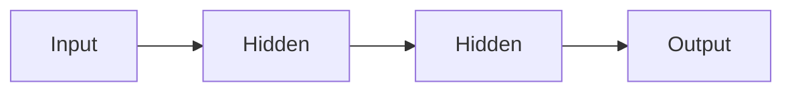

# 1. Neural Networks

> Stacked layers of parameterized transforms that learn representations from data.

## Definition

A **neural network** composes layers of linear maps and nonlinear activations to approximate functions. Depth lets the model build hierarchical features.

## Core pieces

| Piece | Role |
|-------|------|
| Layer | Affine transform + nonlinearity |
| Weights / biases | Learnable parameters |
| Forward pass | Input → prediction |
| Loss | How wrong the prediction is |
| Backward pass | Gradients for each parameter |



## Code (PyTorch sketch)

```python
import torch.nn as nn

model = nn.Sequential(
    nn.Linear(20, 64),
    nn.ReLU(),
    nn.Linear(64, 10),
)
```

## See also

- [Perceptron](02-perceptron.md) · [Forward Propagation](03-forward-propagation.md)

---

## Continue

- **Section hub:** [Deep Learning Basics](README.md)
- **DL overview:** [Deep Learning](../README.md)
