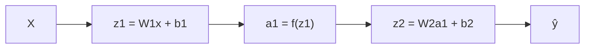

# 3. Forward Propagation

> Compute predictions by pushing inputs through layers left to right.

## Definition

**Forward propagation** evaluates the network: each layer transforms activations until the output (logits / probabilities).

## Flow



## Code

```python
import torch
import torch.nn.functional as F

x = torch.randn(4, 20)
W1, b1 = torch.randn(64, 20), torch.zeros(64)
W2, b2 = torch.randn(10, 64), torch.zeros(10)
a1 = F.relu(x @ W1.T + b1)
logits = a1 @ W2.T + b2
```

## Tips

- Keep shapes explicit (batch, features)  
- Autograd records this graph for backprop

---

## Continue

- **Section hub:** [Deep Learning Basics](README.md)
- **DL overview:** [Deep Learning](../README.md)
