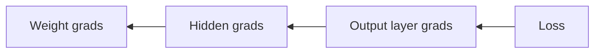

# 4. Backpropagation

> Chain-rule gradients from loss back to every weight — how nets learn.

## Definition

**Backpropagation** applies the chain rule to compute \(\partial L / \partial W\) for each parameter efficiently by reusing intermediate derivatives.

## Intuition



## Code

```python
import torch

x = torch.randn(8, 4, requires_grad=False)
W = torch.randn(4, 3, requires_grad=True)
y = torch.randn(8, 3)
pred = x @ W
loss = ((pred - y) ** 2).mean()
loss.backward()
print(W.grad.shape)
```

## Common mistakes

- In-place ops that break the graph  
- Forgetting `zero_grad()` before the next step

---

## Continue

- **Section hub:** [Deep Learning Basics](README.md)
- **DL overview:** [Deep Learning](../README.md)
