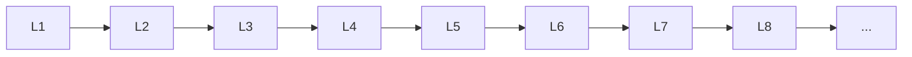

# Dl Basics

> Deep lessons for **Dl Basics** in the Deep Learning handbook.

## Lessons

| # | Lesson |
|---|--------|
| 1 | [Neural Networks](01-neural-networks.md) |
| 2 | [Perceptron](02-perceptron.md) |
| 3 | [Forward Propagation](03-forward-propagation.md) |
| 4 | [Backpropagation](04-backpropagation.md) |
| 5 | [Activation Functions](05-activation-functions.md) |
| 6 | [Loss Functions](06-loss-functions.md) |
| 7 | [Gradient Descent](07-gradient-descent.md) |
| 8 | [Learning Rate](08-learning-rate.md) |
| 9 | [Epochs & Batches](09-epochs-and-batches.md) |
| 10 | [Optimizers](10-optimizers.md) |
| 11 | [Weight Initialization](11-weight-initialization.md) |
| 12 | [Regularization](12-regularization.md) |

**Topic hub:** [../README.md](../README.md)
