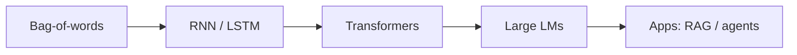

# From Deep Learning to Language Models

> How sequence models evolved into transformers and LLMs.

## Definition

Language modeling predicts the next token (or masked tokens). Early NLP used RNNs/LSTMs; transformers replaced recurrence with attention, enabling massive parallel training and today's LLMs.

## Why it matters

This historical bridge explains why tokenization, context windows, and pretrain→adapt matter for application engineers.

## How it works

## Key principles

1. **Pretrain then adapt** — General corpora → task data
2. **Scale laws intuition** — More data/compute/params often help — with costs
3. **Objectives shape behavior** — CLM vs MLM vs instruction tuning

## Common applications

| Application | Description |
|-------------|-------------|
| Chat models | Instruction-tuned LMs |
| Embedders | Contrastive sentence models |
| Rerankers | Cross-encoders |

## Common mistakes

- Treating ChatGPT as unrelated to neural LMs
- Ignoring tokenization when debugging weird outputs

## Further reading

- [NLP](../natural-language-processing/README.md)
- [Transformers](../transformers/README.md)
- [LLMs](../llm-engineering/README.md)
