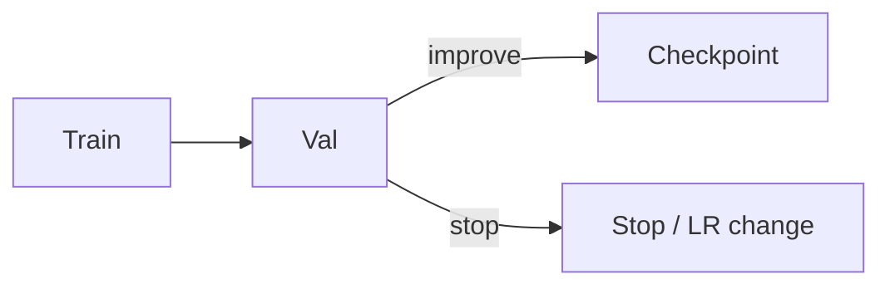

# 1. Training & Validation

> Split discipline for deep nets — train for learning, val for selection.

## Definition

Use **train** for gradient updates, **validation** for early stopping / LR / checkpoints, and **test** once for final claims.

## Loop

## See also

- [ML splits](../../machine-learning/ml-basics/03-training-validation-testing.md)

---

## Continue

- **Section hub:** [Model Evaluation & Debugging](README.md)
- **DL overview:** [Deep Learning](../README.md)
