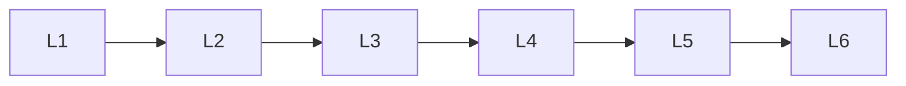

# Model Evaluation Debugging

> Deep lessons for **Model Evaluation Debugging** in the Deep Learning handbook.

## Lessons

| # | Lesson |
|---|--------|
| 1 | [Training & Validation](01-training-and-validation.md) |
| 2 | [Overfitting & Underfitting](02-overfitting-and-underfitting.md) |
| 3 | [Model Checkpointing](03-model-checkpointing.md) |
| 4 | [Experiment Tracking](04-experiment-tracking.md) |
| 5 | [Error Analysis](05-error-analysis.md) |
| 6 | [Hyperparameter Tuning](06-hyperparameter-tuning.md) |

**Topic hub:** [../README.md](../README.md)
