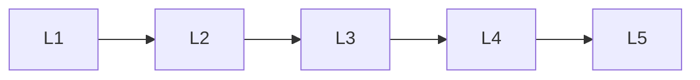

# Neural Network Architectures

> Deep lessons for **Neural Network Architectures** in the Deep Learning handbook.

## Lessons

| # | Lesson |
|---|--------|
| 1 | [Feedforward Neural Networks](01-feedforward-neural-networks.md) |
| 2 | [Multilayer Perceptrons](02-multilayer-perceptrons.md) |
| 3 | [Deep Neural Networks](03-deep-neural-networks.md) |
| 4 | [Residual Networks](04-residual-networks.md) |
| 5 | [Dense Networks](05-dense-networks.md) |

**Topic hub:** [../README.md](../README.md)
