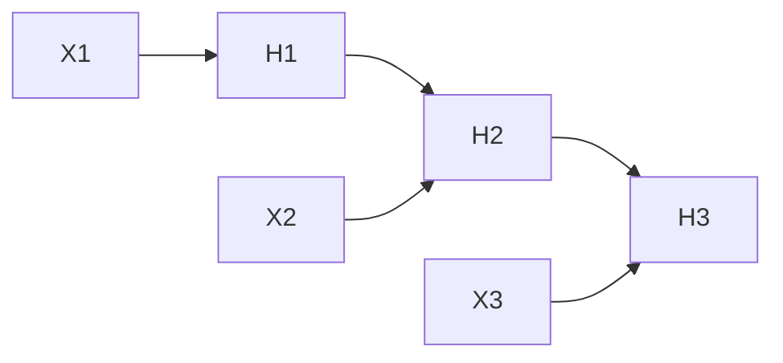

# 1. Recurrent Neural Networks

> Hidden state across time — sequential processing with shared weights.

## Definition

An **RNN** updates a hidden state \(h_t = f(h_{t-1}, x_t)\) to model sequences. Vanilla RNNs struggle with long-range dependencies (vanishing gradients).

## See also

- [LSTM](02-lstm.md) · [GRU](03-gru.md) · [Transformers](../../transformers/README.md)

---

## Continue

- **Section hub:** [Sequence Models](README.md)
- **DL overview:** [Deep Learning](../README.md)
