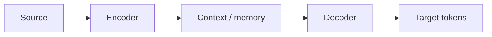

# 5. Sequence-to-Sequence Models

> Encoder–decoder for transduction — translation, summarization, ASR roots.

## Definition

**Seq2seq** maps an input sequence to an output sequence via an encoder (reads source) and decoder (writes target), historically with RNNs + attention.

## Pattern

## See also

- [Attention Mechanism](../advanced-deep-learning/04-attention-mechanism.md) · [Transformers](../../transformers/README.md)

---

## Continue

- **Section hub:** [Sequence Models](README.md)
- **DL overview:** [Deep Learning](../README.md)
