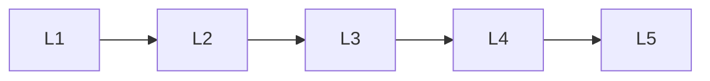

# Sequence Models

> Deep lessons for **Sequence Models** in the Deep Learning handbook.

## Lessons

| # | Lesson |
|---|--------|
| 1 | [Recurrent Neural Networks](01-recurrent-neural-networks.md) |
| 2 | [LSTM](02-lstm.md) |
| 3 | [GRU](03-gru.md) |
| 4 | [Bidirectional RNNs](04-bidirectional-rnns.md) |
| 5 | [Sequence-to-Sequence Models](05-sequence-to-sequence-models.md) |

**Topic hub:** [../README.md](../README.md)
