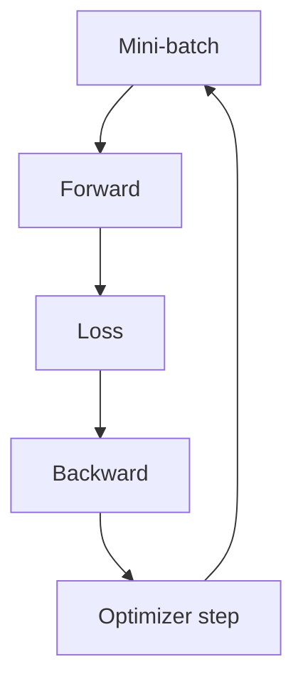

# Training Loop and Optimization

> Forward pass, loss, backward pass, and optimizers in practice.

## Definition

Training repeatedly: forward → compute loss → backpropagate gradients → optimizer step (SGD/Adam). Mini-batches, learning rates, and regularization (dropout, weight decay) dominate real-world success.

## Why it matters

Fine-tuning LLMs is this same loop with carefully chosen parameters (LR, LoRA ranks, epochs) and evaluation gates.

## How it works

## Key principles

1. **LR is king** — Most failures are learning-rate or data issues.
2. **Early stopping** — Watch val loss to avoid overfitting.
3. **Checkpoint everything** — Reproducibility beats heroics.

## Common applications

| Application | Description |
|-------------|-------------|
| From-scratch training | Domain models |
| Fine-tuning | Adapters / LoRA |
| Embedding models | Contrastive training |

## Common mistakes

- Training without a validation curve
- Changing too many hyperparameters at once

## Further reading

- [LLM Fine-Tuning](../llm-fine-tuning/README.md)
- [From DL to language models](from-dl-to-language-models.md)
