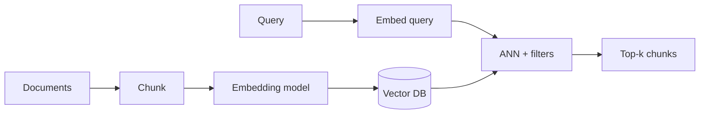

# Embeddings & Vector Databases

> Turning content into vectors and storing/searching them at scale — the retrieval substrate for RAG and memory.

**Prerequisites:** [Mathematics & Statistics](../mathematics-statistics/README.md) · [Natural Language Processing](../natural-language-processing/README.md)  
**Unlocks:** [RAG](../rag/README.md) · [Chatbots](../chatbots/README.md)

---

## Definition

**Embeddings** map objects (text, images) to vectors that capture semantic similarity. A **vector database** stores those vectors and supports approximate nearest neighbor (ANN) search, often with metadata filters. Together they power RAG, semantic search, and memory.

---

## Learning path

---

## Documents

| # | Topic | Document |
|---|-------|----------|
| 1 | Embeddings explained | [embeddings-explained.md](embeddings-explained.md) |
| 2 | Vector databases explained | [vector-databases-explained.md](vector-databases-explained.md) |
| 3 | Choosing embedding + VDB | [choosing-embedding-and-vdb.md](choosing-embedding-and-vdb.md) |

---

## Related topics

- [RAG — embeddings for RAG](../rag/embeddings-for-rag.md)
- [RAG — vector databases](../rag/vector-databases.md)
- [LLM Engineering embeddings](../llm-engineering/embeddings-llm-perspective.md)

---

## See also

- [Domains overview](../README.md)
- [Learning Roadmap](../../meta/roadmap.md)
- [Master Index](../../meta/indexes/MASTER-INDEX.md)
