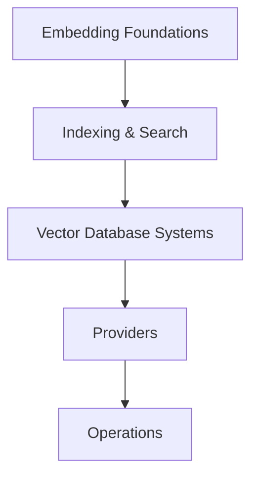
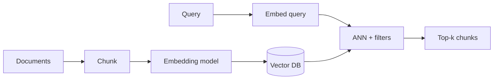

# Embeddings & Vector Databases

> Turning content into vectors and storing/searching them at scale — the retrieval substrate for RAG, semantic search, and memory.

**Prerequisites:** [Mathematics & Statistics](../mathematics-statistics/README.md) · [Natural Language Processing](../natural-language-processing/README.md)  
**Unlocks:** [RAG](../rag/README.md) · [Chatbots](../chatbots/README.md)

Start with a section hub below (or expand **13. Embeddings & Vector Databases** in the left sidebar).

---

## Sections

| # | Section | What you will learn | Hub |
|---|---------|---------------------|-----|
| 1 | **Embedding Foundations** | What embeddings are, metrics, dimensions & models | [embedding-foundations/](embedding-foundations/README.md) |
| 2 | **Indexing & Search** | ANN, HNSW/IVF, hybrid BM25+vector | [indexing-and-search/](indexing-and-search/README.md) |
| 3 | **Vector Database Systems** | VDB capabilities, schema/filters, multi-tenancy | [vector-database-systems/](vector-database-systems/README.md) |
| 4 | **Providers** | Chroma, FAISS, pgvector, Pinecone, Qdrant, Weaviate, Milvus | [providers/](providers/README.md) |
| 5 | **Operations** | Choosing a stack, reindex/drift, cost & retrieval eval | [operations/](operations/README.md) |

---

## Hierarchy

### 1. Embedding Foundations

| # | Topic |
|---|-------|
| 1 | [Embeddings Explained](embedding-foundations/01-embeddings-explained.md) |
| 2 | [Similarity & Metrics](embedding-foundations/02-similarity-and-metrics.md) |
| 3 | [Dimensions & Models](embedding-foundations/03-dimensions-and-models.md) |

### 2. Indexing & Search

| # | Topic |
|---|-------|
| 1 | [ANN & Approximate Search](indexing-and-search/01-ann-and-approximate-search.md) |
| 2 | [HNSW & IVF](indexing-and-search/02-hnsw-and-ivf.md) |
| 3 | [Hybrid BM25 + Vector](indexing-and-search/03-hybrid-bm25-vector.md) |

### 3. Vector Database Systems

| # | Topic |
|---|-------|
| 1 | [Vector Databases Explained](vector-database-systems/01-vector-databases-explained.md) |
| 2 | [Schema & Filters](vector-database-systems/02-schema-and-filters.md) |
| 3 | [Multi-tenancy](vector-database-systems/03-multi-tenancy.md) |

### 4. Providers

| # | Topic |
|---|-------|
| 1 | [Chroma](providers/01-chroma.md) |
| 2 | [FAISS](providers/02-faiss.md) |
| 3 | [pgvector](providers/03-pgvector.md) |
| 4 | [Pinecone](providers/04-pinecone.md) |
| 5 | [Qdrant](providers/05-qdrant.md) |
| 6 | [Weaviate](providers/06-weaviate.md) |
| 7 | [Milvus](providers/07-milvus.md) |

### 5. Operations

| # | Topic |
|---|-------|
| 1 | [Choosing Embedding and VDB](operations/01-choosing-embedding-and-vdb.md) |
| 2 | [Reindex & Drift](operations/02-reindex-and-drift.md) |
| 3 | [Cost & Retrieval Eval](operations/03-cost-and-retrieval-eval.md) |

---

## Definition

**Embeddings** map objects (text, images, code) to vectors that capture semantic similarity. A **vector database** stores those vectors and supports approximate nearest neighbor (ANN) search, often with metadata filters. Together they power RAG, semantic search, and memory.

---

## Learning path

---

## Related topics

- [RAG — embeddings for RAG](../rag/embeddings-for-rag.md)
- [RAG — vector databases](../rag/vector-databases.md)
- [RAG provider primers](../rag/providers/README.md) (legacy location; prefer this topic’s [providers/](providers/README.md))
- [LLM Engineering embeddings](../llm-engineering/embeddings-llm-perspective.md)

---

## See also

- [Domains overview](../README.md)
- [Learning Roadmap](../../meta/roadmap.md)
- [Master Index](../../meta/indexes/MASTER-INDEX.md)
