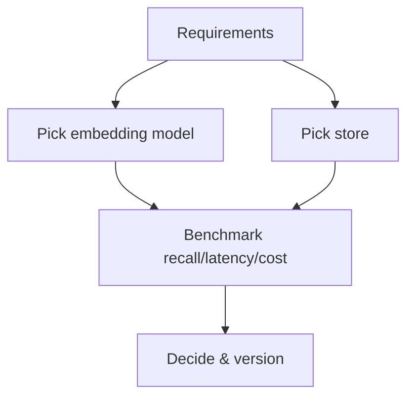

# Choosing Embedding Models and Vector Databases

> A decision guide for model + store selection.

## Definition

Choose embeddings based on language/domain, asymmetric retrieval needs, dimension/cost, and license. Choose a vector store based on ops model (managed vs self-host), filter needs, scale, and existing data platform (e.g., pgvector).

## Why it matters

Premature specialty databases add ops load. Many teams start with pgvector or a managed vector API and revisit at scale.

## How it works

## Key principles

1. **Benchmark on your data** — Public MTEB ≠ your corpus.
2. **Prefer platform fit** — Postgres/Redis familiarity matters.
3. **Cost the full path** — Embed + store + query + rerank.

## Common applications

| Application | Description |
|-------------|-------------|
| Startup RAG | pgvector + open embedder |
| Multi-tenant SaaS | Managed VDB with strong filters |
| Enterprise | VPC / self-host constraints |

## Common mistakes

- Picking a DB from Twitter hype without filter/hybrid needs analysis
- Not budgeting for re-embed jobs

## Further reading

- [RAG](../rag/README.md)
- [Databases](../databases/README.md)
