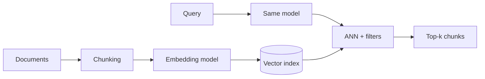
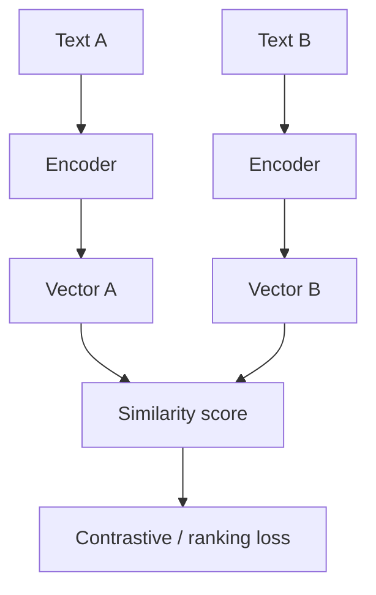

# 1. Embeddings Explained

> Embedding models convert objects into fixed-size vectors so that semantic similarity becomes geometry — the foundation of vector search, RAG, and memory systems.

## Table of Contents

- [Definition](#definition)
- [Why Embeddings Matter](#why-embeddings-matter)
- [How Embeddings Work](#how-embeddings-work)
- [Symmetric vs Asymmetric Retrieval](#symmetric-vs-asymmetric-retrieval)
- [Dense, Sparse, and Hybrid](#dense-sparse-and-hybrid)
- [Chunking and Embedding Quality](#chunking-and-embedding-quality)
- [Versioning and Compatibility](#versioning-and-compatibility)
- [Key Principles](#key-principles)
- [Common Applications](#common-applications)
- [Python Examples](#python-examples)
- [Common Mistakes](#common-mistakes)
- [Interview Preparation](#interview-preparation)
- [Navigation](#navigation)

---

## Definition

An **embedding model** maps an input (text, image, audio, code) to a vector in ℝⁿ such that **similar inputs land nearby** under a chosen similarity metric (cosine, dot product, L2).

The model’s training objective, domain data, and input formatting determine what “similar” means. A fancy vector database cannot rescue a weak embedding space.

| Term | Meaning |
|------|---------|
| **Encoder** | Model that produces vectors (bi-encoder for retrieval) |
| **Dimension** | Length of the vector (e.g. 384, 768, 1536, 3072) |
| **Metric** | How “nearby” is scored at query time |
| **Index** | Data structure that finds approximate nearest neighbors |

---

## Why Embeddings Matter

Retrieval quality is mostly embedding + chunking quality. Index choice affects latency and cost; it does not invent semantic signal that the encoder never learned.



Bad embeddings show up as: irrelevant RAG context, missed paraphrases, brittle keyword failures with no lexical fallback, and silent regressions after model upgrades.

---

## How Embeddings Work

Modern text embedders are usually **transformer encoders** fine-tuned with contrastive or ranking losses. Training pulls positive pairs together and pushes negatives apart.



At inference you embed once per chunk at ingest, store vectors + metadata, then embed each query with the **same model** and search.

### Mental model

Treat the embedder as a **frozen feature function**:

```
embed(text, model_id, normalize?) → vector
```

Changing any of those three inputs means vectors are **not comparable** and must not share an index.

---

## Symmetric vs Asymmetric Retrieval

| Mode | Query ≈ Document style? | Typical use |
|------|-------------------------|-------------|
| **Symmetric** | Similar length/role | Clustering, dedup, similar-doc search |
| **Asymmetric** | Short query → long passage | FAQ, RAG, web search |

Many retrieval models use instruction prefixes or dual towers so queries and documents are encoded appropriately. Using a symmetric model for asymmetric RAG often underperforms.

---

## Dense, Sparse, and Hybrid

| Type | Representation | Strengths | Weaknesses |
|------|----------------|-----------|------------|
| **Dense** | Compact float vector | Paraphrase, semantics | Weak on rare IDs/codes |
| **Sparse** | High-dim sparse (BM25, SPLADE) | Exact terms, SKUs | Weaker paraphrase |
| **Hybrid** | Fuse both scores | Production default | Extra ops + tuning |

Enterprise RAG almost always wants hybrid (or dense + BM25) because product names, error codes, and legal citations need lexical precision.

---

## Chunking and Embedding Quality

One vector summarizes one chunk. If a chunk mixes unrelated topics, the vector is a blur.

1. Chunk by semantic unit (section, procedure, FAQ answer).
2. Keep enough context for standalone meaning (titles, headers).
3. Prefer many coherent chunks over few huge ones.
4. Evaluate retrieval on your golden queries — not only MTEB.

---

## Versioning and Compatibility

Record on every vector:

```
embedding_model: "text-embedding-3-large"
embedding_dim: 3072
embedding_version: "2026-08"
chunking_policy: "v3-headers-512"
```

Model change ⇒ **full reindex**. Dual-write / dual-read migrations are the safe production pattern.

---

## Key Principles

1. **Task match** — Symmetric vs asymmetric, language, domain, code vs prose.
2. **One model per index** — Never mix encoders in one collection.
3. **Metric match** — Cosine indexes need the normalization the model expects.
4. **Version everything** — Model, dim, chunk policy, index build.
5. **Benchmark on your data** — Public leaderboards are a starting hint only.

---

## Common Applications

| Application | Role of embeddings |
|-------------|-------------------|
| Semantic search | Query → relevant passages |
| RAG | Retrieve grounding chunks for an LLM |
| Memory | Store/retrieve user facts and session summaries |
| Dedup / clustering | Near-duplicate detection |
| Recommendations | Item–item or user–item similarity |

---

## Python Examples

```python
import math
from typing import Sequence


def l2_normalize(v: Sequence[float]) -> list[float]:
    n = math.sqrt(sum(x * x for x in v)) or 1.0
    return [x / n for x in v]


def cosine(a: Sequence[float], b: Sequence[float]) -> float:
    a_n, b_n = l2_normalize(a), l2_normalize(b)
    return sum(x * y for x, y in zip(a_n, b_n))


# OpenAI-style batch embed (pseudo-client)
async def embed_texts(client, texts: list[str], model: str) -> list[list[float]]:
    resp = await client.embeddings.create(model=model, input=texts)
    # Preserve input order via index if the API returns unsorted rows
    by_idx = {row.index: row.embedding for row in resp.data}
    return [by_idx[i] for i in range(len(texts))]
```

```python
# Local sentence-transformers sketch
from sentence_transformers import SentenceTransformer

model = SentenceTransformer("BAAI/bge-small-en-v1.5")
vectors = model.encode(
    ["Refunds take 3 business days.", "How long do refunds take?"],
    normalize_embeddings=True,
)
print(float(vectors[0] @ vectors[1]))  # cosine via dot of unit vectors
```

---

## Common Mistakes

- Mixing vectors from different models or dimensions in one index
- Embedding huge multi-topic chunks
- Changing models without a reindex plan
- Assuming higher dimensions always improve recall
- Skipping hybrid/lexical search when IDs and proper nouns matter

---

## Interview Preparation

**Q: What does an embedding model optimize for?**

> A geometry where task-relevant similarity is proximity under a metric — usually via contrastive or ranking objectives on labeled pairs.

**Q: Why must query and document use the same model?**

> Different models define incompatible spaces; nearest-neighbor search across spaces is meaningless.

**Q: Dense vs sparse for RAG?**

> Dense for paraphrase/semantics; sparse/BM25 for exact terms; hybrid for production.

---

## Navigation

- **Next:** [Similarity & Metrics](02-similarity-and-metrics.md)
- **Section hub:** [Embedding Foundations](README.md)
- **Topic hub:** [Embeddings & Vector Databases](../README.md)
