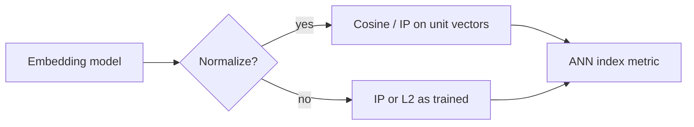

# 2. Similarity and Metrics

> Similarity metrics define “nearby” in embedding space. The metric must match how vectors were trained, normalized, and indexed — or recall collapses quietly.

## Table of Contents

- [Definition](#definition)
- [Why Metrics Matter](#why-metrics-matter)
- [Cosine Similarity](#cosine-similarity)
- [Dot Product](#dot-product)
- [Euclidean / L2](#euclidean--l2)
- [Normalization Rules](#normalization-rules)
- [Metric ↔ Index Configuration](#metric--index-configuration)
- [Ranking and Score Interpretation](#ranking-and-score-interpretation)
- [Python Examples](#python-examples)
- [Common Mistakes](#common-mistakes)
- [Interview Preparation](#interview-preparation)
- [Navigation](#navigation)

---

## Definition

A **similarity** (or distance) **metric** scores how close two vectors are. Retrieval returns the top-k neighbors under that metric, optionally after metadata filters.

| Family | Score | Higher is better? |
|--------|-------|-------------------|
| Cosine similarity | Angle-based | Yes |
| Inner product / IP | Dot product | Yes |
| Euclidean (L2) | Distance | No (lower is better) |

---

## Why Metrics Matter

ANN libraries and managed VDBs require you to declare the metric at index creation. Mismatch examples:

- Cosine-trained normalized vectors stored in an L2 index without understanding equivalence
- Unnormalized vectors queried with cosine assumptions
- Comparing raw scores across different metrics or models



---

## Cosine Similarity

$$
\cos(a,b) = \frac{a \cdot b}{\|a\| \|b\|}
$$

Cosine ignores magnitude and focuses on direction — the default for most text embedders when vectors are L2-normalized.

**When to use:** General semantic search with normalized embeddings.

---

## Dot Product

$$
a \cdot b = \sum_i a_i b_i
$$

If both vectors are unit-normalized, **dot product equals cosine**. Some models leave magnitude meaningful (e.g. confidence/length effects); then IP ≠ cosine.

**When to use:** Models/docs that prescribe inner product; MIPS (maximum inner product search) indexes.

---

## Euclidean / L2

$$
\|a-b\|_2 = \sqrt{\sum_i (a_i-b_i)^2}
$$

For unit vectors, ranking by L2 distance is equivalent to ranking by cosine (monotonic transform). Still configure the index to the metric you intend to report and tune.

**When to use:** Some vision embeddings and FAISS recipes; follow the model card.

---

## Normalization Rules

1. Read the model card: does it expect `normalize_embeddings=True`?
2. Normalize **queries and documents** the same way.
3. If using cosine in the VDB, normalize before upsert/query unless the DB normalizes for you.
4. Re-check after dimension truncation (Matryoshka) — re-normalize truncated vectors.

---

## Metric ↔ Index Configuration

| Store | Typical setting |
|-------|-----------------|
| pgvector | `vector_cosine_ops` / `vector_ip_ops` / `vector_l2_ops` |
| FAISS | `METRIC_INNER_PRODUCT` vs `METRIC_L2` |
| Chroma | `hnsw:space: cosine|l2|ip` |
| Qdrant | `Distance.COSINE|DOT|EUCLID` |
| Pinecone | metric at index create time (immutable) |

Changing metric usually means **rebuild the index**.

---

## Ranking and Score Interpretation

- Do not threshold cosine scores as absolute truth across domains — calibrate on your eval set.
- Hybrid fusion (RRF, weighted sums) needs score normalization because BM25 and cosine live on different scales.
- Rerankers consume text, not raw ANN scores — treat ANN as candidate generation.

---

## Python Examples

```python
import numpy as np


def cosine_matrix(docs: np.ndarray, query: np.ndarray) -> np.ndarray:
    """docs: (n, d), query: (d,) — both should be L2-normalized for true cosine."""
    q = query / (np.linalg.norm(query) + 1e-12)
    d = docs / (np.linalg.norm(docs, axis=1, keepdims=True) + 1e-12)
    return d @ q


def top_k(scores: np.ndarray, k: int = 5) -> list[int]:
    # argpartition is O(n) average for top-k
    idx = np.argpartition(-scores, kth=min(k, len(scores) - 1))[:k]
    return sorted(idx.tolist(), key=lambda i: scores[i], reverse=True)
```

```python
# RRF fusion sketch for hybrid retrieval
def rrf(rank_lists: list[list[str]], k: int = 60) -> list[tuple[str, float]]:
    scores: dict[str, float] = {}
    for ranks in rank_lists:
        for r, doc_id in enumerate(ranks, start=1):
            scores[doc_id] = scores.get(doc_id, 0.0) + 1.0 / (k + r)
    return sorted(scores.items(), key=lambda x: x[1], reverse=True)
```

---

## Common Mistakes

- Declaring cosine in the DB but upserting unnormalized vectors from a model that needs normalization
- Comparing Pinecone/Qdrant scores to cosine thresholds from another model
- Mixing L2 and IP results in one ranked list without fusion logic
- Forgetting that lower L2 is better when merging candidate lists

---

## Interview Preparation

**Q: When are cosine and dot product identical?**

> When both vectors are L2-normalized to unit length.

**Q: Why is metric fixed at index creation in many VDBs?**

> The ANN structure and quantization assume a distance; changing it invalidates the graph/centroids.

---

## Navigation

- **Prev:** [Embeddings Explained](01-embeddings-explained.md)
- **Next:** [Dimensions & Models](03-dimensions-and-models.md)
- **Section hub:** [Embedding Foundations](README.md)
