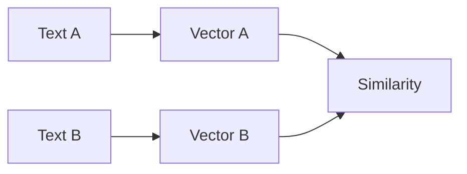

# Embeddings Explained

> What embedding models do and how similarity search uses them.

## Definition

An embedding model converts an input into a fixed-size vector such that similar inputs land nearby. Similarity metrics (cosine, dot product, L2) define 'nearby'. Domain and training objective determine quality for your task.

## Why it matters

Bad embeddings cannot be fixed by a fancy vector DB. Start with embedding quality and chunking.

## How it works

## Key principles

1. **Task match** — Symmetric vs asymmetric retrieval models differ.
2. **Version embeddings** — Model changes require re-indexing.
3. **Normalize thoughtfully** — Metric and normalization must match index config.

## Common applications

| Application | Description |
|-------------|-------------|
| Semantic search | Query → documents |
| Dedup/clustering | Near-duplicate detection |
| Memory | Store/retrieve user facts |

## Common mistakes

- Mixing vectors from different models in one index
- Huge chunks that blur topics inside one vector

## Further reading

- [RAG embeddings](../rag/embeddings-for-rag.md)
- [Vector databases explained](vector-databases-explained.md)
