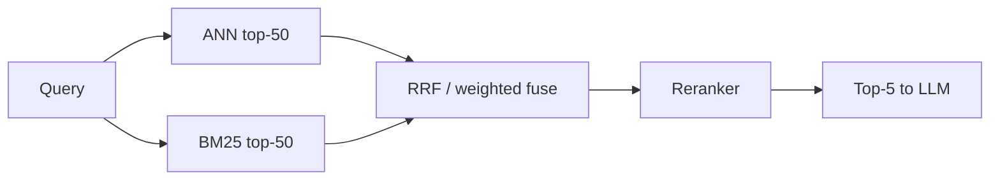

# 1. ANN and Approximate Search

> Approximate nearest neighbor (ANN) search finds “close enough” vectors much faster than brute force — the core query path inside every vector database.

## Table of Contents

- [Definition](#definition)
- [Exact vs Approximate](#exact-vs-approximate)
- [Why ANN Exists](#why-ann-exists)
- [Recall, Latency, and Cost](#recall-latency-and-cost)
- [Candidate Generation vs Ranking](#candidate-generation-vs-ranking)
- [Filters and ANN](#filters-and-ann)
- [Evaluating ANN Quality](#evaluating-ann-quality)
- [Python Examples](#python-examples)
- [Common Mistakes](#common-mistakes)
- [Interview Preparation](#interview-preparation)
- [Navigation](#navigation)

---

## Definition

**Nearest neighbor search** returns the k vectors closest to a query under a metric. **ANN** algorithms sacrifice a little recall to avoid scanning every vector — essential beyond ~10⁵–10⁶ vectors at interactive latency.

---

## Exact vs Approximate

| Mode | Complexity | Use |
|------|------------|-----|
| **Exact / flat** | O(n · d) | Baselines, tiny corpora, offline eval |
| **ANN** | Sublinear (graph, IVF, LSH, …) | Production query serving |

```mermaid
flowchart TB
  Q[Query vector] --> Exact[Brute-force scan]
  Q --> ANN[ANN index]
  Exact --> Gold[True top-k]
  ANN --> Approx[Approximate top-k]
  Gold --> Rec[Recall@k = overlap]
  Approx --> Rec
```

---

## Why ANN Exists

At 10M vectors × 1536 dims, a naive scan is billions of FLOPs per query. ANN structures (HNSW graphs, IVF clusters, PQ compression, DiskANN) prune the search space so P99 stays in the low milliseconds to tens of milliseconds.

---

## Recall, Latency, and Cost

| Knob | Effect |
|------|--------|
| Higher search breadth (`ef`, `nprobe`) | ↑ recall, ↑ latency/CPU |
| Quantization / PQ | ↓ RAM, ↓ recall (tune carefully) |
| Over-fetch then rerank | ↑ quality, ↑ cost |

**Production mindset:** ANN is a **candidate generator**. Many stacks over-fetch (e.g. top 50) then apply a cross-encoder reranker for top 5.

---

## Candidate Generation vs Ranking



Do not expect ANN alone to be the final relevance ranking for high-stakes RAG.

---

## Filters and ANN

Metadata filters (`tenant_id`, ACL, time range) interact with ANN:

- **Pre-filter** — restrict candidates before/during graph walk (required for security tenancy)
- **Post-filter** — retrieve then drop — can return fewer than k hits and leak work across tenants if misused

Prefer engines with first-class filtered ANN (Qdrant payload filters, pgvector `WHERE`, Pinecone metadata filters).

---

## Evaluating ANN Quality

1. Build a golden set: query → relevant chunk IDs.
2. Compute exact top-k offline (flat index) as reference when feasible.
3. Measure ANN **recall@k** vs exact, plus end-to-end **retrieval recall** vs human labels.
4. Sweep `ef`/`nprobe` for the latency SLO curve.
5. Retest after quantization or compaction.

---

## Python Examples

```python
import numpy as np


def exact_topk(docs: np.ndarray, query: np.ndarray, k: int) -> np.ndarray:
    # docs and query L2-normalized → cosine via dot
    scores = docs @ query
    return np.argpartition(-scores, kth=k - 1)[:k]


def ann_recall_at_k(exact_ids: np.ndarray, ann_ids: np.ndarray) -> float:
    return len(set(exact_ids.tolist()) & set(ann_ids.tolist())) / len(exact_ids)


# Sweep a hypothetical search_breadth parameter
def sweep_recall(run_ann, docs, queries, ks=(10,), breadths=(16, 32, 64, 128)):
    rows = []
    for b in breadths:
        recalls = []
        for q in queries:
            exact = exact_topk(docs, q, k=max(ks))
            approx = run_ann(q, k=max(ks), breadth=b)
            recalls.append(ann_recall_at_k(exact, approx))
        rows.append((b, float(np.mean(recalls))))
    return rows
```

---

## Common Mistakes

- Shipping ANN with default params and never measuring recall
- Using post-filter only for tenant isolation
- Treating ANN scores as calibrated probabilities
- Skipping flat-index baselines on a sample before production cutover

---

## Interview Preparation

**Q: What does ANN trade?**

> Recall (and sometimes precision of the neighbor set) for latency, throughput, and memory.

**Q: How do you know ANN is “good enough”?**

> Measure recall@k against exact search and against labeled relevance; tune search breadth to your P99 budget.

---

## Navigation

- **Next:** [HNSW & IVF](02-hnsw-and-ivf.md)
- **Section hub:** [Indexing & Search](README.md)
- **Topic hub:** [Embeddings & Vector Databases](../README.md)
