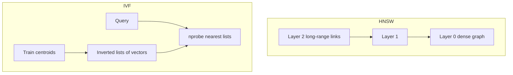

# 2. HNSW and IVF

> HNSW and IVF are the two ANN families you will configure most often — graph navigation vs cluster probing, with optional quantization for memory.

## Table of Contents

- [Definition](#definition)
- [HNSW Overview](#hnsw-overview)
- [HNSW Parameters](#hnsw-parameters)
- [IVF Overview](#ivf-overview)
- [IVF Parameters](#ivf-parameters)
- [Product Quantization](#product-quantization)
- [Choosing HNSW vs IVF](#choosing-hnsw-vs-ivf)
- [Python Examples](#python-examples)
- [Ops Notes](#ops-notes)
- [Interview Preparation](#interview-preparation)
- [Navigation](#navigation)

---

## Definition

**HNSW** (Hierarchical Navigable Small World) builds a multi-layer proximity graph for greedy search. **IVF** (Inverted File) partitions the vector space into coarse clusters and searches only a few probes. Both power FAISS, Milvus, pgvector, Qdrant, Weaviate, and others.



---

## HNSW Overview

Search starts at the top layer (long-range edges), greedily walks toward the query, then descends. Layer 0 holds all points with denser connections.

**Strengths:** Strong recall/latency for mid-scale in-memory indexes; great default in Qdrant/Weaviate/pgvector.  
**Weaknesses:** High RAM for full-precision graphs; insert cost; graph rebuilds on major changes.

---

## HNSW Parameters

| Param | Meaning | Tuning |
|-------|---------|--------|
| `M` | Max connections per node | Higher → better recall, more RAM |
| `efConstruction` | Build-time candidate list | Higher → better graph, slower build |
| `efSearch` / `ef` | Query-time candidate list | Higher → better recall, slower queries |

Start with library defaults, then sweep `efSearch` against your P99 and recall@k targets.

---

## IVF Overview

1. Train `nlist` centroids (k-means) on a sample.
2. Assign each vector to its nearest centroid (inverted list).
3. At query time, find `nprobe` nearest centroids and scan those lists (optionally with PQ).

**Strengths:** Scales to very large corpora; GPU-friendly in FAISS; memory can be reduced with PQ.  
**Weaknesses:** Training step; poor `nprobe` hurts recall; centroid drift if data distribution shifts.

---

## IVF Parameters

| Param | Meaning |
|-------|---------|
| `nlist` | Number of coarse clusters |
| `nprobe` | Lists visited per query |
| Training size | Enough vectors to stabilize centroids |

Rule of thumb starters (always verify): `nlist ≈ sqrt(N)`, `nprobe` from 1–10% of `nlist` depending on recall needs.

---

## Product Quantization

**PQ** compresses vectors into codebooks to cut RAM and distance cost. Often combined as **IVF-PQ** or HNSW with scalar/product quantization.

Tradeoff: memory ↓ , recall ↓ unless you compensate with higher `nprobe`/`ef` or over-fetch + rerank.

---

## Choosing HNSW vs IVF

| Situation | Prefer |
|-----------|--------|
| < few M vectors, simple ops, filtered queries | HNSW |
| Tens of M–B vectors, FAISS/Milvus, GPU | IVF-PQ / DiskANN family |
| Postgres-centric app | pgvector HNSW (IVFFlat older option) |
| Need frequent deletes/updates with filters | Engine-native HNSW (Qdrant et al.) |

---

## Python Examples

```python
import faiss
import numpy as np

d, n = 128, 50_000
xb = np.random.randn(n, d).astype("float32")
faiss.normalize_L2(xb)

# HNSW flat (full precision)
hnsw = faiss.IndexHNSWFlat(d, 32)  # M=32
hnsw.hnsw.efConstruction = 200
hnsw.add(xb)
hnsw.hnsw.efSearch = 64

# IVF-PQ sketch
nlist, m = 1024, 16
quantizer = faiss.IndexFlatIP(d)
ivf = faiss.IndexIVFPQ(quantizer, d, nlist, m, 8)
ivf.train(xb)
ivf.add(xb)
ivf.nprobe = 16
```

```python
# pgvector-oriented SQL (conceptual)
# CREATE INDEX ON chunks USING hnsw (embedding vector_cosine_ops)
#   WITH (m = 16, ef_construction = 64);
# SET hnsw.ef_search = 40;
```

---

## Ops Notes

- Rebuild or compact after massive deletes — fragmentation hurts.
- Persist `M`/`ef`/`nlist`/`nprobe` in config alongside embedding model version.
- Measure RAM: HNSW graphs dominate memory more than raw float payloads alone.
- For IVF, retrain centroids if the corpus distribution shifts heavily.

---

## Interview Preparation

**Q: Explain HNSW in one minute.**

> Multi-layer small-world graph; greedy search from coarse layers down to a dense base layer; tune `ef` for recall vs latency.

**Q: What is `nprobe`?**

> How many IVF clusters you scan; primary recall/latency knob at query time.

---

## Navigation

- **Prev:** [ANN & Approximate Search](01-ann-and-approximate-search.md)
- **Next:** [Hybrid BM25 + Vector](03-hybrid-bm25-vector.md)
- **Section hub:** [Indexing & Search](README.md)
