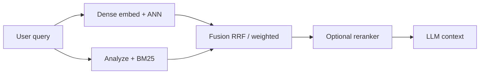

# 3. Hybrid BM25 + Vector

> Hybrid retrieval fuses lexical matching (BM25 / sparse) with dense vector search so paraphrases and exact tokens both survive — the practical default for enterprise RAG.

## Table of Contents

- [Definition](#definition)
- [Why Hybrid Wins](#why-hybrid-wins)
- [Architecture](#architecture)
- [Fusion Methods](#fusion-methods)
- [Tuning Alpha and Over-Fetch](#tuning-alpha-and-over-fetch)
- [Where Hybrid Lives](#where-hybrid-lives)
- [Python Examples](#python-examples)
- [Ops Notes](#ops-notes)
- [Common Mistakes](#common-mistakes)
- [Interview Preparation](#interview-preparation)
- [Navigation](#navigation)

---

## Definition

**Hybrid search** runs a lexical retriever and a dense retriever (or a learned sparse model), then **fuses** rankings into one candidate list — often before cross-encoder reranking.

---

## Why Hybrid Wins

| Signal | Dense vectors | BM25 / sparse |
|--------|---------------|---------------|
| Paraphrase / semantics | Strong | Weak |
| SKUs, error codes, names | Weak | Strong |
| Typos / morphology | Model-dependent | Analyzer-dependent |

Support desks, legal corpora, and code docs almost always need both.

---

## Architecture



Keep filters (`tenant_id`, ACL) applied on **both** legs or at fusion time with a shared allow-list.

---

## Fusion Methods

| Method | Idea | Pros |
|--------|------|------|
| **RRF** (Reciprocal Rank Fusion) | Score by rank, not raw score | Scale-free, robust |
| **Weighted sum** | `α·dense + (1-α)·lexical` | Tunable when scores calibrated |
| **Cascade** | Lexical gate then dense (or vice versa) | Simple but brittle |

RRF is a strong default when BM25 and cosine scores are incomparable.

---

## Tuning Alpha and Over-Fetch

- Weaviate-style `alpha`: 0 = pure BM25, 1 = pure vector.
- Over-fetch each leg (e.g. 50) → fuse → take 20 → rerank to 5.
- Tune on a labeled query set; plot recall@k vs latency.

---

## Where Hybrid Lives

| Stack | Hybrid approach |
|-------|-----------------|
| Weaviate | Native `hybrid` query |
| Elasticsearch / OpenSearch | BM25 + dense_vector |
| pgvector + Postgres | `tsvector` + vector ORDER BY |
| Qdrant | Sparse + dense vectors / payload text via external BM25 |
| Custom | Two queries + RRF in app code |

---

## Python Examples

```python
from collections import defaultdict


def rrf_fuse(*ranked_id_lists: list[list[str]], k: int = 60, limit: int = 20) -> list[str]:
    scores: dict[str, float] = defaultdict(float)
    for ids in ranked_id_lists:
        for rank, doc_id in enumerate(ids, start=1):
            scores[doc_id] += 1.0 / (k + rank)
    return [d for d, _ in sorted(scores.items(), key=lambda x: x[1], reverse=True)[:limit]]


def weighted_fuse(
    dense: list[tuple[str, float]],
    lexical: list[tuple[str, float]],
    alpha: float = 0.5,
    limit: int = 20,
) -> list[str]:
    """Assumes scores already min-max normalized per list."""
    scores: dict[str, float] = defaultdict(float)
    for doc_id, s in dense:
        scores[doc_id] += alpha * s
    for doc_id, s in lexical:
        scores[doc_id] += (1 - alpha) * s
    return [d for d, _ in sorted(scores.items(), key=lambda x: x[1], reverse=True)[:limit]]
```

```python
# Postgres hybrid sketch
SQL = """
WITH vec AS (
  SELECT id, 1 - (embedding <=> %(qvec)s) AS vscore
  FROM chunks
  WHERE tenant_id = %(tenant)s
  ORDER BY embedding <=> %(qvec)s
  LIMIT 50
),
lex AS (
  SELECT id, ts_rank(search_tsv, plainto_tsquery('english', %(q)s)) AS lscore
  FROM chunks
  WHERE tenant_id = %(tenant)s
    AND search_tsv @@ plainto_tsquery('english', %(q)s)
  ORDER BY lscore DESC
  LIMIT 50
)
SELECT COALESCE(vec.id, lex.id) AS id,
       COALESCE(vec.vscore, 0) AS vscore,
       COALESCE(lex.lscore, 0) AS lscore
FROM vec FULL OUTER JOIN lex USING (id);
"""
```

---

## Ops Notes

- Index both inverted text and vectors on ingest; schema migrations need both.
- Analyzers (stemming, locales) affect BM25 as much as embed models affect dense.
- Log which leg contributed winners — debugging relevance becomes possible.

---

## Common Mistakes

- Dense-only search on corpora full of IDs and product codes
- Adding raw BM25 + cosine without normalization or RRF
- Applying tenant filters on only one retrieval leg
- Tuning `alpha` on anecdotes instead of an eval set

---

## Interview Preparation

**Q: Why not only embeddings?**

> Embeddings miss exact tokens and rare identifiers; BM25 catches them. Hybrid covers both failure modes.

**Q: Why is RRF popular?**

> It depends on ranks, not incompatible raw scores, so it fuses heterogeneous retrievers cleanly.

---

## Navigation

- **Prev:** [HNSW & IVF](02-hnsw-and-ivf.md)
- **Next section:** [Vector Databases Explained](../vector-database-systems/01-vector-databases-explained.md)
- **Section hub:** [Indexing & Search](README.md)
