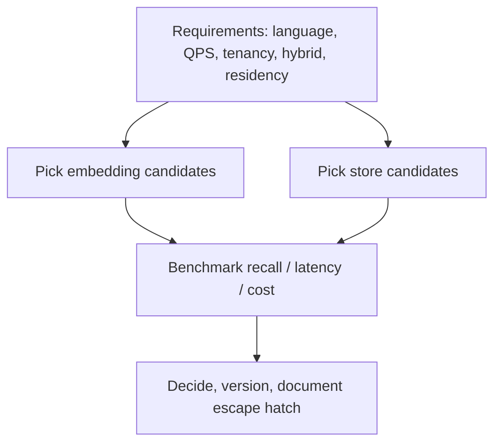

# 1. Choosing Embedding and VDB

> Choose embeddings for language, domain, and asymmetric retrieval needs. Choose a vector store for ops model, filters, scale, and platform fit. Benchmark both on your data before locking in.

## Table of Contents

- [Definition](#definition)
- [Why It Matters](#why-it-matters)
- [Decision Flow](#decision-flow)
- [Embedding Selection](#embedding-selection)
- [Vector Store Selection](#vector-store-selection)
- [Reference Starting Points](#reference-starting-points)
- [Benchmark Protocol](#benchmark-protocol)
- [Common Mistakes](#common-mistakes)
- [Interview Preparation](#interview-preparation)
- [Navigation](#navigation)

---

## Definition

Selection is a **paired decision**: the embedding model defines the geometry; the store defines how you query, filter, and operate that geometry at scale.

---

## Why It Matters

Premature specialty databases add ops load. Many teams start with **pgvector** or a managed vector API and revisit at scale. Conversely, forcing Postgres past its comfort zone creates outages on the primary OLTP system.

---

## Decision Flow

---

## Embedding Selection

Checklist:

1. Language & domain coverage
2. Symmetric vs asymmetric retrieval
3. Dim, metric, normalization
4. Privacy / self-host vs API
5. Latency & rate limits
6. Eval on **your** golden queries
7. Reindex cost if you change later

---

## Vector Store Selection

| Need | Lean toward |
|------|-------------|
| Already on Postgres, <~1M vectors | **pgvector** |
| Fast prototype / embedded | **Chroma** / FAISS |
| Strong filtered ANN, self-host | **Qdrant** |
| Native hybrid search | **Weaviate** / OpenSearch |
| Managed minimal ops | **Pinecone** / Zilliz |
| Billion-scale distributed | **Milvus** / FAISS+custom |
| Max control, custom ops | **FAISS** + metadata DB |

Also weigh: VPC/on-prem requirements, SSO, backup story, Terraform providers, and team expertise.

---

## Reference Starting Points

| Context | Starter stack |
|---------|---------------|
| Startup RAG | Open embedder or API embed + pgvector |
| Multi-tenant SaaS | Managed VDB with namespaces + strict filters |
| Enterprise on-prem | Qdrant/Milvus/Weaviate in VPC |
| Research / custom | FAISS + Postgres metadata |

---

## Benchmark Protocol

1. Freeze a golden set (50–500 queries with relevant chunk IDs).
2. Embed corpus with each candidate model.
3. Measure recall@k, MRR, and p95 embed+search latency.
4. Add filter selectivity scenarios (hot tenant, rare doc_type).
5. Estimate monthly $: embed + storage + query units + rerank.
6. Run a failure drill: reindex time, backup restore.

---

## Common Mistakes

- Picking a DB from hype without filter/hybrid analysis
- No budget for re-embed jobs
- Ignoring data residency until security review
- Coupling app code to one vendor SDK with no interface

---

## Interview Preparation

**Q: pgvector or dedicated VDB?**

> pgvector for prototypes and moderate scale with strong SQL needs; dedicated/managed when vector QPS, filtered ANN, or isolation requirements outgrow Postgres comfort.

**Q: How do you justify a model change?**

> Side-by-side recall@k and cost on golden sets, plus a dual-index migration plan.

---

## Navigation

- **Next:** [Reindex & Drift](02-reindex-and-drift.md)
- **Section hub:** [Operations](README.md)
- **Topic hub:** [Embeddings & Vector Databases](../README.md)
