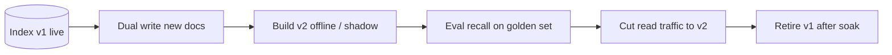

# 2. Reindex and Drift

> Embeddings drift when models, chunking, or data change. Treat reindexing as a versioned migration with dual-running indexes — not a silent in-place overwrite.

## Table of Contents

- [Definition](#definition)
- [Sources of Drift](#sources-of-drift)
- [When a Full Reindex Is Required](#when-a-full-reindex-is-required)
- [Dual-Index Migration](#dual-index-migration)
- [Partial Updates vs Rebuilds](#partial-updates-vs-rebuilds)
- [Version Metadata](#version-metadata)
- [Python Examples](#python-examples)
- [Ops Checklist](#ops-checklist)
- [Interview Preparation](#interview-preparation)
- [Navigation](#navigation)

---

## Definition

**Drift** is the gap between what your index represents and what your product needs: new docs, changed chunkers, better models, or stale payloads. **Reindex** rebuilds vectors (and often ANN structures) so the index matches a declared version.

---

## Sources of Drift

| Source | Symptom |
|--------|---------|
| New embedding model | Incompatible geometry |
| Chunking policy change | Wrong granularity / missed context |
| Corpus edits | Stale answers, ghost chunks |
| Metric/normalization change | Nonsense rankings |
| Quantization change | Recall regression |

---

## When a Full Reindex Is Required

- Embedding model or dimension change
- Metric / normalization policy change
- Breaking chunking changes (not just typos in text)
- Major schema changes that invalidate IDs

Content-only edits can often **upsert** affected doc IDs without rebuilding everything.

---

## Dual-Index Migration



1. Create collection `kb_v2` with new model metadata.
2. Backfill all documents; dual-write new ingest to v1+v2.
3. Shadow-query v2; compare recall and latency.
4. Flip reads to v2 behind a flag.
5. Keep v1 for rollback until soak period ends.

---

## Partial Updates vs Rebuilds

| Change | Strategy |
|--------|----------|
| Single doc edited | Delete old chunk IDs + upsert new chunks |
| Tenant offboarding | Delete-by-filter / drop namespace |
| Model upgrade | Full dual-index migration |
| HNSW param tweak | Often rebuild index; some engines allow limited retune |

---

## Version Metadata

Store on every point and in a control plane record:

```
embedding_model: text-embedding-3-large
embedding_dim: 3072
chunking_policy: headers-v3-512
index_version: 12
built_at: 2026-08-12T00:00:00Z
```

Application config should pin `index_version` for reads.

---

## Python Examples

```python
from dataclasses import dataclass


@dataclass(frozen=True)
class IndexSpec:
    name: str
    model: str
    dim: int
    chunking_policy: str
    version: int


def migrate(build_index, eval_recall, cutover, old: IndexSpec, new: IndexSpec, min_recall: float):
    build_index(new)  # backfill + dual write already running
    score = eval_recall(new)
    if score < min_recall:
        raise RuntimeError(f"v{new.version} recall {score:.3f} < {min_recall}")
    cutover(read_from=new, rollback=old)


def chunk_ids_for_doc(doc_id: str, n_chunks: int) -> list[str]:
    return [f"{doc_id}:{i}" for i in range(n_chunks)]
```

---

## Ops Checklist

- [ ] Estimate embed + write time and cost before starting
- [ ] Pause or dual-write ingest
- [ ] Verify counts: docs, chunks, tenants
- [ ] Run golden-set eval and latency check
- [ ] Feature-flag cutover + rollback plan
- [ ] Delete old index only after soak
- [ ] Update runbooks and dashboards for new collection name

---

## Interview Preparation

**Q: Can you mix old and new embeddings in one collection?**

> No — different models define incompatible spaces. Use a new collection/version.

**Q: How do you reindex with near-zero downtime?**

> Dual-write, backfill, shadow eval, atomic read cutover, retain rollback index.

---

## Navigation

- **Prev:** [Choosing Embedding and VDB](01-choosing-embedding-and-vdb.md)
- **Next:** [Cost & Retrieval Eval](03-cost-and-retrieval-eval.md)
- **Section hub:** [Operations](README.md)
