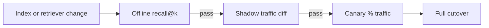

# 3. Cost and Retrieval Eval

> Cost the full path — embed, store, query, rerank — and gate releases on retrieval metrics from a golden set. Without both, teams overpay for indexes that still miss the answer.

## Table of Contents

- [Definition](#definition)
- [Cost Model](#cost-model)
- [Quality Metrics](#quality-metrics)
- [Golden Sets](#golden-sets)
- [Online Signals](#online-signals)
- [CI Quality Gates](#ci-quality-gates)
- [Python Examples](#python-examples)
- [Optimization Levers](#optimization-levers)
- [Interview Preparation](#interview-preparation)
- [Navigation](#navigation)

---

## Definition

**Retrieval evaluation** measures whether the right chunks appear in top-k before the LLM sees them. **Cost evaluation** measures dollars and capacity to achieve that quality under load.

---

## Cost Model

```text
monthly ≈ embed_ingest + embed_query + storage + query_units + rerank + ops
```

| Component | Drivers |
|-----------|---------|
| Embed ingest | Corpus tokens × reindex frequency × $/1k tokens |
| Embed query | QPS × tokens/query × cache hit rate |
| Storage | Vectors × dim × replicas (+ payload) |
| Query units | Managed VDB pricing, or CPU/RAM for self-host |
| Rerank | Candidates × $/request |

Always include **reindex events** in annual cost — model upgrades are not free.

---

## Quality Metrics

| Metric | Meaning |
|--------|---------|
| **Recall@k** | Fraction of relevant docs captured in top-k |
| **MRR** | Mean reciprocal rank of first relevant hit |
| **nDCG@k** | Graded relevance quality |
| **Hit rate** | ≥1 relevant in top-k |
| **Faithfulness proxy** | Downstream: grounded answer rate (RAG eval) |

Optimize retrieval metrics **before** blaming the LLM for bad answers.

---

## Golden Sets

1. Sample real queries (anonymized).
2. Label relevant chunk IDs (binary or graded).
3. Stratify: navigational, paraphrases, keyword/ID lookups, long-tail.
4. Version the set next to `index_version`.
5. Exclude training/tuning queries from final holdout.

Size guidance: start with 50–100 labeled queries; grow to hundreds for production gates.

---

## Online Signals

- User thumbs / explicit feedback
- Citation click-through
- “No result” and empty-filter rates
- Reranker score distributions
- Guardrail: track regressions after chunker/model changes

Online data complements — does not replace — offline golden sets.

---

## CI Quality Gates



Fail the build if recall@k drops more than a set epsilon without an approved exception.

---

## Python Examples

```python
def recall_at_k(relevant: set[str], retrieved: list[str], k: int) -> float:
    if not relevant:
        return 0.0
    return len(relevant & set(retrieved[:k])) / len(relevant)


def mrr(relevant: set[str], retrieved: list[str]) -> float:
    for i, doc_id in enumerate(retrieved, start=1):
        if doc_id in relevant:
            return 1.0 / i
    return 0.0


def estimate_monthly_cost(
    corpus_tokens: int,
    reindexes_per_month: float,
    queries_per_month: int,
    tokens_per_query: int,
    embed_per_1k: float,
    store_fixed: float,
    query_unit_cost: float,
) -> float:
    ingest = (corpus_tokens / 1000) * embed_per_1k * reindexes_per_month
    q_embed = (queries_per_month * tokens_per_query / 1000) * embed_per_1k
    q_search = queries_per_month * query_unit_cost
    return ingest + q_embed + store_fixed + q_search
```

---

## Optimization Levers

- Cache query embeddings for popular questions
- Matryoshka truncation to cut storage/IO
- Over-fetch less if reranker is expensive
- Tiered storage: hot tenants on HNSW RAM, cold on disk ANN
- Hybrid may reduce required dense `top_k` for ID-heavy queries

---

## Interview Preparation

**Q: LLM answer quality dropped — where do you look first?**

> Retrieval: recall@k on golden queries, citation presence, then prompt/model. Bad context dominates.

**Q: How do you cost a vector stack?**

> Sum embed (ingest+query), storage/replicas, query units or compute, rerank, and planned reindex events.

---

## Navigation

- **Prev:** [Reindex & Drift](02-reindex-and-drift.md)
- **Related:** [RAG handbook](../../rag/README.md) · [LLM Evaluation](../../ai-evaluation/README.md)
- **Section hub:** [Operations](README.md)
