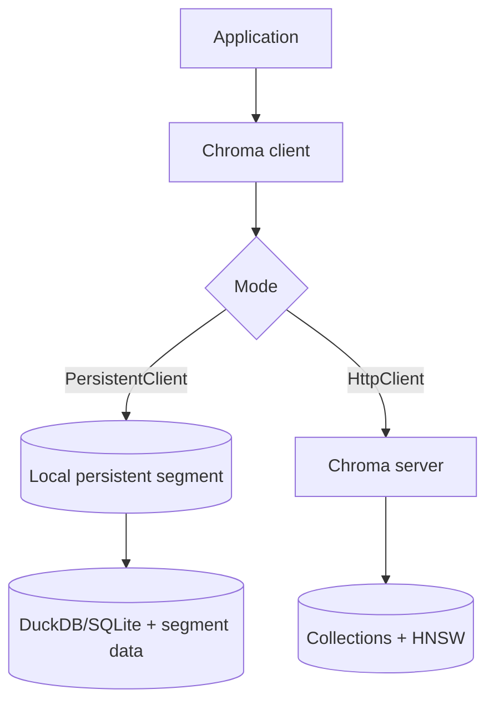

# 1. Chroma

> Chroma is an open-source embedding database with a small Python API — excellent for local development and modest production knowledge bases, with a clear graduation path when scale or tenancy hardens.

## Table of Contents

- [Definition](#definition)
- [When to Use](#when-to-use)
- [Architecture](#architecture)
- [Collections and Metadata](#collections-and-metadata)
- [Python Examples](#python-examples)
- [Ops Notes](#ops-notes)
- [Limitations](#limitations)
- [Comparison Snapshot](#comparison-snapshot)
- [Interview Preparation](#interview-preparation)
- [Navigation](#navigation)

---

## Definition

**Chroma** stores documents, embeddings, and metadata; it can embed for you (via integrated functions) or accept precomputed vectors. It runs **embedded** in-process (`PersistentClient`) or as a **client–server** deployment.

| Aspect | Detail |
|--------|--------|
| Architecture | Embedded or client-server |
| Index | HNSW (backend) |
| Strengths | Fast DX, simple filters, OSS + Chroma Cloud |
| Weaknesses | Less battle-tested at massive multi-tenant scale |
| Best for | MVPs, local RAG, small–medium corpora |

---

## When to Use

**Use Chroma when:**

- You want a working RAG loop in minutes
- Corpus is thousands to low millions of chunks
- Team prefers Python-native APIs over SQL/infra-heavy stacks
- Single-tenant or light tenancy via metadata filters is enough

**Choose something else when:**

- You need hard multi-tenant isolation and quotas at SaaS scale
- You already standardize on Postgres (prefer pgvector)
- You need billion-scale distributed ANN (Milvus/FAISS)

---

## Architecture



Ingest path: documents → (optional embed) → collection.add → HNSW upsert.  
Query path: query texts/vectors → metadata `where` filter → ANN top-k.

---

## Collections and Metadata

- One **collection** ≈ one embedding space (model + metric + dim).
- Set distance at create time: `hnsw:space` = `cosine` | `l2` | `ip`.
- Metadata fields support simple equality/`$and`/`$or` filters — design `tenant_id` early.
- Changing embedding model ⇒ **new collection** (or full rebuild).

---

## Python Examples

```python
import chromadb

client = chromadb.PersistentClient(path="./chroma_db")
collection = client.get_or_create_collection(
    name="kb_v1",
    metadata={"hnsw:space": "cosine", "embedding_model": "bge-small-en-v1.5"},
)

collection.add(
    ids=["policy:refund:0"],
    documents=["Refund policy: 3 business days after approval."],
    metadatas=[{"tenant_id": "acme", "doc_type": "policy", "doc_id": "refund"}],
)

results = collection.query(
    query_texts=["how long for refund"],
    n_results=5,
    where={"tenant_id": "acme"},
    include=["documents", "metadatas", "distances"],
)
print(results["ids"][0], results["documents"][0])
```

```python
# Precomputed vectors — keep model outside Chroma
collection.add(
    ids=["policy:refund:0"],
    embeddings=[[0.01, 0.02, /* ... dim floats ... */]],
    documents=["Refund policy: 3 business days after approval."],
    metadatas=[{"tenant_id": "acme", "embedding_model": "text-embedding-3-small"}],
)

hits = collection.query(
    query_embeddings=[query_vec],
    n_results=10,
    where={"$and": [{"tenant_id": "acme"}, {"doc_type": "policy"}]},
)
```

```python
# Idempotent re-chunk: delete by id prefix then add
existing = collection.get(where={"doc_id": "refund"})
if existing["ids"]:
    collection.delete(ids=existing["ids"])
```

---

## Ops Notes

- Persist `path=` on a durable volume; ephemeral disks lose the index.
- Backup by snapshotting the persistence directory consistently.
- Pin embedding model in collection metadata; never mix models.
- For server mode, put TLS and auth in front (API gateway / private network).
- Watch disk growth: documents + vectors + HNSW overhead.
- Graduate to Qdrant/pgvector/Pinecone when QPS, tenancy, or HA requirements exceed comfort.

---

## Limitations

- Filter language is simpler than Qdrant/Postgres.
- Operational maturity (sharding, replicas, enterprise SSO) trails dedicated clusters.
- “Embed for me” convenience can hide model versioning — prefer explicit vectors in production.

---

## Comparison Snapshot

| vs FAISS | Higher-level API, built-in persistence/metadata |
| vs pgvector | Less SQL power; easier local DX |
| vs Qdrant | Lighter ops; fewer production filter/HA features |

---

## Interview Preparation

**Q: Is Chroma production-ready?**

> Yes for small–medium workloads with disciplined persistence and model versioning; evaluate carefully for large multi-tenant SaaS.

**Q: How do you change embedding models?**

> Create a new collection, re-embed, evaluate, cut over — do not mix vectors in one collection.

---

## Navigation

- **Next:** [FAISS](02-faiss.md)
- **RAG primer (legacy):** [rag/providers/01-chroma.md](../../rag/providers/01-chroma.md)
- **Section hub:** [Providers](README.md)
