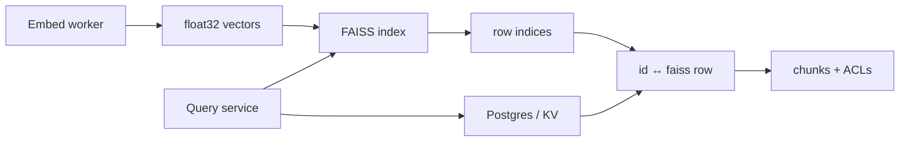

# 2. FAISS

> FAISS (Facebook AI Similarity Search) is a **library**, not a database — maximum control over ANN indexes (CPU/GPU) when you own persistence, metadata, and the serving API.

## Table of Contents

- [Definition](#definition)
- [When to Use](#when-to-use)
- [Architecture](#architecture)
- [Index Cheatsheet](#index-cheatsheet)
- [Python Examples](#python-examples)
- [Ops Notes](#ops-notes)
- [Limitations](#limitations)
- [Comparison Snapshot](#comparison-snapshot)
- [Interview Preparation](#interview-preparation)
- [Navigation](#navigation)

---

## Definition

**FAISS** builds in-process indexes over float/binary vectors and searches them efficiently. You decide how to store IDs, payloads, snapshots, and multi-tenant isolation.

| Aspect | Detail |
|--------|--------|
| Architecture | In-process index objects |
| Strengths | Speed, GPU, IVF+PQ at huge scale, free OSS |
| Weaknesses | No built-in metadata server or filters |
| Best for | Research, custom high-throughput, on-prem control |

---

## When to Use

**Use FAISS when:**

- You need IVF-PQ / GPU search at very large N
- Custom sharding and metadata already live in Postgres/Redis
- You are embedding FAISS inside workers you control

**Avoid as sole store when:**

- You want managed filters, RBAC, and SaaS ops out of the box
- Team cannot own snapshotting, rebuilds, and ID maps

---

## Architecture



Pattern: FAISS for ANN; relational/KV for payloads and ACL; application joins results.

---

## Index Cheatsheet

| Index | Notes |
|-------|-------|
| `IndexFlatIP` / `L2` | Exact — eval baseline |
| `IndexHNSWFlat` | Strong mid-scale recall |
| `IndexIVFFlat` | Coarse quantizer + flat lists |
| `IndexIVFPQ` | Memory-efficient large scale |
| `IndexIDMap` / `IDMap2` | Map to external 64-bit IDs |

Always match metric to embedding normalization (IP on unit vectors ≈ cosine).

---

## Python Examples

```python
import faiss
import numpy as np

dim = 768
vectors = np.random.random((10_000, dim)).astype("float32")
faiss.normalize_L2(vectors)

index = faiss.IndexHNSWFlat(dim, 32)
index.hnsw.efConstruction = 200
index.add(vectors)
index.hnsw.efSearch = 64

q = np.random.random((1, dim)).astype("float32")
faiss.normalize_L2(q)
distances, indices = index.search(q, k=5)
```

```python
# IVF-PQ with ID map
nlist, m = 1024, 16
quantizer = faiss.IndexFlatIP(dim)
ivf = faiss.IndexIVFPQ(quantizer, dim, nlist, m, 8)
ivf.train(vectors)
id_index = faiss.IndexIDMap2(ivf)
ids = np.arange(len(vectors)).astype("int64")
id_index.add_with_ids(vectors, ids)
ivf.nprobe = 16

# Persist
faiss.write_index(id_index, "kb_v12.faiss")
loaded = faiss.read_index("kb_v12.faiss")
```

```python
# Metadata join sketch
def search_with_payload(index, meta_db, query_vec, k=10, tenant=None):
    faiss.normalize_L2(query_vec)
    scores, ids = index.search(query_vec, k * 5)  # over-fetch if filtering
    hits = []
    for score, i in zip(scores[0], ids[0]):
        if i < 0:
            continue
        row = meta_db.get(int(i))
        if tenant and row["tenant_id"] != tenant:
            continue
        hits.append((score, row))
        if len(hits) >= k:
            break
    return hits
```

---

## Ops Notes

- Snapshot index files atomically (write temp + rename); version filenames with `index_version`.
- Rebuild on embedding model change; keep ID map and payload DB in sync.
- GPU: `StandardGpuResources` + `index_cpu_to_gpu` for large batch search — plan host RAM for staging.
- Deletes are awkward on some index types — mark tombstones in metadata or rebuild periodically.
- Warm up indexes on deploy to avoid first-query latency spikes.

---

## Limitations

- Filters are your problem (pre-filter via separate structures or post-filter).
- No native replication — put a service layer + shared storage/sharding design in front.
- Operational complexity grows quickly past a single machine.

---

## Comparison Snapshot

| vs Chroma | Lower-level, more control, more glue |
| vs Milvus | Library vs distributed database |
| vs Pinecone | Self-managed performance vs SaaS convenience |

---

## Interview Preparation

**Q: Why pair FAISS with Postgres?**

> FAISS lacks rich metadata/ACL; Postgres holds payloads and tenancy while FAISS returns neighbor IDs.

**Q: Flat vs IVF-PQ?**

> Flat for exact/small; IVF-PQ when memory and N demand compression and coarse filtering.

---

## Navigation

- **Prev:** [Chroma](01-chroma.md)
- **Next:** [pgvector](03-pgvector.md)
- **Section hub:** [Providers](README.md)
