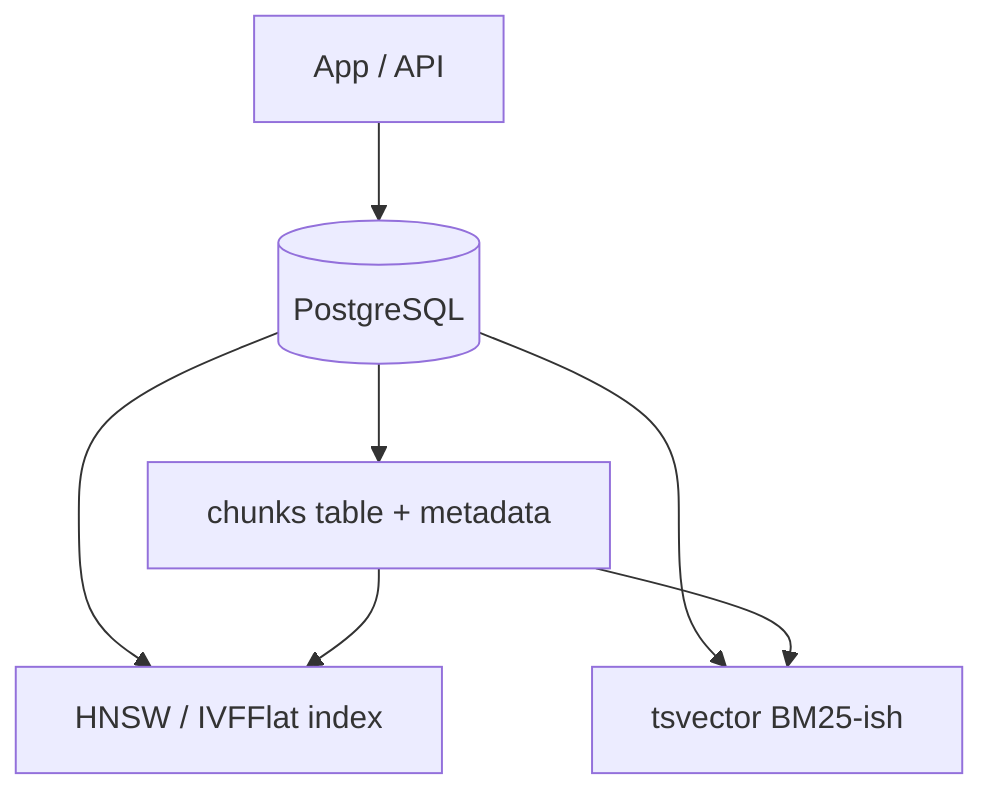

# 3. pgvector

> **pgvector** extends PostgreSQL with a `vector` type and ANN indexes so embeddings live next to transactional metadata — ideal when Postgres is already your system of record.

## Table of Contents

- [Definition](#definition)
- [When to Use](#when-to-use)
- [Architecture](#architecture)
- [Indexes and Ops Classes](#indexes-and-ops-classes)
- [Python / SQL Examples](#python--sql-examples)
- [Ops Notes](#ops-notes)
- [Limitations](#limitations)
- [Comparison Snapshot](#comparison-snapshot)
- [Interview Preparation](#interview-preparation)
- [Navigation](#navigation)

---

## Definition

pgvector adds similarity operators and **HNSW** / **IVFFlat** indexes inside Postgres. You query with SQL: filters, joins, permissions, and vectors in one plan (within reason).

| Aspect | Detail |
|--------|--------|
| Architecture | Vectors in PG tables + ANN index |
| Strengths | ACID, joins, RLS, familiar ops |
| Weaknesses | Not a billion-scale vector warehouse |
| Best for | Enterprise PG shops, hybrid SQL+RAG, moderate N |

---

## When to Use

**Use pgvector when:**

- Postgres already stores documents/tenants/users
- You want one backup/HA story
- Corpus size and QPS fit comfortably on your PG class
- Row-level security matters

**Move out when:**

- Vector search saturates primary OLTP CPU/IO
- You need specialized filtered ANN features at huge scale

---

## Architecture



Keep chunk text, tenant keys, and embeddings in one row (or split text to TOAST-aware design) and cite via `doc_id`.

---

## Indexes and Ops Classes

| Ops class | Metric |
|-----------|--------|
| `vector_cosine_ops` | Cosine distance |
| `vector_ip_ops` | Inner product |
| `vector_l2_ops` | Euclidean |

HNSW is the modern default; IVFFlat needs training-like clustering and is older guidance in many docs.

---

## Python / SQL Examples

```sql
CREATE EXTENSION IF NOT EXISTS vector;

CREATE TABLE chunks (
  id TEXT PRIMARY KEY,
  tenant_id TEXT NOT NULL,
  doc_id TEXT NOT NULL,
  content TEXT NOT NULL,
  embedding vector(1536) NOT NULL,
  search_tsv tsvector GENERATED ALWAYS AS (to_tsvector('english', content)) STORED
);

CREATE INDEX chunks_tenant_idx ON chunks (tenant_id);
CREATE INDEX chunks_hnsw ON chunks USING hnsw (embedding vector_cosine_ops)
  WITH (m = 16, ef_construction = 64);
CREATE INDEX chunks_fts ON chunks USING gin (search_tsv);
```

```python
# asyncpg sketch
SQL = """
SELECT id, content, 1 - (embedding <=> $1::vector) AS score
FROM chunks
WHERE tenant_id = $2
ORDER BY embedding <=> $1::vector
LIMIT $3
"""

async def search(conn, query_vec: list[float], tenant_id: str, k: int = 5):
    vec_literal = "[" + ",".join(str(x) for x in query_vec) + "]"
    return await conn.fetch(SQL, vec_literal, tenant_id, k)
```

```sql
-- Hybrid: fetch both legs then fuse in app (or FULL OUTER JOIN)
-- Vector leg
SELECT id FROM chunks
WHERE tenant_id = $tenant
ORDER BY embedding <=> $qvec LIMIT 50;

-- Lexical leg
SELECT id FROM chunks
WHERE tenant_id = $tenant
  AND search_tsv @@ plainto_tsquery('english', $q)
ORDER BY ts_rank(search_tsv, plainto_tsquery('english', $q)) DESC
LIMIT 50;
```

---

## Ops Notes

- Set `hnsw.ef_search` per session/transaction for recall/latency.
- Bulk load: insert, then create index (or tune maintenance_work_mem).
- `VACUUM`/autovacuum after mass updates/deletes.
- Use **RLS** policies on `tenant_id` for defense in depth.
- Monitor whether ANN queries compete with OLTP — isolate on a read replica or separate PG if needed.
- Dimension is part of column type — changing dim means migration.

---

## Limitations

- Very large pure-vector workloads favor Milvus/FAISS/Qdrant.
- Some filtered ANN edge cases are less sophisticated than purpose-built VDBs.
- Extension versions differ across managed PG vendors — verify support.

---

## Comparison Snapshot

| vs Pinecone | More ops, deeper SQL, no per-query SaaS units |
| vs Qdrant | Better joins/transactions; weaker specialist vector features |
| vs FAISS | Filters/HA come “free” with Postgres |

---

## Interview Preparation

**Q: Why pgvector for RAG?**

> Unified transactional data + vectors, RLS, and hybrid `tsvector` without a second system — until scale demands split.

**Q: HNSW vs IVFFlat in pgvector?**

> HNSW is generally preferred for query quality/ops simplicity today; verify on your PG/pgvector version.

---

## Navigation

- **Prev:** [FAISS](02-faiss.md)
- **Next:** [Pinecone](04-pinecone.md)
- **Section hub:** [Providers](README.md)
