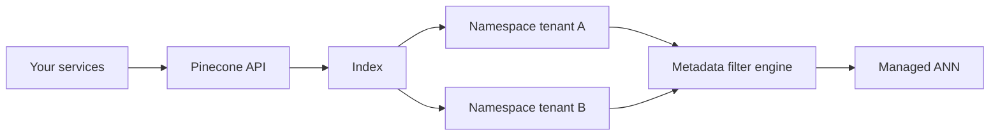

# 4. Pinecone

> Pinecone is a fully managed vector database — minimal ops, namespaces for isolation, and metadata filtering — trading vendor lock-in and usage cost for speed to production.

## Table of Contents

- [Definition](#definition)
- [When to Use](#when-to-use)
- [Architecture](#architecture)
- [Indexes, Namespaces, and Metadata](#indexes-namespaces-and-metadata)
- [Python Examples](#python-examples)
- [Ops Notes](#ops-notes)
- [Cost Awareness](#cost-awareness)
- [Limitations](#limitations)
- [Comparison Snapshot](#comparison-snapshot)
- [Interview Preparation](#interview-preparation)
- [Navigation](#navigation)

---

## Definition

**Pinecone** exposes upsert/query APIs over managed ANN indexes. You do not operate HNSW graphs yourself; you configure dimension, metric, and cloud region, then ship vectors.

| Aspect | Detail |
|--------|--------|
| Architecture | Managed SaaS (serverless / historically pods) |
| Strengths | Ops-free ANN, filters, namespaces |
| Weaknesses | Cost at scale, lock-in, less SQL |
| Best for | Fast enterprise launch, variable traffic |

---

## When to Use

**Use Pinecone when:**

- Team wants near-zero vector infra
- Multi-tenant SaaS can map tenants → namespaces
- Bursting query load would be painful on self-host

**Prefer alternatives when:**

- Strict on-prem / air-gapped requirements (unless their enterprise offerings fit)
- Cost model favors self-host at steady high QPS
- You need deep hybrid BM25 in-database (Weaviate/OpenSearch)

---

## Architecture



Control plane: create index (dim, metric). Data plane: upsert/query/delete by namespace.

---

## Indexes, Namespaces, and Metadata

- **Metric and dimension are fixed** at index creation — plan migrations as new indexes.
- **Namespaces** isolate tenants/environments without separate indexes (still enforce auth in app).
- Metadata filters: equality/ranges on declared fields — keep payloads lean.
- Batch upserts (e.g. 100–200 vectors) for throughput.

---

## Python Examples

```python
from pinecone import Pinecone

pc = Pinecone(api_key="...")
index = pc.Index("kb-prod")

index.upsert(
    namespace="tenant:acme",
    vectors=[{
        "id": "policy:refund:0",
        "values": embedding,  # list[float] length == index dim
        "metadata": {
            "doc_type": "policy",
            "doc_id": "refund",
            "embedding_model": "text-embedding-3-small",
        },
    }],
)

results = index.query(
    namespace="tenant:acme",
    vector=query_embedding,
    top_k=10,
    filter={"doc_type": {"$eq": "policy"}},
    include_metadata=True,
)
```

```python
# Safe delete + re-upsert for a document
def reindex_doc(index, namespace: str, doc_id: str, points: list[dict]):
    # Prefer listing by metadata if your plan/API supports; else track ids in app DB
    old_ids = [p["id"] for p in points]  # if deterministic ids, overwrite via upsert
    index.upsert(namespace=namespace, vectors=points)
```

```python
# Dual-index cutover sketch
READY = False  # set true after backfill+eval
active = "kb-v12" if READY else "kb-v11"
index = pc.Index(active)
```

---

## Ops Notes

- Pin `environment`/region for latency and residency.
- Monitor read/write units; alert on cost anomalies.
- Cache frequent query embeddings in your app.
- Store mapping `doc_id → vector ids` externally for GDPR deletes.
- Practice creating a sibling index for model upgrades; never “mutate metric.”
- Use separate namespaces for `prod` vs `staging` even within one tenant scheme.

---

## Cost Awareness

Serverless bills on usage; large reindexes and high QPS dominate. Model:

```text
cost ≈ storage + write units (ingest/reindex) + read units (query)
```

Compare annual cost against Qdrant/pgvector self-host TCO including people time.

---

## Limitations

- Less transparent index knobs than FAISS.
- Hybrid lexical usually requires an external search engine.
- Vendor API changes and pricing require abstraction layers.

---

## Comparison Snapshot

| vs Qdrant | Less ops, more $ / lock-in |
| vs pgvector | Better pure-vector scale-out story; weaker SQL joins |
| vs Milvus/Zilliz | Similar “managed vector” niche via Zilliz Cloud |

---

## Interview Preparation

**Q: How do you isolate tenants in Pinecone?**

> Prefer namespaces (and/or metadata filters), with tenant identity from auth — never trust client-supplied namespace alone.

**Q: How do you change embedding dimensions?**

> Create a new index with the new dim/metric, re-embed, dual-run, cut over.

---

## Navigation

- **Prev:** [pgvector](03-pgvector.md)
- **Next:** [Qdrant](05-qdrant.md)
- **Section hub:** [Providers](README.md)
