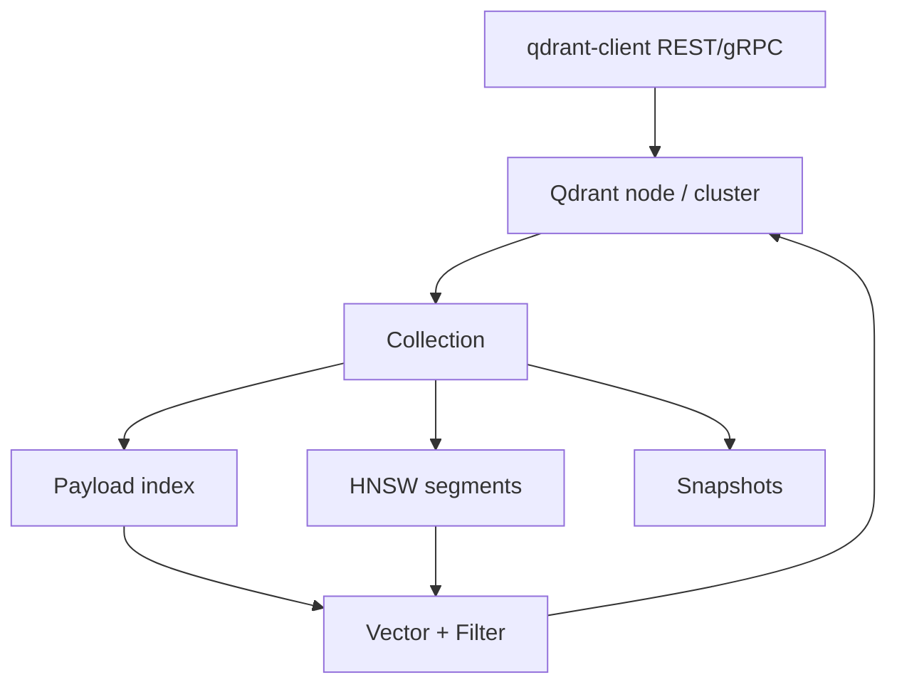

# 5. Qdrant

> Qdrant is a high-performance vector database written in Rust with first-class **payload filtering** — a popular self-host and cloud choice for production RAG.

## Table of Contents

- [Definition](#definition)
- [When to Use](#when-to-use)
- [Architecture](#architecture)
- [Collections, Points, Payloads](#collections-points-payloads)
- [Python Examples](#python-examples)
- [Ops Notes](#ops-notes)
- [Limitations](#limitations)
- [Comparison Snapshot](#comparison-snapshot)
- [Interview Preparation](#interview-preparation)
- [Navigation](#navigation)

---

## Definition

**Qdrant** stores points `(id, vector, payload)` in collections, serves filtered HNSW search, and supports snapshots, replication, and quantization.

| Aspect | Detail |
|--------|--------|
| Architecture | Collections, shards, replicas |
| Strengths | Fast filtered ANN, clean API, OSS + cloud |
| Weaknesses | Smaller beginner ecosystem than some SaaS |
| Best for | Production self-host with serious metadata filters |

---

## When to Use

**Use Qdrant when:**

- Filtered vector search is a core requirement
- You want Docker/K8s self-host or Qdrant Cloud
- gRPC performance matters

**Consider others when:**

- You need native BM25+vector in one query (Weaviate) without extra pieces
- You insist on SQL-only stacks (pgvector)

---

## Architecture



Filtered search aims to apply payload constraints during ANN — critical for multi-tenant correctness.

---

## Collections, Points, Payloads

- Collection defines vector size, distance, and optional multiple named vectors.
- Payload fields used in filters should get **payload indexes**.
- Point IDs may be UUID or unsigned integers — deterministic string UUIDs work well for docs.
- Quantization reduces memory at some recall cost — measure.

---

## Python Examples

```python
from qdrant_client import QdrantClient
from qdrant_client.models import (
    Distance, VectorParams, PointStruct,
    Filter, FieldCondition, MatchValue, PayloadSchemaType,
)

client = QdrantClient(url="http://localhost:6333")

client.create_collection(
    collection_name="kb_v12",
    vectors_config=VectorParams(size=768, distance=Distance.COSINE),
)
client.create_payload_index(
    collection_name="kb_v12",
    field_name="tenant_id",
    field_schema=PayloadSchemaType.KEYWORD,
)

client.upsert(
    collection_name="kb_v12",
    points=[PointStruct(
        id="a0eebc99-9c0b-4ef8-bb6d-6bb9bd380a11",
        vector=embedding,
        payload={
            "tenant_id": "acme",
            "content": "Refund in 3 days.",
            "doc_id": "p-44",
            "embedding_model": "bge-base-en-v1.5",
        },
    )],
)

hits = client.search(
    collection_name="kb_v12",
    query_vector=query_embedding,
    query_filter=Filter(must=[
        FieldCondition(key="tenant_id", match=MatchValue(value="acme")),
    ]),
    limit=10,
    with_payload=True,
)
```

```python
# Delete all points for a document
client.delete(
    collection_name="kb_v12",
    points_selector=Filter(must=[
        FieldCondition(key="doc_id", match=MatchValue(value="p-44")),
        FieldCondition(key="tenant_id", match=MatchValue(value="acme")),
    ]),
)
```

---

## Ops Notes

- Use snapshots for backup; test restore regularly.
- Prefer gRPC clients for lower latency under load.
- Tune `hnsw_ef` at query time for recall/latency.
- Enable quantization for large collections after eval.
- Shard/replicate in cluster mode for HA; watch disk for WAL + segments.
- Put TLS and network policies around self-hosted deployments.

---

## Limitations

- Full-text BM25 may need accompanying search or sparse vectors setup.
- Cluster ops still require SRE skills (vs pure SaaS).
- Payload design mistakes (unindexed filters) show up as latency.

---

## Comparison Snapshot

| vs Pinecone | More control/self-host; more ops |
| vs Weaviate | Stronger “filter-first vector DB” feel; hybrid differs |
| vs Milvus | Often simpler ops at mid-scale |

---

## Interview Preparation

**Q: Why do payload indexes matter?**

> Filters on unindexed fields degrade performance; tenant_id and doc_type almost always deserve indexes.

**Q: How does Qdrant help multitenancy?**

> Filtered HNSW with mandatory tenant payload conditions (or separate collections for hard isolation).

---

## Navigation

- **Prev:** [Pinecone](04-pinecone.md)
- **Next:** [Weaviate](06-weaviate.md)
- **Section hub:** [Providers](README.md)
