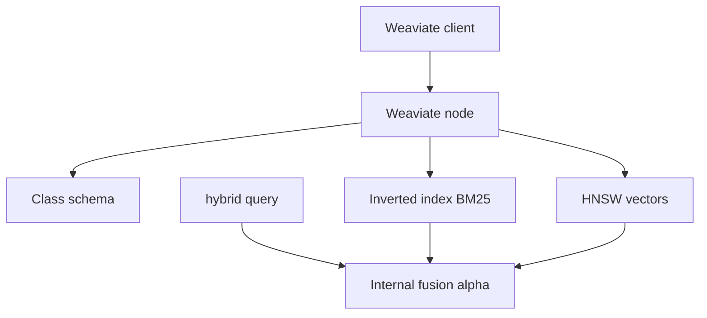

# 6. Weaviate

> Weaviate is an open-source vector database with **native hybrid search** (BM25 + vector), schema’d classes, and modular vectorizers — minimizing glue for lexical+dense retrieval.

## Table of Contents

- [Definition](#definition)
- [When to Use](#when-to-use)
- [Architecture](#architecture)
- [Schema and Hybrid Search](#schema-and-hybrid-search)
- [Python Examples](#python-examples)
- [Ops Notes](#ops-notes)
- [Limitations](#limitations)
- [Comparison Snapshot](#comparison-snapshot)
- [Interview Preparation](#interview-preparation)
- [Navigation](#navigation)

---

## Definition

**Weaviate** stores objects in classes/collections with properties, inverted indexes for BM25, and HNSW for vectors. Queries can be vector, keyword, or **hybrid** with an `alpha` blend.

| Aspect | Detail |
|--------|--------|
| Architecture | Go core; REST/gRPC; optional modules |
| Strengths | Native hybrid, schema, modules |
| Weaknesses | Learning curve vs minimal APIs |
| Best for | Hybrid search without custom fusion services |

---

## When to Use

**Use Weaviate when:**

- Hybrid BM25+vector is a day-one requirement
- You want schema properties and inverted indexes built-in
- Cloud or self-host both acceptable

**Consider others when:**

- You only need simple vector CRUD with filters (Qdrant/Chroma)
- Deep SQL joins dominate (pgvector)

---

## Architecture



Vectorizers can run as modules (bring-your-own vectors is preferred for version control).

---

## Schema and Hybrid Search

- Define properties with types; mark tokenization for text fields.
- `alpha=0` → pure BM25; `alpha=1` → pure vector; mid values blend.
- Multi-tenancy features available — use them instead of DIY filters when offered for your version.
- Backup before schema-breaking migrations.

---

## Python Examples

```python
import weaviate
from weaviate.classes.config import Configure, Property, DataType
from weaviate.classes.query import Filter

client = weaviate.connect_to_local()

client.collections.create(
    name="KbChunk",
    vectorizer_config=Configure.Vectorizer.none(),
    properties=[
        Property(name="content", data_type=DataType.TEXT),
        Property(name="tenant_id", data_type=DataType.TEXT),
        Property(name="doc_id", data_type=DataType.TEXT),
    ],
)

collection = client.collections.get("KbChunk")
collection.data.insert(
    properties={
        "content": "Refund in 3 business days.",
        "tenant_id": "acme",
        "doc_id": "refund",
    },
    vector=embedding,
)

response = collection.query.hybrid(
    query="refund timeline",
    vector=query_embedding,
    alpha=0.5,
    limit=5,
    filters=Filter.by_property("tenant_id").equal("acme"),
)
for obj in response.objects:
    print(obj.properties["content"], obj.metadata.score)
```

```python
# Tune alpha on an eval set
def sweep_alpha(run_hybrid, alphas=(0.0, 0.25, 0.5, 0.75, 1.0)):
    return {a: run_hybrid(alpha=a) for a in alphas}
```

---

## Ops Notes

- Prefer bringing your own vectors so embedding model versions stay explicit.
- Monitor hybrid vs vector-only quality — alpha is a product knob, not set-and-forget.
- Use tenancy APIs for SaaS isolation when available; still authZ in the app.
- Snapshot/backup before class migrations; schema changes can be heavy.
- Size memory for HNSW + text indexes — hybrid stores more than vectors alone.

---

## Limitations

- Concepts (classes, modules) take longer to learn than Chroma.
- Version differences between Weaviate releases matter — pin server + client.
- Over-reliance on server-side vectorizer modules can obscure model drift.

---

## Comparison Snapshot

| vs Qdrant | Better built-in BM25 hybrid; different filter DX |
| vs OpenSearch | Vector+text also possible; Weaviate is vector-first |
| vs Pinecone | Self-host hybrid vs managed dense-first |

---

## Interview Preparation

**Q: What does hybrid `alpha` do?**

> Balances BM25 vs vector contributions; tune on labeled queries.

**Q: Why bring your own vectors?**

> Explicit model versioning, consistent dims, and portable migrations across providers.

---

## Navigation

- **Prev:** [Qdrant](05-qdrant.md)
- **Next:** [Milvus](07-milvus.md)
- **Section hub:** [Providers](README.md)
