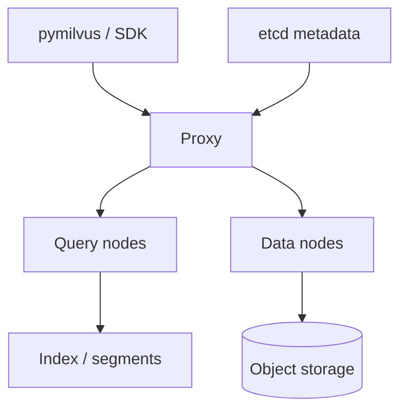

# 7. Milvus

> Milvus is an open-source **distributed** vector database aimed at large-scale embedding search — storage/compute separation, rich indexes, and Zilliz Cloud as a managed path.

## Table of Contents

- [Definition](#definition)
- [When to Use](#when-to-use)
- [Architecture](#architecture)
- [Collections, Partitions, Indexes](#collections-partitions-indexes)
- [Python Examples](#python-examples)
- [Ops Notes](#ops-notes)
- [Limitations](#limitations)
- [Comparison Snapshot](#comparison-snapshot)
- [Interview Preparation](#interview-preparation)
- [Navigation](#navigation)

---

## Definition

**Milvus** coordinates query nodes, data nodes, and object storage to serve ANN at high scale with indexes such as HNSW, IVF, and DiskANN. **Zilliz Cloud** offers managed Milvus.

| Aspect | Detail |
|--------|--------|
| Architecture | Cloud-native; K8s-friendly |
| Strengths | Scale, index variety, hybrid features maturing |
| Weaknesses | Operational complexity self-hosting |
| Best for | Large corpora, on-prem/cloud scale-out |

---

## When to Use

**Use Milvus when:**

- Vector counts and QPS exceed comfortable single-node VDBs
- You need flexible index types including disk-oriented options
- K8s platform teams can own the dependency (or you use Zilliz)

**Avoid as first prototype when:**

- A laptop Chroma/pgvector demo would unblock product learning faster

---

## Architecture



Understand **segments**, flush, and compaction — they drive ingest freshness and latency.

---

## Collections, Partitions, Indexes

- Collection ≈ table with vector field + scalar fields.
- **Partitions** (e.g. by `tenant_id`) improve isolation and prune search.
- Build index explicitly; `load()` collection into query nodes before search.
- Expression filters (`expr`) combine with ANN — test selectivity.

---

## Python Examples

```python
from pymilvus import connections, FieldSchema, CollectionSchema, DataType, Collection, utility

connections.connect(uri="http://localhost:19530")

fields = [
    FieldSchema(name="id", dtype=DataType.VARCHAR, is_primary=True, max_length=64),
    FieldSchema(name="tenant_id", dtype=DataType.VARCHAR, max_length=64),
    FieldSchema(name="content", dtype=DataType.VARCHAR, max_length=2048),
    FieldSchema(name="embedding", dtype=DataType.FLOAT_VECTOR, dim=768),
]
schema = CollectionSchema(fields, description="kb chunks")
collection = Collection("kb_chunks", schema)

collection.create_index(
    field_name="embedding",
    index_params={"index_type": "HNSW", "metric_type": "COSINE", "params": {"M": 16, "efConstruction": 200}},
)
collection.load()

collection.insert([
    ["chunk-1"],
    ["acme"],
    ["Refund in 3 business days."],
    [embedding],
])
collection.flush()

results = collection.search(
    data=[query_embedding],
    anns_field="embedding",
    param={"metric_type": "COSINE", "params": {"ef": 64}},
    limit=10,
    expr='tenant_id == "acme"',
    output_fields=["content", "tenant_id"],
)
```

```python
# Partition by tenant for large SaaS
def ensure_partition(collection: Collection, tenant_id: str) -> str:
    name = f"tenant_{tenant_id}"
    if not collection.has_partition(name):
        collection.create_partition(name)
    return name
```

---

## Ops Notes

- Monitor segment flush lag — search does not see unflushed data the way you might expect.
- Compaction and index build consume resources; schedule heavy ingest windows.
- Use partitions for huge tenants; avoid millions of tiny partitions.
- Zilliz Cloud reduces ops if you lack a platform team.
- Backup/restore and version upgrades need runbooks — treat Milvus as critical data infra.
- Tune `ef` / `nprobe` like any ANN system; record settings next to `index_version`.

---

## Limitations

- Heavier than Chroma/Qdrant single-node for small apps.
- Learning curve around segments, collections, and cluster topology.
- Overkill when pgvector already meets SLOs.

---

## Comparison Snapshot

| vs Qdrant | Stronger distributed scale story; more moving parts |
| vs FAISS | Database features vs library |
| vs Pinecone | OSS/self-host path via Milvus; managed via Zilliz |

---

## Interview Preparation

**Q: When is Milvus justified?**

> When vector scale, throughput, or index flexibility exceed single-node comfort and the team can operate it (or buys Zilliz).

**Q: What is a partition strategy?**

> Route tenants or time windows into partitions to prune search and manage lifecycle — without creating unbounded partition counts.

---

## Navigation

- **Prev:** [Weaviate](06-weaviate.md)
- **Next section:** [Choosing Embedding and VDB](../operations/01-choosing-embedding-and-vdb.md)
- **Section hub:** [Providers](README.md)
