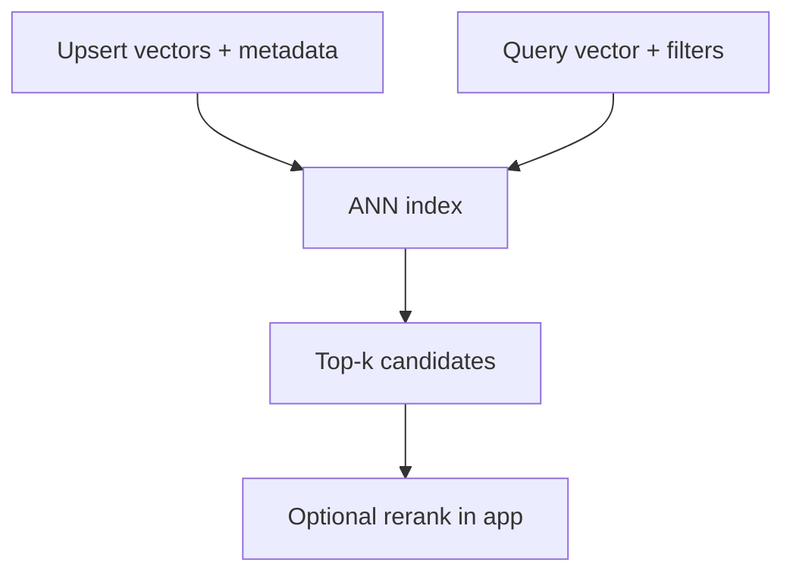

# 1. Vector Databases Explained

> A vector database stores embeddings and serves approximate nearest neighbor queries under latency SLOs — with metadata filters, upserts, tenancy, and operational tooling a raw ANN library leaves to you.

## Table of Contents

- [Definition](#definition)
- [Why It Matters](#why-it-matters)
- [Core Capabilities](#core-capabilities)
- [Library vs Database vs Extension](#library-vs-database-vs-extension)
- [Query Path](#query-path)
- [Operational Concerns](#operational-concerns)
- [When You Need a Dedicated VDB](#when-you-need-a-dedicated-vdb)
- [Python-Shaped Mental Model](#python-shaped-mental-model)
- [Common Mistakes](#common-mistakes)
- [Interview Preparation](#interview-preparation)
- [Navigation](#navigation)

---

## Definition

A **vector database** (or vector-capable store) persists vectors + payload/metadata and answers:

```
query_vector + filters + top_k → ranked points
```

Production systems also need: durability, backups, auth, multitenancy, hybrid search hooks, observability, and predictable reindexing.

---

## Why It Matters

ANN is approximate: you trade recall for latency and cost. The database product wraps the index with the features that keep RAG and memory systems correct under concurrency, tenancy, and growth.



---

## Core Capabilities

| Capability | Why you care |
|------------|--------------|
| ANN index (HNSW/IVF/…) | Interactive semantic search |
| Metadata filters | Tenancy, ACL, doc type, time |
| Upsert / delete | Fresh corpora, GDPR erasure |
| Collections / namespaces | Env and tenant isolation |
| Durability + snapshots | Disaster recovery |
| Metrics | P99, recall proxies, error rates |
| Hybrid / sparse | Lexical + dense in one product |

---

## Library vs Database vs Extension

| Type | Examples | You manage |
|------|----------|------------|
| **Library** | FAISS | Persistence, metadata, API, HA |
| **Extension** | pgvector | Lives inside Postgres ops model |
| **Dedicated VDB** | Qdrant, Weaviate, Milvus, Pinecone, Chroma | Vector-first APIs; ops vary by OSS vs SaaS |

Choose based on platform fit, scale, and filter/hybrid needs — not Twitter hype.

---

## Query Path

1. Embed query with the **same** model used at ingest.
2. Apply **security filters first** (tenant/ACL).
3. ANN search → candidates.
4. Optional fusion with BM25.
5. Optional rerank.
6. Return text + citations to the LLM layer.

---

## Operational Concerns

- **Re-embeds** when model or chunking changes (migration, not a config flip)
- **Compaction / vacuum** after bulk deletes
- **Capacity** — RAM for HNSW, disk for payloads, write amplification
- **SLOs** — separate ingest lag SLO from query P99 SLO
- **Schema evolution** — payload fields used in filters need indexes too

---

## When You Need a Dedicated VDB

Stay on pgvector/FAISS longer if: corpus modest, team knows Postgres, filters are simple SQL.

Move toward dedicated/managed when: QPS and corpus size stress the primary DB, you need advanced filtered ANN, multitenant isolation primitives, or hybrid features without glue code.

---

## Python-Shaped Mental Model

```python
class VectorStore(Protocol):
    def upsert(self, ids: list[str], vectors: list[list[float]], payloads: list[dict]) -> None: ...
    def search(self, vector: list[float], filters: dict, top_k: int) -> list[Hit]: ...
    def delete(self, ids: list[str] | None = None, filters: dict | None = None) -> None: ...
```

Wrap vendors behind this interface so RAG code does not hard-bind to one SDK.

---

## Common Mistakes

- No hybrid lexical fallback when names/IDs matter
- Unlimited namespace growth without retention
- Using the OLTP database as an unbounded vector warehouse
- Ignoring backup/restore drills for the vector cluster

---

## Interview Preparation

**Q: How is a vector DB different from FAISS?**

> FAISS is an in-process index library. A vector DB adds persistence, filters, multi-tenant ops, APIs, and cluster features.

**Q: What must you measure in production?**

> Query P99, ingest lag, filter cardinality effects, recall via offline eval, and cost per 1k queries.

---

## Navigation

- **Next:** [Schema & Filters](02-schema-and-filters.md)
- **Section hub:** [Vector Database Systems](README.md)
- **Topic hub:** [Embeddings & Vector Databases](../README.md)
