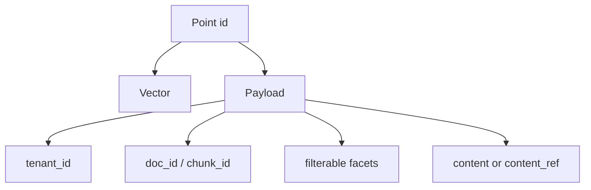

# 2. Schema and Filters

> Vector search without a careful metadata schema becomes an ungoverned blob store. Filters enforce tenancy, freshness, and document type — and they must be designed with the ANN engine in mind.

## Table of Contents

- [Definition](#definition)
- [What Belongs in Payload](#what-belongs-in-payload)
- [Schema Design Patterns](#schema-design-patterns)
- [Filter Semantics](#filter-semantics)
- [Pre-filter vs Post-filter](#pre-filter-vs-post-filter)
- [Indexing Metadata](#indexing-metadata)
- [Evolution and Compatibility](#evolution-and-compatibility)
- [Python Examples](#python-examples)
- [Common Mistakes](#common-mistakes)
- [Interview Preparation](#interview-preparation)
- [Navigation](#navigation)

---

## Definition

**Schema** here means the structured **payload/metadata** attached to each vector point: fields you filter, display, cite, or audit. The embedding is opaque; the payload is how you operate the system.

---

## What Belongs in Payload

| Field | Purpose |
|-------|---------|
| `tenant_id` / `workspace_id` | Isolation |
| `doc_id` / `chunk_id` / `source_uri` | Citations & deletes |
| `doc_type` / `collection` | Business filters |
| `created_at` / `updated_at` | Freshness windows |
| `acl` / `roles` | Authorization |
| `embedding_model` / `index_version` | Migrations |
| `text` or pointer to text store | RAG context |

Keep large binaries out of the vector payload when possible — store text in object storage/DB and keep a pointer if payloads bloat RAM.

---

## Schema Design Patterns



1. **Stable IDs** — deterministic `doc_id:chunk_idx` for idempotent upserts.
2. **Denormalize filter fields** — do not join at query time inside the VDB.
3. **Explicit types** — strings vs keywords vs datetime matter for indexes (Weaviate/Qdrant).

---

## Filter Semantics

Support boolean trees: `must` / `should` / `must_not` (Qdrant-style) or SQL `WHERE` (pgvector).

Examples:

- `tenant_id = X AND doc_type IN (...)`
- `updated_at >= now() - 30d`
- `acl CONTAINS role`

Security filters are **mandatory**, not optional query params from the client.

---

## Pre-filter vs Post-filter

| Mode | Behavior | Risk |
|------|----------|------|
| **Pre-filter** | Constrain search to matching points | Correct tenancy; need engine support |
| **Post-filter** | ANN then drop non-matches | Underflow top-k; cross-tenant work |

For multi-tenant SaaS, demand **filtered ANN** that respects predicates during search.

---

## Indexing Metadata

High-cardinality filter fields may need secondary indexes (Qdrant payload indexes, Postgres btree/GIN, Weaviate inverted indexes). Unindexed filters degrade to slow scans.

---

## Evolution and Compatibility

- Additive optional fields are usually safe.
- Renaming/removing filter fields needs dual-read migration.
- Changing embedding dim or metric ⇒ new collection, not an in-place schema tweak.

---

## Python Examples

```python
from pydantic import BaseModel, Field
from datetime import datetime


class ChunkPayload(BaseModel):
    tenant_id: str
    doc_id: str
    chunk_id: str
    doc_type: str = "article"
    source_uri: str
    text: str
    embedding_model: str
    index_version: int
    updated_at: datetime = Field(default_factory=datetime.utcnow)
    acl_roles: list[str] = Field(default_factory=list)


def point_id(doc_id: str, chunk_idx: int) -> str:
    return f"{doc_id}:{chunk_idx}"


def tenant_filter(tenant_id: str) -> dict:
    # Generic filter AST — adapt per vendor SDK
    return {"must": [{"key": "tenant_id", "match": tenant_id}]}
```

---

## Common Mistakes

- Filtering only in the application after unfiltered search
- Putting all document text only in an external DB with no `content_ref` on the point
- No `doc_id` — cannot delete or re-chunk cleanly
- Unindexed high-selectivity filters causing timeouts

---

## Interview Preparation

**Q: Why is pre-filtering important?**

> Security and correctness: tenants must not see each other’s vectors, and post-filter can return fewer than k results while wasting search work.

**Q: What is a good vector primary key?**

> Deterministic id derived from document and chunk identity so upserts are idempotent.

---

## Navigation

- **Prev:** [Vector Databases Explained](01-vector-databases-explained.md)
- **Next:** [Multi-tenancy](03-multi-tenancy.md)
- **Section hub:** [Vector Database Systems](README.md)
