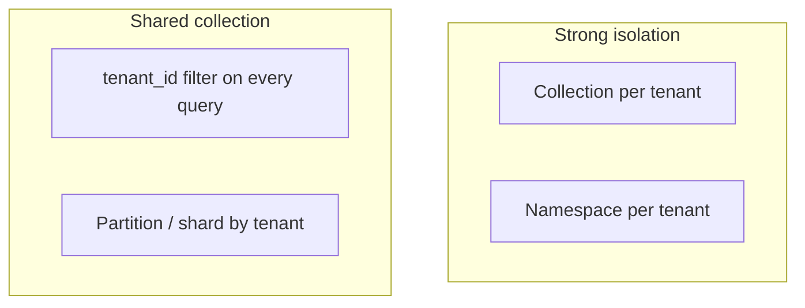

# 3. Multi-tenancy

> Multi-tenant vector systems fail loudly as data leaks. Isolation is a product requirement: choose an isolation model, enforce it on every query, and test it like auth.

## Table of Contents

- [Definition](#definition)
- [Isolation Models](#isolation-models)
- [Comparison](#comparison)
- [Enforcement Patterns](#enforcement-patterns)
- [Noisy Neighbors and Quotas](#noisy-neighbors-and-quotas)
- [Migration and Deletes](#migration-and-deletes)
- [Python Examples](#python-examples)
- [Threat Pitfalls](#threat-pitfalls)
- [Interview Preparation](#interview-preparation)
- [Navigation](#navigation)

---

## Definition

**Multi-tenancy** means many customers/workspaces share infrastructure while their vectors, payloads, and queries remain isolated to the authorization boundary you promise.

---

## Isolation Models



| Model | Mechanism |
|-------|-----------|
| **Collection / index per tenant** | Physical separation |
| **Namespace per tenant** | Logical separation inside one index (e.g. Pinecone) |
| **Payload filter** | Shared index + mandatory `tenant_id` |
| **Partition / shard** | Routing by tenant for scale + partial isolation |

---

## Comparison

| Model | Pros | Cons |
|-------|------|------|
| Per-tenant collection | Hard isolation, easy drop-tenant | Ops overhead at high tenant count |
| Namespace | Simple DX, good mid-ground | Vendor-specific semantics |
| Shared + filter | Efficient density | One missed filter = leak |
| Partition | Scales large tenants | Hot partitions |

Many SaaS systems combine: **namespace or collection for enterprise tiers**, shared filtered collections for free tiers — with careful controls.

---

## Enforcement Patterns

1. Resolve `tenant_id` from the **auth token**, never from the client body alone.
2. Middleware injects the filter/namespace on every search/upsert/delete.
3. Integration tests attempt cross-tenant reads and expect zero hits.
4. Admin/break-glass paths are audited.

---

## Noisy Neighbors and Quotas

- Per-tenant rate limits on upsert and query
- Storage quotas and retention policies
- Separate indexes for huge tenants (elephant tenants)
- Watch compaction and memory when one tenant deletes massively

---

## Migration and Deletes

- **Offboarding** — drop namespace/collection or delete-by-filter; verify counts hit zero
- **Reindex** — build tenant-scoped dual indexes during embedding upgrades
- **Legal hold** — retention flags in payload before GC

---

## Python Examples

```python
class TenantScopedStore:
    def __init__(self, store, tenant_id: str):
        self.store = store
        self.tenant_id = tenant_id

    def upsert(self, points: list[dict]) -> None:
        for p in points:
            p.setdefault("payload", {})["tenant_id"] = self.tenant_id
        self.store.upsert(points)

    def search(self, vector: list[float], top_k: int = 10, extra_filters: dict | None = None):
        filters = {"tenant_id": self.tenant_id}
        if extra_filters:
            filters.update(extra_filters)
        return self.store.search(vector=vector, filters=filters, top_k=top_k)


def assert_no_leak(store, attacker_tenant: str, victim_doc_id: str, query_vec: list[float]):
    hits = TenantScopedStore(store, attacker_tenant).search(query_vec, top_k=50)
    assert all(h.payload.get("doc_id") != victim_doc_id for h in hits)
```

---

## Threat Pitfalls

- Accepting `tenant_id` from request JSON
- Post-filter-only isolation on ANN
- Shared caches keyed only by query text (cross-tenant cache hits)
- Debug endpoints that search without tenant scope
- Backups restored into shared envs without scrubbing

---

## Interview Preparation

**Q: Filter vs namespace isolation?**

> Namespaces/collections reduce blast radius and simplify deletes; filters maximize density but require airtight enforcement and tested pre-filtering.

**Q: How do you test isolation?**

> Automated cross-tenant query attempts, plus upsert visibility checks and delete completeness audits.

---

## Navigation

- **Prev:** [Schema & Filters](02-schema-and-filters.md)
- **Next section:** [Providers — Chroma](../providers/01-chroma.md)
- **Section hub:** [Vector Database Systems](README.md)
