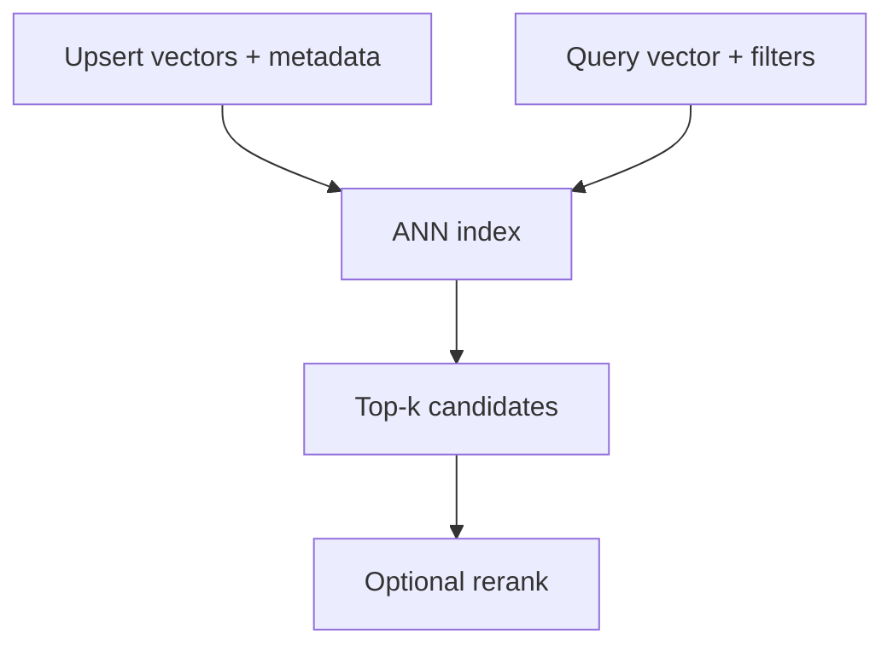

# Vector Databases Explained

> ANN indexes, metadata filters, and operational concerns.

## Definition

Vector databases (or vector indexes in Postgres/etc.) store embeddings and retrieve approximate nearest neighbors quickly. Production concerns include filtering, hybrid search, upserts, re-indexing, multitenancy, and SLOs.

## Why it matters

ANN is approximate: you trade recall for latency/cost. Measure recall@k on your data.

## How it works

## Key principles

1. **Filter + vector together** — Metadata predicates matter as much as ANN.
2. **Plan re-embeds** — Model upgrades are migrations.
3. **Tenancy isolation** — Never search across tenants accidentally.

## Common applications

| Application | Description |
|-------------|-------------|
| RAG corpora | Doc chunks |
| Personalization | User memory stores |
| Recs | Item embeddings |

## Common mistakes

- No hybrid lexical fallback when names/IDs matter
- Unlimited namespace growth without retention policy

## Further reading

- [RAG vector databases](../rag/vector-databases.md)
- [Choosing embedding + VDB](choosing-embedding-and-vdb.md)
