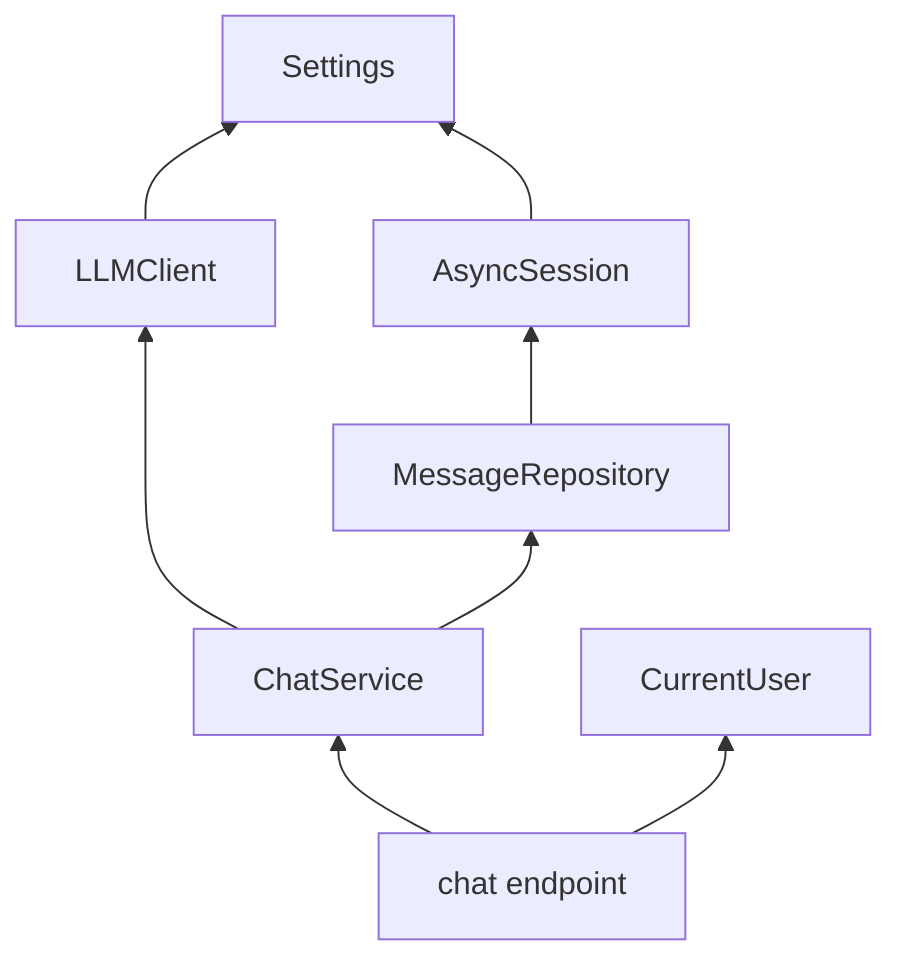
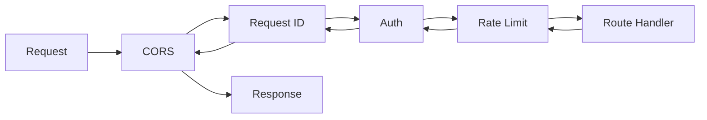

# FastAPI Complete Guide

> production reference for FastAPI in AI applications — every pattern you need from project structure through streaming chat, agent WebSockets, and OpenAPI customization.

## Table of Contents

- [Overview](#overview)
- [Why FastAPI Matters for AI](#why-fastapi-matters-for-ai)
- [AI Use Cases](#ai-use-cases)
- [Project Structure](#project-structure)
- [Application Factory and Lifespan](#application-factory-and-lifespan)
- [Routing and APIRouter](#routing-and-apirouter)
- [Dependency Injection](#dependency-injection)
- [Pydantic v2 Models and Validation](#pydantic-v2-models-and-validation)
- [Response Models](#response-models)
- [Middleware](#middleware)
- [Exception Handling](#exception-handling)
- [Background Tasks](#background-tasks)
- [Async Endpoints](#async-endpoints)
- [File Uploads](#file-uploads)
- [Streaming and SSE](#streaming-and-sse)
- [WebSockets](#websockets)
- [Dependency Overrides and Testing](#dependency-overrides-and-testing)
- [API Versioning](#api-versioning)
- [OpenAPI Customization](#openapi-customization)
- [Production Considerations](#production-considerations)
- [Best Practices](#best-practices)
- [Performance](#performance)
- [Security](#security)
- [Common Mistakes](#common-mistakes)
- [Interview Preparation](#interview-preparation)
- [Navigation](#navigation)

---

## Overview

FastAPI is the **transport and contract layer** for most Python AI backends. It handles HTTP parsing, validation, authentication gates, streaming protocols, and auto-generated API documentation — while your service layer owns RAG, agents, and model orchestration.

This document is a **deep dive**. It assumes you have completed:

- [FastAPI Foundation](fastapi-foundation.md) — **required prerequisite**
- [Backend Fundamentals for AI](../backend-engineering/backend-fundamentals-for-ai.md) — HTTP lifecycle and async basics
- [Software Engineering for AI](../foundations/software-engineering-for-ai.md) — where AI logic belongs in the stack

Foundation covered the basics. Here we cover **production-grade patterns** end to end.

```mermaid
graph TB
    subgraph "FastAPI Application"
        MAIN[main.py / create_app]
        LIFE[lifespan]
        MW[middleware stack]
        V1[/v1 routers]
        DEPS[dependency graph]
        MAIN --> LIFE
        MAIN --> MW
        MAIN --> V1
        V1 --> DEPS
    end

    subgraph "AI Service Layer"
        CHAT[ChatService]
        RAG[RAGService]
        AGENT[AgentService]
    end

    DEPS --> CHAT
    DEPS --> RAG
    DEPS --> AGENT
    CHAT --> LLM[LLM API]
    RAG --> VDB[Vector DB]
    AGENT --> TOOLS[Tool Adapters]
```

---

## Why FastAPI Matters for AI

| AI Requirement | FastAPI Capability |
|----------------|-------------------|
| Streaming token output | `StreamingResponse`, SSE, async generators |
| Strict input contracts | Pydantic v2 validation before handler runs |
| Long-running I/O | Native `async`/`await` with Starlette |
| Real-time agent updates | WebSocket endpoints |
| Document ingestion | `UploadFile`, multipart forms |
| Client SDK generation | OpenAPI 3.1 auto-documentation |
| Testability | `dependency_overrides`, `TestClient` |
| Multi-tenant auth | Middleware + `Depends()` chains |

> **Production Standard:** FastAPI validates and transports. Services orchestrate. See [Backend Architecture for AI](../backend-engineering/backend-architecture-for-ai.md) for where each concern lives.

---

## AI Use Cases

### Synchronous Chat Completion

JSON request/response for batch integrations, eval pipelines, and mobile clients that do not need streaming.

```python
@router.post("/completions", response_model=ChatResponse)
async def create_completion(
    body: ChatRequest,
    service: ChatService = Depends(get_chat_service),
) -> ChatResponse:
    return await service.reply(body)
```

### Streaming Chat (SSE)

Interactive web clients; tokens arrive as Server-Sent Events.

```python
@router.post("/completions/stream")
async def stream_completion(
    body: ChatRequest,
    service: ChatService = Depends(get_chat_service),
) -> StreamingResponse:
    return StreamingResponse(
        service.stream_reply(body),
        media_type="text/event-stream",
        headers={"Cache-Control": "no-cache", "X-Accel-Buffering": "no"},
    )
```

### RAG Document Upload

Multipart upload triggers background ingestion or job queue.

```python
@router.post("/documents", status_code=202)
async def upload_document(
    file: UploadFile,
    background_tasks: BackgroundTasks,
    service: IngestionService = Depends(get_ingestion_service),
) -> UploadAccepted:
    doc_id = await service.stage_upload(file)
    background_tasks.add_task(service.ingest, doc_id)
    return UploadAccepted(document_id=doc_id, status="processing")
```

### Agent WebSocket

Bidirectional channel for tool execution status, partial plans, and cancellation.

```python
@router.websocket("/agents/{run_id}")
async def agent_stream(
    websocket: WebSocket,
    run_id: str,
    service: AgentService = Depends(get_agent_service),
) -> None:
    await websocket.accept()
    async for event in service.run_events(run_id):
        await websocket.send_json(event.model_dump())
```

---

## Project Structure

Production AI APIs outgrow a single `main.py` quickly. This layout scales from 5 to 50+ endpoints:

```
ai-api/
├── app/
│   ├── __init__.py
│   ├── main.py                     # create_app(), middleware registration
│   ├── config.py                   # Pydantic Settings
│   ├── dependencies.py             # Composition root — all Depends()
│   ├── api/
│   │   ├── __init__.py
│   │   ├── deps.py                 # Route-level deps (auth, pagination)
│   │   └── v1/
│   │       ├── __init__.py
│   │       ├── router.py           # Aggregates v1 sub-routers
│   │       ├── chat.py
│   │       ├── documents.py
│   │       ├── agents.py
│   │       └── health.py
│   ├── schemas/
│   │   ├── chat.py
│   │   ├── documents.py
│   │   ├── agents.py
│   │   └── errors.py
│   ├── services/
│   │   ├── chat_service.py
│   │   ├── rag_service.py
│   │   └── ingestion_service.py
│   ├── clients/
│   │   ├── llm.py
│   │   └── vector_store.py
│   ├── middleware/
│   │   ├── request_id.py
│   │   ├── timing.py
│   │   └── rate_limit.py
│   └── core/
│       ├── exceptions.py
│       ├── logging.py
│       └── openapi.py
├── tests/
│   ├── conftest.py
│   ├── unit/
│   └── integration/
├── pyproject.toml
├── Dockerfile
└── docker-compose.yml
```

### `main.py` — Application Factory

```python
from fastapi import FastAPI
from fastapi.middleware.cors import CORSMiddleware

from app.api.v1.router import api_v1_router
from app.config import Settings
from app.core.logging import configure_logging
from app.core.openapi import custom_openapi
from app.dependencies import lifespan
from app.middleware.request_id import RequestIDMiddleware
from app.middleware.timing import TimingMiddleware


def create_app() -> FastAPI:
    settings = Settings()
    configure_logging(json_logs=settings.environment == "production")

    app = FastAPI(
        title=settings.app_name,
        version="1.0.0",
        lifespan=lifespan,
        docs_url="/docs" if settings.debug else None,
        redoc_url="/redoc" if settings.debug else None,
    )

    app.add_middleware(
        CORSMiddleware,
        allow_origins=settings.cors_origins,
        allow_credentials=True,
        allow_methods=["*"],
        allow_headers=["*"],
    )
    app.add_middleware(TimingMiddleware)
    app.add_middleware(RequestIDMiddleware)

    app.include_router(api_v1_router, prefix="/v1")

    app.openapi = lambda: custom_openapi(app)  # type: ignore[method-assign]
    return app


app = create_app()
```

---

## Application Factory and Lifespan

The **lifespan** context manager (replacing deprecated `@app.on_event`) owns process-wide resources: database engines, HTTP clients, Redis connections.

```python
from contextlib import asynccontextmanager
from collections.abc import AsyncIterator

import httpx
from fastapi import FastAPI
from openai import AsyncOpenAI
from sqlalchemy.ext.asyncio import AsyncEngine, async_sessionmaker, create_async_engine

from app.config import Settings


@asynccontextmanager
async def lifespan(app: FastAPI) -> AsyncIterator[None]:
    settings = Settings()

    engine: AsyncEngine = create_async_engine(
        settings.database_url,
        pool_size=10,
        max_overflow=20,
        pool_pre_ping=True,
    )
    session_factory = async_sessionmaker(engine, expire_on_commit=False)

    http_client = httpx.AsyncClient(
        timeout=httpx.Timeout(connect=5.0, read=settings.llm_timeout_seconds, write=30.0, pool=5.0),
        limits=httpx.Limits(max_connections=100, max_keepalive_connections=20),
    )
    openai_client = AsyncOpenAI(api_key=settings.openai_api_key.get_secret_value())

    app.state.settings = settings
    app.state.db_engine = engine
    app.state.session_factory = session_factory
    app.state.http_client = http_client
    app.state.openai_client = openai_client

    yield

    await http_client.aclose()
    await engine.dispose()
```

### Lifespan vs Middleware vs Dependencies

| Mechanism | Scope | Use For |
|-----------|-------|---------|
| **Lifespan** | Process | DB engine, shared HTTP clients, model warm-up |
| **Middleware** | Every request | CORS, auth extraction, rate limits, request ID |
| **Dependencies** | Per route / subgraph | DB session, user context, service instances |

Access lifespan state in dependencies:

```python
from fastapi import Request


def get_http_client(request: Request) -> httpx.AsyncClient:
    return request.app.state.http_client
```

---

## Routing and APIRouter

`APIRouter` groups endpoints by domain. Keep `main.py` thin — aggregate routers in `api/v1/router.py`.

```python
# app/api/v1/chat.py
from fastapi import APIRouter, Depends, HTTPException

from app.api.deps import get_current_user
from app.dependencies import get_chat_service
from app.schemas.chat import ChatRequest, ChatResponse, StreamEvent
from app.schemas.errors import ErrorResponse
from app.services.chat_service import ChatService

router = APIRouter(prefix="/chat", tags=["chat"])


@router.post(
    "",
    response_model=ChatResponse,
    responses={
        401: {"model": ErrorResponse},
        429: {"model": ErrorResponse, "description": "Rate limit exceeded"},
        503: {"model": ErrorResponse, "description": "LLM provider unavailable"},
    },
    summary="Create chat completion",
)
async def create_chat(
    body: ChatRequest,
    service: ChatService = Depends(get_chat_service),
    user=Depends(get_current_user),
) -> ChatResponse:
    return await service.reply(user_id=user.id, request=body)


# app/api/v1/router.py
from fastapi import APIRouter

from app.api.v1 import agents, chat, documents, health

api_v1_router = APIRouter()
api_v1_router.include_router(health.router)
api_v1_router.include_router(chat.router)
api_v1_router.include_router(documents.router)
api_v1_router.include_router(agents.router)
```

### Route Organization Tips

- One router file per resource (`chat.py`, `documents.py`)
- Shared dependencies in `api/deps.py` (auth, pagination)
- Use `tags` for OpenAPI grouping
- Declare `responses` dict for documented error shapes

---

## Dependency Injection

FastAPI resolves a **dependency graph** before your handler runs. This is the framework's composition root integration point.



### Dependency Types

```python
from collections.abc import AsyncIterator
from functools import lru_cache

from fastapi import Depends, Header, HTTPException, Request, status
from sqlalchemy.ext.asyncio import AsyncSession

from app.config import Settings
from app.services.chat_service import ChatService


# Singleton — cached for process lifetime
@lru_cache
def get_settings() -> Settings:
    return Settings()


# Per-request with cleanup
async def get_db_session(request: Request) -> AsyncIterator[AsyncSession]:
    factory = request.app.state.session_factory
    async with factory() as session:
        try:
            yield session
        except Exception:
            await session.rollback()
            raise


# Security dependency
async def get_current_user(authorization: str = Header(...)) -> User:
    if not authorization.startswith("Bearer "):
        raise HTTPException(status_code=status.HTTP_401_UNAUTHORIZED)
    token = authorization.removeprefix("Bearer ")
    user = await verify_jwt(token)
    if user is None:
        raise HTTPException(status_code=status.HTTP_401_UNAUTHORIZED)
    return user


# Service factory
def get_chat_service(
    session: AsyncSession = Depends(get_db_session),
    settings: Settings = Depends(get_settings),
    request: Request = None,
) -> ChatService:
    llm = build_llm_client(request.app.state.openai_client, settings)
    repo = PostgresMessageRepository(session)
    return ChatService(repo=repo, llm=llm, settings=settings)


# Sub-dependencies are reusable
def get_pagination(
    page: int = 1,
    page_size: int = 20,
) -> Pagination:
    return Pagination(page=max(1, page), page_size=min(100, page_size))
```

### `Depends()` with `yield` — Resource Cleanup

Always use `yield` for resources that need teardown (DB sessions, file handles, locks):

```python
async def get_tenant_context(
    user: User = Depends(get_current_user),
    session: AsyncSession = Depends(get_db_session),
) -> AsyncIterator[TenantContext]:
    ctx = TenantContext(user=user, tenant_id=user.tenant_id)
    await session.execute(text("SET app.tenant_id = :tid"), {"tid": ctx.tenant_id})
    try:
        yield ctx
    finally:
        await session.execute(text("RESET app.tenant_id"))
```

---

## Pydantic v2 Models and Validation

Pydantic v2 runs validation **before** your handler. For AI APIs, schemas are contracts between frontend, eval harness, and backend.

### Request Models with AI-Specific Validation

```python
from enum import Enum
from typing import Annotated

from pydantic import BaseModel, Field, field_validator, model_validator


class Role(str, Enum):
    USER = "user"
    ASSISTANT = "assistant"
    SYSTEM = "system"


class ChatMessage(BaseModel):
    role: Role
    content: str = Field(..., min_length=1, max_length=32000)


class ChatRequest(BaseModel):
    messages: list[ChatMessage] = Field(..., min_length=1, max_length=100)
    model: str = Field("gpt-4o-mini", max_length=64)
    temperature: float = Field(0.7, ge=0.0, le=2.0)
    max_tokens: int | None = Field(None, ge=1, le=16384)
    stream: bool = False

    model_config = {
        "str_strip_whitespace": True,
        "json_schema_extra": {
            "examples": [
                {
                    "messages": [{"role": "user", "content": "Explain RAG in one paragraph."}],
                    "temperature": 0.3,
                }
            ]
        },
    }

    @field_validator("messages")
    @classmethod
    def last_message_from_user(cls, messages: list[ChatMessage]) -> list[ChatMessage]:
        if messages[-1].role != Role.USER:
            raise ValueError("Last message must be from user")
        return messages

    @model_validator(mode="after")
    def estimate_token_budget(self) -> "ChatRequest":
        total_chars = sum(len(m.content) for m in self.messages)
        if total_chars > 120_000:
            raise ValueError("Estimated context too large")
        return self
```

### Structured Tool Schema (Agent APIs)

```python
class ToolParameter(BaseModel):
    name: str
    type: str = Field(..., pattern="^(string|number|boolean|object|array)$")
    description: str
    required: bool = True


class ToolDefinition(BaseModel):
    name: str = Field(..., pattern="^[a-z][a-z0-9_]*$")
    description: str = Field(..., min_length=10, max_length=500)
    parameters: list[ToolParameter]

    @field_validator("parameters")
    @classmethod
    def at_least_one_param(cls, params: list[ToolParameter]) -> list[ToolParameter]:
        if not params:
            raise ValueError("Tools must declare at least one parameter")
        return params
```

### Pydantic v2 Key Changes from v1

| v1 | v2 |
|----|-----|
| `@validator` | `@field_validator` |
| `class Config` | `model_config` dict |
| `.dict()` | `.model_dump()` |
| `orm_mode = True` | `from_attributes = True` |
| Slower validation | Rust-core `pydantic-core` — use it |

---

## Response Models

`response_model` enforces output shape, strips undeclared fields, and generates OpenAPI response schemas.

```python
from pydantic import BaseModel, Field


class Citation(BaseModel):
    document_id: str
    title: str
    snippet: str = Field(..., max_length=300)


class ChatResponse(BaseModel):
    id: str
    content: str
    model: str
    citations: list[Citation] = []
    usage: TokenUsage

    model_config = {"from_attributes": True}


class TokenUsage(BaseModel):
    input_tokens: int = Field(..., ge=0)
    output_tokens: int = Field(..., ge=0)
```

### Filtering Internal Fields

```python
class InternalChatResult(BaseModel):
    content: str
    prompt_hash: str          # internal — must not leak
    retrieval_scores: list[float]


@router.post("/chat", response_model=ChatResponse)
async def chat(...) -> ChatResponse:
    result = await service.reply(...)
    return ChatResponse(
        id=result.id,
        content=result.content,
        model=result.model,
        citations=result.citations,
        usage=result.usage,
    )
```

### `response_model_exclude_none`

```python
@router.get("/sessions/{id}", response_model=SessionDetail, response_model_exclude_none=True)
async def get_session(id: str) -> SessionDetail:
    ...
```

---

## Middleware

Middleware wraps every request in LIFO order — last added runs first on the way in.



### Request ID Middleware

```python
import uuid
from starlette.middleware.base import BaseHTTPMiddleware, RequestResponseEndpoint
from starlette.requests import Request
from starlette.responses import Response


class RequestIDMiddleware(BaseHTTPMiddleware):
    async def dispatch(self, request: Request, call_next: RequestResponseEndpoint) -> Response:
        request_id = request.headers.get("X-Request-ID", str(uuid.uuid4()))
        request.state.request_id = request_id
        response = await call_next(request)
        response.headers["X-Request-ID"] = request_id
        return response
```

### Rate Limiting for Chat Endpoints

```python
import time
from starlette.middleware.base import BaseHTTPMiddleware
from starlette.requests import Request
from starlette.responses import JSONResponse


class ChatRateLimitMiddleware(BaseHTTPMiddleware):
    def __init__(self, app, redis, limit: int = 60, window: int = 60):
        super().__init__(app)
        self._redis = redis
        self._limit = limit
        self._window = window

    async def dispatch(self, request: Request, call_next):
        if not request.url.path.endswith("/chat"):
            return await call_next(request)

        user_id = getattr(request.state, "user_id", request.client.host)
        key = f"rate:{user_id}:{int(time.time()) // self._window}"
        count = await self._redis.incr(key)
        if count == 1:
            await self._redis.expire(key, self._window)
        if count > self._limit:
            return JSONResponse(status_code=429, content={"error": {"code": "RATE_LIMITED"}})
        return await call_next(request)
```

### Production Middleware Order

1. CORS (outermost)
2. Request ID / correlation ID
3. Authentication (sets `request.state.user_id`)
4. Rate limiting
5. Timing / metrics (innermost before route)

---

## Exception Handling

Map domain exceptions to stable HTTP responses with a global handler.

```python
# core/exceptions.py
class AppError(Exception):
    def __init__(self, code: str, message: str, status_code: int = 400):
        self.code = code
        self.message = message
        self.status_code = status_code


class LLMUnavailableError(AppError):
    def __init__(self, provider: str):
        super().__init__(
            code="LLM_UNAVAILABLE",
            message=f"Provider {provider} is unavailable",
            status_code=503,
        )


class ValidationError(AppError):
    def __init__(self, message: str):
        super().__init__(code="VALIDATION_ERROR", message=message, status_code=422)


# main.py
from fastapi import Request
from fastapi.responses import JSONResponse

from app.core.exceptions import AppError


@app.exception_handler(AppError)
async def app_error_handler(request: Request, exc: AppError) -> JSONResponse:
    return JSONResponse(
        status_code=exc.status_code,
        content={
            "error": {
                "code": exc.code,
                "message": exc.message,
                "request_id": getattr(request.state, "request_id", None),
            }
        },
    )


@app.exception_handler(Exception)
async def unhandled_error_handler(request: Request, exc: Exception) -> JSONResponse:
    logger.exception("unhandled_error", request_id=getattr(request.state, "request_id", None))
    return JSONResponse(
        status_code=500,
        content={"error": {"code": "INTERNAL_ERROR", "message": "An unexpected error occurred"}},
    )
```

### Route-Level vs Global Handlers

| Approach | When |
|----------|------|
| Global `AppError` handler | Consistent error JSON across API |
| `HTTPException` in routes | Simple one-off cases |
| Route `try/except` | Translate specific service exceptions |

---

## Background Tasks

`BackgroundTasks` runs work **after** the response is sent — same process, best-effort, not durable.

```python
from fastapi import BackgroundTasks, Depends


@router.post("/feedback", status_code=204)
async def submit_feedback(
    body: FeedbackRequest,
    background_tasks: BackgroundTasks,
    analytics: AnalyticsClient = Depends(get_analytics),
) -> None:
    background_tasks.add_task(analytics.track, "feedback", body.model_dump())
```

### Background Tasks vs Job Queue

| | `BackgroundTasks` | Celery / ARQ |
|--|-------------------|--------------|
| Durability | Lost if process dies | Persisted, retried |
| Use case | Analytics, cache warming | Document ingestion, reindexing |
| Latency | Runs after response | Async worker pickup |
| AI example | Log token usage | Embed 500-page PDF |

```python
# Production ingestion — return 202, queue durable job
@router.post("/documents", status_code=202)
async def upload(
    file: UploadFile,
    queue: JobQueue = Depends(get_job_queue),
) -> UploadAccepted:
    doc_id = await stage_to_s3(file)
    await queue.enqueue("ingest_document", {"document_id": doc_id})
    return UploadAccepted(document_id=doc_id)
```

---

## Async Endpoints

Use `async def` for I/O-bound AI work. Use `def` only for CPU-bound sync code (rare in API layer).

```python
# Correct — async LLM call
@router.post("/chat")
async def chat(service: ChatService = Depends(get_chat_service)):
    return await service.reply(...)


# Wrong — blocks event loop
@router.post("/chat-bad")
async def chat_bad():
    client = OpenAI()  # sync SDK
    return client.chat.completions.create(...)  # BLOCKS


# Alternative — sync route with threadpool (not preferred for AI)
@router.post("/chat-sync")
def chat_sync():
    ...  # FastAPI runs in threadpool
```

### Async Checklist

- `AsyncOpenAI`, not sync `OpenAI`
- `httpx.AsyncClient`, not `requests`
- `asyncpg` / SQLAlchemy async engine
- `await` all I/O in `async def` handlers
- Never `time.sleep()` — use `await asyncio.sleep()`

---

## File Uploads

AI apps ingest PDFs, DOCX, and images for RAG. Validate aggressively.

```python
import magic
from fastapi import File, HTTPException, UploadFile

ALLOWED_TYPES = {"application/pdf", "text/plain", "text/markdown"}
MAX_BYTES = 20 * 1024 * 1024  # 20 MB


@router.post("/documents/upload", response_model=UploadResponse)
async def upload_document(
    file: UploadFile = File(..., description="PDF or text document"),
    service: IngestionService = Depends(get_ingestion_service),
) -> UploadResponse:
    contents = await file.read()
    if len(contents) > MAX_BYTES:
        raise HTTPException(413, detail="File too large")

    mime = magic.from_buffer(contents, mime=True)
    if mime not in ALLOWED_TYPES:
        raise HTTPException(415, detail=f"Unsupported type: {mime}")

    doc_id = await service.create_from_bytes(
        filename=file.filename or "upload",
        content=contents,
        mime_type=mime,
    )
    return UploadResponse(document_id=doc_id, status="queued")
```

### Multi-File Upload

```python
@router.post("/documents/batch")
async def upload_batch(
    files: list[UploadFile] = File(...),
    service: IngestionService = Depends(get_ingestion_service),
) -> list[UploadResponse]:
    if len(files) > 10:
        raise HTTPException(400, detail="Maximum 10 files per request")
    return [await upload_single(f, service) for f in files]
```

---

## Streaming and SSE

Server-Sent Events (SSE) is the standard for streaming LLM tokens to web clients.

### SSE Format

Each event: `data: <payload>\n\n`. Terminate with `data: [DONE]\n\n`.

```python
import json
from collections.abc import AsyncIterator

from fastapi.responses import StreamingResponse
from starlette.requests import Request


async def sse_generator(
    service: ChatService,
    request: ChatRequest,
    http_request: Request,
) -> AsyncIterator[str]:
    try:
        async for chunk in service.stream_reply(request):
            if await http_request.is_disconnected():
                break
            payload = json.dumps({"content": chunk})
            yield f"data: {payload}\n\n"
        yield "data: [DONE]\n\n"
    except Exception as exc:
        error = json.dumps({"error": str(exc)})
        yield f"data: {error}\n\n"


@router.post("/chat/stream")
async def stream_chat(
    body: ChatRequest,
    http_request: Request,
    service: ChatService = Depends(get_chat_service),
) -> StreamingResponse:
    return StreamingResponse(
        sse_generator(service, body, http_request),
        media_type="text/event-stream",
        headers={
            "Cache-Control": "no-cache",
            "Connection": "keep-alive",
            "X-Accel-Buffering": "no",
        },
    )
```

### Service-Layer Stream

```python
class ChatService:
    async def stream_reply(self, request: ChatRequest) -> AsyncIterator[str]:
        async for token in self._llm.stream(
            CompletionRequest(messages=[m.model_dump() for m in request.messages])
        ):
            yield token
```

### nginx SSE Configuration

```nginx
location /v1/chat/stream {
    proxy_pass http://api_backend;
    proxy_buffering off;
    proxy_cache off;
    proxy_read_timeout 300s;
    chunked_transfer_encoding on;
}
```

---

## WebSockets

WebSockets suit **bidirectional** agent UIs: cancel runs, approve tool calls, receive step events.

```python
from fastapi import WebSocket, WebSocketDisconnect


@router.websocket("/agents/{run_id}/events")
async def agent_events(
    websocket: WebSocket,
    run_id: str,
    service: AgentService = Depends(get_agent_service),
    user: User = Depends(get_ws_user),
) -> None:
    await websocket.accept()

    if not await service.user_owns_run(user.id, run_id):
        await websocket.close(code=4003, reason="Forbidden")
        return

    try:
        async for event in service.stream_events(run_id):
            await websocket.send_json(event.model_dump())

            # Handle client messages (cancel, approve tool)
            try:
                msg = await asyncio.wait_for(websocket.receive_json(), timeout=0.01)
                if msg.get("action") == "cancel":
                    await service.cancel(run_id)
                    break
            except asyncio.TimeoutError:
                pass
    except WebSocketDisconnect:
        await service.client_disconnected(run_id)
```

### WebSocket Auth

Pass JWT via query param or first message — headers are limited in browser WebSocket API:

```python
@router.websocket("/ws")
async def ws_endpoint(websocket: WebSocket, token: str = Query(...)):
    user = await verify_jwt(token)
    if not user:
        await websocket.close(code=4001)
        return
    await websocket.accept()
```

### WebSocket vs SSE

| | SSE | WebSocket |
|--|-----|-----------|
| Direction | Server → client | Bidirectional |
| Protocol | HTTP | WS upgrade |
| AI use | Token streaming | Agent control + events |
| Proxy support | Excellent | Requires sticky sessions sometimes |
| Reconnection | `EventSource` auto-reconnect | Manual |

---

## Dependency Overrides and Testing

`app.dependency_overrides` replaces any `Depends()` callable — essential for AI API tests without real LLM charges.

```python
# tests/conftest.py
import pytest
from fastapi.testclient import TestClient

from app.dependencies import get_chat_service, get_llm_client, lifespan
from app.main import create_app


class FakeLLM:
    async def complete(self, request):
        return CompletionResult(content="Paris.", input_tokens=5, output_tokens=2, model="fake")

    async def stream(self, request):
        for token in ["Paris", "."]:
            yield token


@pytest.fixture
def app():
    application = create_app()
    application.dependency_overrides[get_llm_client] = lambda: FakeLLM()
    return application


@pytest.fixture
def client(app):
    with TestClient(app) as c:
        yield c
    app.dependency_overrides.clear()


def test_chat_returns_200(client):
    response = client.post("/v1/chat", json={"messages": [{"role": "user", "content": "Capital of France?"}]})
    assert response.status_code == 200
    assert "Paris" in response.json()["content"]


def test_streaming(client):
    with client.stream("POST", "/v1/chat/stream", json={"messages": [{"role": "user", "content": "Hi"}]}) as r:
        chunks = list(r.iter_lines())
    assert any("Paris" in c for c in chunks)
```

### Async Test Client

```python
import pytest
from httpx import ASGITransport, AsyncClient


@pytest.fixture
async def async_client(app):
    transport = ASGITransport(app=app)
    async with AsyncClient(transport=transport, base_url="http://test") as ac:
        yield ac
```

---

## API Versioning

### URL Prefix (Recommended)

```python
app.include_router(api_v1_router, prefix="/v1")
app.include_router(api_v2_router, prefix="/v2")
```

### Deprecation Headers

```python
from fastapi import Response


@router.get("/legacy-search", deprecated=True)
async def legacy_search(response: Response):
    response.headers["Deprecation"] = "true"
    response.headers["Sunset"] = "Sat, 01 Jan 2027 00:00:00 GMT"
    response.headers["Link"] = '</v2/search>; rel="successor-version"'
    ...
```

### Versioning Rules

1. Never break `/v1/` response schemas silently
2. Add fields as optional; remove only in new major version
3. Document migration in OpenAPI description
4. Run contract tests against exported OpenAPI spec in CI

---

## OpenAPI Customization

### Tags and Metadata

```python
app = FastAPI(
    title="RAG Assistant API",
    description="Production AI API with chat, RAG, and agents.",
    version="1.2.0",
    openapi_tags=[
        {"name": "chat", "description": "Completions and streaming"},
        {"name": "documents", "description": "Upload and manage knowledge base"},
        {"name": "agents", "description": "Tool-using agent runs"},
    ],
    contact={"name": "Platform Team", "email": "platform@example.com"},
    license_info={"name": "Proprietary"},
)
```

### Custom OpenAPI Schema

```python
# core/openapi.py
from fastapi import FastAPI
from fastapi.openapi.utils import get_openapi


def custom_openapi(app: FastAPI):
    if app.openapi_schema:
        return app.openapi_schema

    schema = get_openapi(
        title=app.title,
        version=app.version,
        description=app.description,
        routes=app.routes,
    )
    schema["components"]["securitySchemes"] = {
        "BearerAuth": {"type": "http", "scheme": "bearer", "bearerFormat": "JWT"}
    }
    schema["security"] = [{"BearerAuth": []}]
    app.openapi_schema = schema
    return schema
```

### Export OpenAPI in CI

```bash
python -c "from app.main import app; import json; print(json.dumps(app.openapi()))" > openapi.json
```

Use `openapi.json` to generate TypeScript/Python SDKs and contract tests.

---

## Production Considerations

| Topic | Recommendation |
|-------|----------------|
| **Workers** | `uvicorn --workers 4`; 2–4 per CPU core for I/O-bound AI |
| **Timeouts** | `httpx.Timeout(connect=5, read=120)` for LLM calls |
| **Health** | `/health` liveness + `/ready` checks DB, Redis, vector store |
| **Graceful shutdown** | Lifespan closes pools; K8s `terminationGracePeriodSeconds ≥ 30` |
| **Idempotency** | `Idempotency-Key` header on costly endpoints |
| **OpenAPI** | Disable `/docs` in prod or protect with auth |
| **Structured logs** | JSON with `request_id`, `user_id`, `model`, `latency_ms`, `tokens` |
| **Metrics** | Histogram per endpoint; counter for 4xx/5xx and LLM errors |

### Uvicorn Production Command

```bash
uvicorn app.main:app \
  --host 0.0.0.0 \
  --port 8000 \
  --workers 4 \
  --loop uvloop \
  --http httptools \
  --timeout-keep-alive 75 \
  --limit-concurrency 1000
```

### Dockerfile

```dockerfile
FROM python:3.12-slim

WORKDIR /app
RUN pip install --no-cache-dir uv

COPY pyproject.toml uv.lock ./
RUN uv sync --frozen --no-dev

COPY app ./app
EXPOSE 8000

HEALTHCHECK CMD curl -f http://localhost:8000/v1/health || exit 1

CMD ["uvicorn", "app.main:app", "--host", "0.0.0.0", "--port", "8000", "--workers", "4"]
```

### Readiness Probe

```python
@router.get("/ready")
async def readiness(request: Request) -> dict[str, str]:
    engine = request.app.state.db_engine
    async with engine.connect() as conn:
        await conn.execute(text("SELECT 1"))
    return {"status": "ready"}
```

---

## Best Practices

1. **`create_app()` factory** — enables test apps with different config
2. **Lifespan for shared clients** — one `httpx.AsyncClient` per process
3. **`response_model` always** — prevents internal field leakage
4. **Thin routes** — delegate to services immediately
5. **Central `dependencies.py`** — single composition root
6. **Pydantic validators for AI inputs** — reject bad prompts before LLM call
7. **SSE disconnect handling** — `request.is_disconnected()` saves tokens
8. **`dependency_overrides` in every test** — no real API charges
9. **Versioned routers** — `/v1/` from day one
10. **Export OpenAPI in CI** — contract tests catch breaking changes

---

## Performance

| Technique | Impact |
|-----------|--------|
| `uvloop` + `httptools` | 2–4x throughput vs default asyncio loop |
| Connection pooling | Reuse DB and HTTP connections |
| `ORJSONResponse` | Faster JSON serialization for large responses |
| Streaming | Better TTFB; user perceives faster responses |
| Pagination | Never return unbounded message history |
| `lru_cache` on settings | Avoid re-parsing env on every request |
| Avoid sync code in `async def` | Prevents event loop starvation |

```python
from fastapi.responses import ORJSONResponse

app = FastAPI(default_response_class=ORJSONResponse)
```

---

## Security

| Risk | Mitigation |
|------|------------|
| Prompt injection | Validate inputs; sanitize uploaded documents |
| Oversized payloads | Pydantic limits + reverse proxy `client_max_body_size` |
| Auth bypass | Auth middleware + `Depends(get_current_user)` on sensitive routes |
| CORS misconfiguration | Explicit origin allowlist — never `*` with credentials |
| Schema leakage | Disable `/docs` in production |
| File upload attacks | Magic-byte validation; scan in sandboxed worker |
| Rate limit bypass | Rate limit by authenticated user ID, not just IP |
| Secret logging | `SecretStr`; never log full settings |

```python
from pydantic import SecretStr

class Settings(BaseSettings):
    openai_api_key: SecretStr
    jwt_secret: SecretStr
```

---

## Common Mistakes

| Mistake | Symptom | Fix |
|---------|---------|-----|
| God `main.py` | Unmaintainable | Routers + `create_app()` |
| New HTTP client per request | Socket exhaustion | Lifespan-scoped client |
| Sync OpenAI in `async def` | Timeouts under load | `AsyncOpenAI` |
| No `response_model` | Leaked internal fields | Always declare output schema |
| Background tasks for ingestion | Lost jobs on restart | Durable job queue |
| Streaming without nginx config | Buffered, laggy tokens | `X-Accel-Buffering: no` |
| Skipping `dependency_overrides` | Flaky tests, API charges | Fake LLM in `conftest.py` |
| Global mutable state | Race conditions | `app.state` + lifespan |
| WebSocket without auth | Open agent control | JWT on connect |
| Ignoring disconnect during stream | Wasted tokens/money | `is_disconnected()` check |

---

## Interview Preparation

### Frequently Asked Questions

**Q1: Walk through a production FastAPI project structure for a RAG app.**

> **Strong answer:** `api/v1` routers by resource, `schemas` for contracts, `services` for RAG orchestration, `clients` for LLM/vector adapters, `dependencies.py` as composition root, lifespan for shared HTTP client and DB engine. Mention testing with overrides.

**Q2: How do you implement streaming chat in FastAPI?**

> **Strong answer:** `StreamingResponse` with `text/event-stream`, async generator in service yielding tokens, SSE `data:` framing, disconnect handling, nginx `proxy_buffering off`. Log token usage after stream completes.

**Q3: Explain dependency injection in FastAPI and how you test it.**

> **Strong answer:** `Depends()` builds a graph: settings (cached) → clients (lifespan) → per-request session → services. Tests use `app.dependency_overrides[get_llm_client] = lambda: FakeLLM()`. Mention `yield` for cleanup.

**Q4: What belongs in lifespan vs middleware vs dependencies?**

> **Strong answer:** Lifespan: process resources (DB engine, HTTP clients). Middleware: cross-cutting per-request (CORS, auth, rate limits). Dependencies: per-route resolution (user, service, DB session).

**Q5: How do you version a FastAPI API without breaking clients?**

> **Strong answer:** URL prefix `/v1/`, add `/v2/` for breaking changes, deprecation headers, optional fields only in minor changes, export OpenAPI in CI for contract tests.

### System Design Prompt

**Design a FastAPI service with streaming RAG chat, document upload, agent WebSockets, multi-tenant auth, and rate limiting.**

> **Discussion points:** Router layout, `RAGService` + `ChatService` + `AgentService`, SSE streaming endpoint, WebSocket with JWT auth, Redis rate limiter middleware, `UploadFile` with validation, 202 + job queue for ingestion, readiness checks, `dependency_overrides` for tests, OpenAPI with security scheme.

---

## Navigation

### Prerequisites

- [FastAPI Foundation](fastapi-foundation.md) — **required** — routers, lifespan basics, Pydantic patterns, streaming intro
- [Backend Fundamentals for AI](../backend-engineering/backend-fundamentals-for-ai.md) — HTTP lifecycle, middleware, async overview
- [Software Engineering for AI](../foundations/software-engineering-for-ai.md) — service layer, DI, project organization

### Related Topics

- [Backend Architecture for AI](../backend-engineering/backend-architecture-for-ai.md) — architectural patterns this guide implements
- [Backend Fundamentals for AI](../backend-engineering/backend-fundamentals-for-ai.md) — broader backend concepts
- [HTTP Fundamentals for AI](../apis/http-fundamentals-for-ai.md) — REST, status codes, auth headers
- [Configuration and Secrets](../foundations/configuration-and-secrets.md) — Pydantic Settings and secrets

### Next Topics

- [AI Application Architecture](../ai-application-architecture/README.md) — end-to-end system design
- [Observability](../observability/README.md) — tracing LLM calls and API latency
- [Security](../security/README.md) — API auth, prompt injection defenses
- [Model Serving](../model-serving/README.md) — when to externalize inference

### Future Reading

- OAuth2 and advanced auth patterns — coming in this domain
- Pagination, filtering, and cursor-based APIs
- [CICD](../cicd/README.md) — testing and deploying AI APIs
- [Docker](../docker/README.md) — containerizing FastAPI services

---

## See Also

- [FastAPI Official Documentation](https://fastapi.tiangolo.com/)
- [Pydantic v2 Documentation](https://docs.pydantic.dev/)
- [Starlette Documentation](https://www.starlette.io/)
- [Uvicorn Deployment Guide](https://www.uvicorn.org/deployment/)

## Changelog

| Version | Date | Changes |
|---------|------|---------|
| 1.0 | 2026-07-13 | Initial release |
