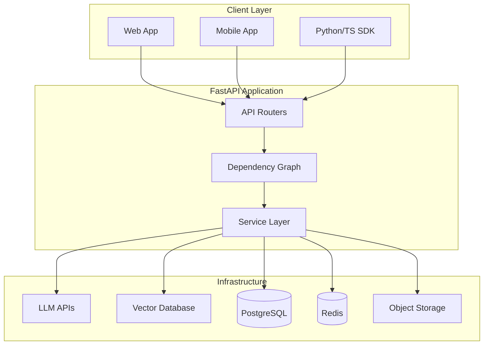
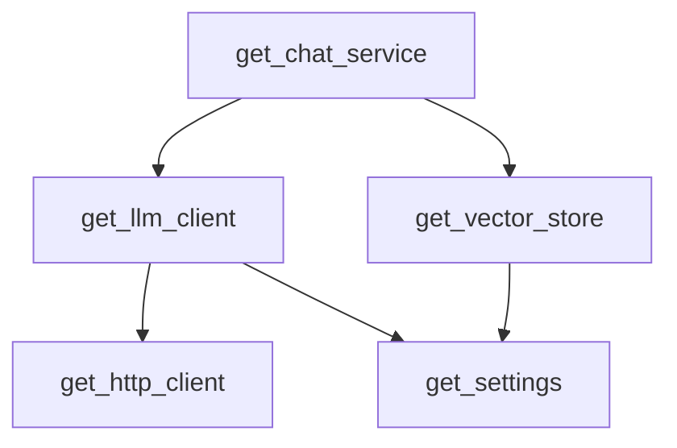
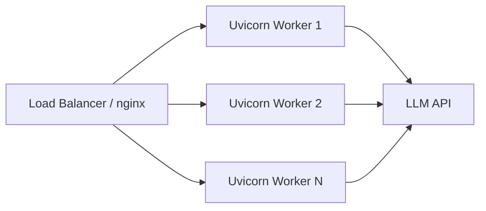

# FastAPI Foundation

> Practical FastAPI patterns for building production AI APIs — structured for engineers who already understand HTTP and Python async basics.

## Table of Contents

- [Who This Guide Is For](#who-this-guide-is-for)
- [FastAPI in the AI Stack](#fastapi-in-the-ai-stack)
- [Project Structure](#project-structure)
- [Application Factory and Lifespan](#application-factory-and-lifespan)
- [Routers and API Versioning](#routers-and-api-versioning)
- [Pydantic Models for AI APIs](#pydantic-models-for-ai-apis)
- [Dependency Injection Patterns](#dependency-injection-patterns)
- [Error Handling](#error-handling)
- [Streaming LLM Responses](#streaming-llm-responses)
- [File Upload and Ingestion Endpoints](#file-upload-and-ingestion-endpoints)
- [WebSocket Agent Endpoints](#websocket-agent-endpoints)
- [Testing FastAPI AI Services](#testing-fastapi-ai-services)
- [Production Deployment](#production-deployment)
- [Production Considerations](#production-considerations)
- [Common Mistakes](#common-mistakes)
- [Interview Preparation](#interview-preparation)
- [Navigation](#navigation)

---

## Who This Guide Is For

This document assumes you have read:

- [Backend Fundamentals for AI](../backend-engineering/backend-fundamentals-for-ai.md) — request lifecycle, middleware, async basics
- [HTTP Fundamentals for AI](../apis/http-fundamentals-for-ai.md) — status codes, headers, REST conventions
- [Python for AI Engineering](../python-engineering/python-for-ai-engineering.md) — type hints, async/await, virtual environments

Here we go deeper on **FastAPI-specific patterns** that appear in every production AI service: structured projects, lifespan management, typed schemas for prompts and tools, streaming completions, and testable dependency graphs.

> **Production Standard:** FastAPI is the transport layer. AI orchestration belongs in services — see [Software Engineering for AI](../foundations/software-engineering-for-ai.md).

---

## FastAPI in the AI Stack



### FastAPI Responsibilities vs Service Responsibilities

| Layer | Owns | Does Not Own |
|-------|------|--------------|
| **FastAPI routes** | HTTP parsing, validation, auth gate, response format | Prompt engineering logic |
| **Dependencies** | Wiring settings, clients, sessions | Business rules |
| **Pydantic models** | Request/response contracts | Retrieval algorithms |
| **Services** | RAG, agents, tool use, eval hooks | HTTP status code selection (mostly) |

---

## Project Structure

A consistent layout makes AI codebases navigable as they grow from one endpoint to dozens.

```
ai-api/
├── app/
│   ├── __init__.py
│   ├── main.py                 # App factory, middleware registration
│   ├── config.py               # Pydantic Settings
│   ├── dependencies.py         # Shared Depends() functions
│   ├── api/
│   │   ├── __init__.py
│   │   └── v1/
│   │       ├── __init__.py
│   │       ├── router.py       # Aggregates v1 routers
│   │       ├── chat.py
│   │       ├── documents.py
│   │       └── health.py
│   ├── schemas/
│   │   ├── chat.py             # Pydantic request/response models
│   │   └── documents.py
│   ├── services/
│   │   ├── chat_service.py
│   │   └── ingestion_service.py
│   ├── clients/
│   │   ├── llm.py              # LLM port/adapter
│   │   └── vector_store.py
│   └── core/
│       ├── exceptions.py
│       └── logging.py
├── tests/
│   ├── conftest.py
│   ├── test_chat.py
│   └── test_documents.py
├── pyproject.toml
└── Dockerfile
```

### `main.py` Entry Point

```python
from fastapi import FastAPI

from app.api.v1.router import api_v1_router
from app.core.logging import configure_logging
from app.dependencies import lifespan


def create_app() -> FastAPI:
    configure_logging()

    app = FastAPI(
        title="AI API",
        version="1.0.0",
        lifespan=lifespan,
        docs_url="/docs",
        redoc_url="/redoc",
    )

    app.include_router(api_v1_router, prefix="/v1")
    return app


app = create_app()
```

---

## Application Factory and Lifespan

The **lifespan** context manager replaces deprecated `@app.on_event("startup")`. Use it to open shared resources once and close them on shutdown.

```python
from contextlib import asynccontextmanager
from collections.abc import AsyncIterator

import httpx
from fastapi import FastAPI
from sqlalchemy.ext.asyncio import AsyncEngine, create_async_engine

from app.config import Settings


@asynccontextmanager
async def lifespan(app: FastAPI) -> AsyncIterator[None]:
    settings = Settings()
    engine: AsyncEngine = create_async_engine(settings.database_url, pool_size=10)
    http_client = httpx.AsyncClient(timeout=httpx.Timeout(60.0))

    app.state.settings = settings
    app.state.db_engine = engine
    app.state.http_client = http_client

    yield

    await http_client.aclose()
    await engine.dispose()
```

Access shared state in dependencies:

```python
from fastapi import Request


def get_http_client(request: Request) -> httpx.AsyncClient:
    return request.app.state.http_client
```

> **Production Standard:** One `httpx.AsyncClient` (or one per provider) per process — not per request. Creating clients per request exhausts sockets.

---

## Routers and API Versioning

Split endpoints by domain using `APIRouter`. Aggregate versioned routers for clean `main.py`.

```python
# app/api/v1/chat.py
from fastapi import APIRouter, Depends

from app.dependencies import get_chat_service
from app.schemas.chat import ChatRequest, ChatResponse
from app.services.chat_service import ChatService

router = APIRouter(prefix="/chat", tags=["chat"])


@router.post("", response_model=ChatResponse)
async def create_chat_completion(
    body: ChatRequest,
    service: ChatService = Depends(get_chat_service),
) -> ChatResponse:
    return await service.reply(body)


# app/api/v1/router.py
from fastapi import APIRouter

from app.api.v1 import chat, documents, health

api_v1_router = APIRouter()
api_v1_router.include_router(health.router)
api_v1_router.include_router(chat.router)
api_v1_router.include_router(documents.router)
```

### Versioning Strategy

| Approach | When to Use |
|----------|-------------|
| URL prefix `/v1/` | Default for public APIs |
| Header versioning | Internal services with long-lived clients |
| Separate apps | Rare; major breaking rewrites |

Never break `/v1/` contracts silently. Add `/v2/` and deprecate with a timeline.

---

## Pydantic Models for AI APIs

Pydantic v2 validates requests before your handler runs and generates OpenAPI schemas automatically. For AI APIs, models are contracts between frontend, backend, and eval pipelines.

### Chat Request with Validation

```python
from enum import Enum
from pydantic import BaseModel, Field, field_validator


class ModelTier(str, Enum):
    FAST = "fast"
    QUALITY = "quality"


class ChatMessage(BaseModel):
    role: str = Field(..., pattern="^(user|assistant|system)$")
    content: str = Field(..., min_length=1, max_length=32000)


class ChatRequest(BaseModel):
    messages: list[ChatMessage] = Field(..., min_length=1, max_length=50)
    model_tier: ModelTier = ModelTier.FAST
    temperature: float = Field(0.7, ge=0.0, le=2.0)
    stream: bool = False

    model_config = {
        "json_schema_extra": {
            "examples": [
                {
                    "messages": [{"role": "user", "content": "Summarize RAG in one sentence."}],
                    "model_tier": "fast",
                }
            ]
        }
    }

    @field_validator("messages")
    @classmethod
    def must_end_with_user(cls, messages: list[ChatMessage]) -> list[ChatMessage]:
        if messages[-1].role != "user":
            raise ValueError("Last message must be from the user")
        return messages
```

### Structured LLM Output

```python
from pydantic import BaseModel


class Citation(BaseModel):
    document_id: str
    snippet: str
    score: float


class RAGResponse(BaseModel):
    answer: str
    citations: list[Citation]
    model: str
    latency_ms: float
```

Use `response_model` on routes to strip extra fields and document the API contract.

---

## Dependency Injection Patterns

FastAPI DI is function-based and recursive. Build a dependency graph that mirrors your architecture.



### Service Factory Dependency

```python
from typing import Annotated

from fastapi import Depends

from app.clients.llm import LLMClient, OpenAILLMClient
from app.clients.vector_store import VectorStore, QdrantVectorStore
from app.config import Settings, get_settings
from app.services.chat_service import ChatService


def get_llm_client(
    settings: Annotated[Settings, Depends(get_settings)],
    http_client: Annotated[httpx.AsyncClient, Depends(get_http_client)],
) -> LLMClient:
    return OpenAILLMClient(
        api_key=settings.openai_api_key,
        model_fast=settings.model_fast,
        model_quality=settings.model_quality,
        http_client=http_client,
    )


def get_vector_store(
    settings: Annotated[Settings, Depends(get_settings)],
) -> VectorStore:
    return QdrantVectorStore(url=settings.qdrant_url, api_key=settings.qdrant_api_key)


def get_chat_service(
    llm: Annotated[LLMClient, Depends(get_llm_client)],
    vector_store: Annotated[VectorStore, Depends(get_vector_store)],
) -> ChatService:
    return ChatService(llm=llm, vector_store=vector_store)
```

### Per-Request User Context

```python
from fastapi import Depends, HTTPException, status
from fastapi.security import HTTPAuthorizationCredentials, HTTPBearer

security = HTTPBearer()


async def get_current_user(
    credentials: Annotated[HTTPAuthorizationCredentials, Depends(security)],
) -> User:
    user = await auth_service.verify_token(credentials.credentials)
    if user is None:
        raise HTTPException(status_code=status.HTTP_401_UNAUTHORIZED, detail="Invalid token")
    return user
```

### Test Overrides

```python
import pytest
from fastapi.testclient import TestClient

from app.main import create_app
from app.dependencies import get_llm_client
from tests.fakes import FakeLLMClient


@pytest.fixture
def client():
    app = create_app()
    app.dependency_overrides[get_llm_client] = lambda: FakeLLMClient(
        fixed_response="Test answer"
    )
    with TestClient(app) as test_client:
        yield test_client
    app.dependency_overrides.clear()
```

---

## Error Handling

AI APIs fail often — provider outages, rate limits, context length exceeded. Return consistent, actionable errors.

```python
from fastapi import FastAPI, Request
from fastapi.responses import JSONResponse

from app.core.exceptions import LLMProviderError, RateLimitError


def register_exception_handlers(app: FastAPI) -> None:
    @app.exception_handler(RateLimitError)
    async def rate_limit_handler(request: Request, exc: RateLimitError) -> JSONResponse:
        return JSONResponse(
            status_code=429,
            content={"error": {"code": "rate_limit_exceeded", "message": str(exc)}},
            headers={"Retry-After": str(exc.retry_after_seconds)},
        )

    @app.exception_handler(LLMProviderError)
    async def llm_handler(request: Request, exc: LLMProviderError) -> JSONResponse:
        return JSONResponse(
            status_code=503,
            content={"error": {"code": "llm_unavailable", "message": "Model provider error"}},
        )
```

### HTTP Status Code Guide for AI Endpoints

| Status | Meaning | Example |
|--------|---------|---------|
| 200 | Success | Chat completion returned |
| 202 | Accepted | Document queued for ingestion |
| 400 | Bad input | Prompt too long, invalid JSON |
| 401 | Unauthorized | Missing API key |
| 413 | Payload too large | Upload exceeds limit |
| 422 | Validation error | Pydantic rejects request body |
| 429 | Rate limited | User or provider quota hit |
| 503 | Upstream failure | OpenAI timeout after retries |

Details on HTTP semantics: [HTTP Fundamentals for AI](../apis/http-fundamentals-for-ai.md).

---

## Streaming LLM Responses

FastAPI returns streams via `StreamingResponse`. For chat, SSE is the most common format.

```python
import json
from collections.abc import AsyncGenerator

from fastapi import Depends
from fastapi.responses import StreamingResponse

from app.schemas.chat import ChatRequest


async def sse_events(
    request: ChatRequest,
    service: ChatService,
) -> AsyncGenerator[str, None]:
    try:
        async for token in service.stream_reply(request):
            yield f"data: {json.dumps({'token': token})}\n\n"
    except LLMProviderError:
        yield f"data: {json.dumps({'error': 'provider_error'})}\n\n"
    finally:
        yield "data: [DONE]\n\n"


@router.post("/stream")
async def stream_chat(
    body: ChatRequest,
    service: ChatService = Depends(get_chat_service),
) -> StreamingResponse:
    return StreamingResponse(
        sse_events(body, service),
        media_type="text/event-stream",
        headers={"Cache-Control": "no-cache", "X-Accel-Buffering": "no"},
    )
```

### Streaming Service Implementation Sketch

```python
class ChatService:
    async def stream_reply(self, request: ChatRequest) -> AsyncGenerator[str, None]:
        context = await self._vector_store.search(request.messages[-1].content)
        prompt = self._build_prompt(request.messages, context)
        async for chunk in self._llm.stream(prompt, tier=request.model_tier):
            if chunk:
                yield chunk
```

### Client Disconnect Detection

```python
from fastapi import Request


@router.post("/stream")
async def stream_chat(request: Request, body: ChatRequest, ...) -> StreamingResponse:
    async def cancellable_stream():
        async for event in sse_events(body, service):
            if await request.is_disconnected():
                break
            yield event

    return StreamingResponse(cancellable_stream(), media_type="text/event-stream")
```

Stop the LLM stream when the client disconnects to avoid burning tokens.

---

## File Upload and Ingestion Endpoints

Combine `UploadFile`, background tasks or job queues, and `202 Accepted` for RAG ingestion.

```python
from uuid import uuid4

from fastapi import BackgroundTasks, File, UploadFile, status


@router.post("/upload", status_code=status.HTTP_202_ACCEPTED)
async def upload_document(
    background_tasks: BackgroundTasks,
    file: UploadFile = File(..., description="PDF, TXT, or Markdown"),
    service: IngestionService = Depends(get_ingestion_service),
    user: User = Depends(get_current_user),
) -> dict[str, str]:
    job_id = str(uuid4())
    payload = await file.read()
    await service.validate_and_store(job_id, user.id, file.filename, payload)
    background_tasks.add_task(service.ingest, job_id)
    return {"job_id": job_id, "status": "queued"}
```

For production ingestion at scale, replace `BackgroundTasks` with ARQ, Celery, or a cloud task queue — see [Backend Fundamentals for AI](../backend-engineering/backend-fundamentals-for-ai.md).

---

## WebSocket Agent Endpoints

Agent systems push heterogeneous events: tool calls, partial reasoning, final answers. WebSockets fit this shape.

```python
from fastapi import WebSocket, WebSocketDisconnect


@router.websocket("/ws/{session_id}")
async def agent_session(
    websocket: WebSocket,
    session_id: str,
    agent: AgentService = Depends(get_agent_service),
) -> None:
    await websocket.accept()
    try:
        while True:
            payload = await websocket.receive_json()
            async for event in agent.run_step(session_id, payload):
                await websocket.send_json(event.model_dump())
    except WebSocketDisconnect:
        await agent.release(session_id)
```

Define event schemas with Pydantic for consistency:

```python
class AgentEvent(BaseModel):
    type: str  # "tool_call", "tool_result", "token", "done"
    data: dict
```

---

## Testing FastAPI AI Services

Test the HTTP layer and service layer separately. Override dependencies to avoid real LLM calls in CI.

```python
def test_chat_returns_reply(client: TestClient):
    response = client.post(
        "/v1/chat",
        json={"messages": [{"role": "user", "content": "Hello"}]},
    )
    assert response.status_code == 200
    body = response.json()
    assert body["answer"] == "Test answer"
    assert "citations" in body


def test_chat_rejects_empty_messages(client: TestClient):
    response = client.post("/v1/chat", json={"messages": []})
    assert response.status_code == 422
```

### Async Test Client

For async endpoints and lifespan, use `httpx.AsyncClient` with `ASGITransport`:

```python
import pytest
from httpx import ASGITransport, AsyncClient

from app.main import create_app


@pytest.fixture
async def async_client():
    app = create_app()
    app.dependency_overrides[get_llm_client] = lambda: FakeLLMClient()
    transport = ASGITransport(app=app)
    async with AsyncClient(transport=transport, base_url="http://test") as ac:
        yield ac
    app.dependency_overrides.clear()
```

### What to Test in AI APIs

| Test Type | Assert |
|-----------|--------|
| Schema validation | 422 on malformed prompts |
| Auth | 401 without token |
| Service integration | Correct service called with parsed input |
| Error mapping | Provider failure → 503 with stable error code |
| Streaming | First chunk arrives; stream terminates with `[DONE]` |

---

## Production Deployment



### Uvicorn Command

```bash
uvicorn app.main:app \
  --host 0.0.0.0 \
  --port 8000 \
  --workers 4 \
  --loop uvloop \
  --http httptools \
  --timeout-keep-alive 75
```

### Dockerfile Sketch

```dockerfile
FROM python:3.12-slim

WORKDIR /app
COPY pyproject.toml .
RUN pip install --no-cache-dir .

COPY app ./app
EXPOSE 8000

CMD ["uvicorn", "app.main:app", "--host", "0.0.0.0", "--port", "8000", "--workers", "4"]
```

### Health Endpoints

```python
@router.get("/health")
async def liveness() -> dict[str, str]:
    return {"status": "ok"}


@router.get("/ready")
async def readiness(
    db_engine: AsyncEngine = Depends(get_db_engine),
) -> dict[str, str]:
    async with db_engine.connect() as conn:
        await conn.execute(text("SELECT 1"))
    return {"status": "ready"}
```

---

## Production Considerations

| Topic | Recommendation |
|-------|----------------|
| **Workers** | 2–4 per CPU core for I/O-bound AI APIs; profile before scaling |
| **Connection pools** | Size DB pool ≥ expected concurrent requests per worker |
| **Timeouts** | `httpx.Timeout(connect=5, read=120, write=30, pool=5)` |
| **Retries** | Retry idempotent LLM calls with exponential backoff + jitter |
| **Idempotency** | Accept `Idempotency-Key` header on costly endpoints |
| **OpenAPI** | Disable `/docs` in prod or require auth |
| **CORS** | Explicit allowlist — never `*` with credentials |
| **Request size** | Limit via reverse proxy and `UploadFile` validation |
| **Structured logs** | JSON logs with `request_id`, `user_id`, `model`, `token_count` |
| **Metrics** | Track latency histograms per endpoint and per model |

### Middleware Stack (Production Order)

1. CORS (outermost)
2. Request ID / correlation ID
3. Authentication
4. Rate limiting (especially on `/chat` and `/stream`)
5. Timing metrics

---

## Common Mistakes

| Mistake | Symptom | Fix |
|---------|---------|-----|
| God `main.py` with all routes | Unmaintainable monolith | Routers + `create_app()` factory |
| New HTTP client per request | Socket exhaustion, slow | Lifespan-shared `httpx.AsyncClient` |
| Skipping `response_model` | Schema drift, leaked internal fields | Always declare response models |
| Global mutable state | Race conditions under load | `app.state` + lifespan, or DI |
| Not using `dependency_overrides` in tests | Flaky tests, real API charges | Fake LLM client in `conftest.py` |
| `def` routes calling sync OpenAI SDK | Blocked event loop | `AsyncOpenAI` or sync workers |
| Ignoring `422` validation design | Bad prompts hit LLM | Strict Pydantic validators |
| Streaming without nginx config | Bursty, laggy tokens | `X-Accel-Buffering: no` |
| Missing `/ready` probe | Traffic routed to broken instances | Check DB + critical deps |

---

## Interview Preparation

### Frequently Asked Questions

**Q1: How do you structure a FastAPI project for a RAG application?**

> **Strong answer:** Describe `api/v1` routers, `schemas` for contracts, `services` for RAG orchestration, `clients` for LLM and vector DB adapters, `dependencies` for wiring. Mention DI for testability and lifespan for shared HTTP clients.

**Q2: Explain FastAPI dependency injection and how you test it.**

> **Strong answer:** `Depends()` resolves a graph of callables. Settings cached with `lru_cache`, per-request DB sessions with `yield`. Tests use `app.dependency_overrides` to inject fakes. Give a concrete `get_llm_client` example.

**Q3: How do you implement streaming chat in FastAPI?**

> **Strong answer:** `StreamingResponse` with `text/event-stream`, async generator yielding SSE frames, service-layer `async for` over LLM stream. Mention disconnect handling, nginx buffering, and logging token usage at end of stream.

**Q4: What goes in lifespan vs middleware vs dependencies?**

> **Strong answer:** Lifespan: process-wide startup/shutdown (DB engine, HTTP client). Middleware: cross-cutting per-request wrapping (auth, logging, CORS). Dependencies: per-route resource resolution and injection (user, service, DB session).

### System Design Prompt

**Design a FastAPI service that exposes a streaming chat API with RAG, rate limiting, and multi-tenant auth.**

> **Discussion points:** Router layout, `ChatService` with retriever + LLM client, SSE streaming endpoint, Redis rate limiter middleware, JWT dependency, vector store per tenant vs metadata filter, readiness checks, dependency overrides for integration tests.

---

## Navigation

### Prerequisites

- [Backend Fundamentals for AI](../backend-engineering/backend-fundamentals-for-ai.md) — HTTP lifecycle, middleware, async, streaming overview
- [HTTP Fundamentals for AI](../apis/http-fundamentals-for-ai.md) — REST, status codes, authentication headers
- [Python for AI Engineering](../python-engineering/python-for-ai-engineering.md) — async/await, typing, packaging
- [Software Engineering for AI](../foundations/software-engineering-for-ai.md) — layered architecture, SOLID, DI concepts

### Related Topics

- [Backend Fundamentals for AI](../backend-engineering/backend-fundamentals-for-ai.md) — broader backend concepts including WebSockets and background tasks
- [Software Engineering for AI](../foundations/software-engineering-for-ai.md) — where to place AI logic in the stack

### Next Topics

- [FastAPI Complete Guide](fastapi-complete-guide.md) — Phase 3 comprehensive production reference
- [Backend Architecture for AI](../backend-engineering/backend-architecture-for-ai.md) — where AI logic lives in the stack
- [AI Application Architecture](../ai-application-architecture/README.md) — end-to-end system design
- [Observability](../observability/README.md) — tracing LLM calls and API latency
- [Security](../security/README.md) — API auth, input sanitization, prompt injection defenses

### Future Reading

- [FastAPI Complete Guide](fastapi-complete-guide.md) — SSE, WebSockets, OpenAPI customization, production deployment
- OAuth2 and advanced auth patterns — coming in this domain
- [Model Serving](../model-serving/README.md) — when to move inference out of the API process
- [CICD](../cicd/README.md) — testing and deploying AI APIs

---

## See Also

- [FastAPI Documentation](https://fastapi.tiangolo.com/)
- [Pydantic v2 Documentation](https://docs.pydantic.dev/)
- [Uvicorn Deployment](https://www.uvicorn.org/deployment/)

## Changelog

| Version | Date | Changes |
|---------|------|---------|
| 1.0 | 2026-07-13 | Initial foundation release |
