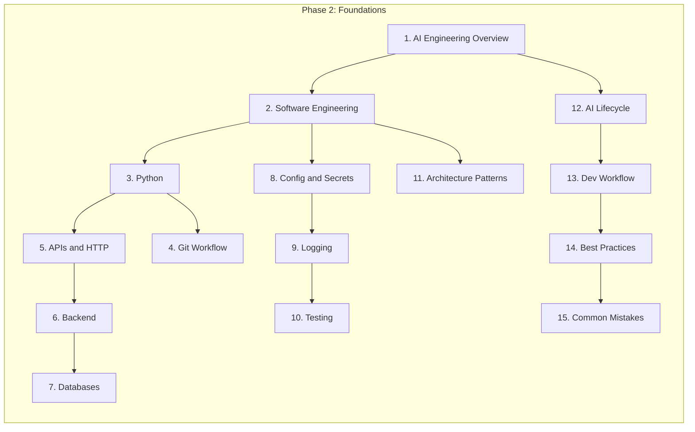

# Foundations — Phase 2: AI Engineering Foundations

> Prerequisite module for all subsequent phases (LLMs, RAG, Agents, Production AI).
> Complete this module before advancing to Phase 3.

---

## Module Overview

Phase 2 builds the engineering foundation that every AI application depends on.
The content is distributed across multiple domains but forms a single connected learning path.

---

## Learning Path

Follow this order for the recommended path:

| # | Topic | Document | Domain |
|---|-------|----------|--------|
| 1 | AI Engineering Overview | [ai-engineering-overview.md](ai-engineering-overview.md) | foundations |
| 2 | Software Engineering for AI | [software-engineering-for-ai.md](software-engineering-for-ai.md) | foundations |
| 3 | Python for AI Engineering | [python-for-ai-engineering.md](../python-engineering/python-for-ai-engineering.md) | python-engineering |
| 4 | Git and GitHub Workflow | [git-github-workflow.md](git-github-workflow.md) | foundations |
| 5 | APIs and HTTP | [http-fundamentals-for-ai.md](../apis/http-fundamentals-for-ai.md) | apis |
| 6 | Backend Fundamentals | [backend-fundamentals-for-ai.md](../backend-engineering/backend-fundamentals-for-ai.md) | backend-engineering |
| 6b | FastAPI Foundation | [fastapi-foundation.md](../fastapi/fastapi-foundation.md) | fastapi |
| 7 | Databases for AI | [databases-for-ai-applications.md](../databases/databases-for-ai-applications.md) | databases |
| 7b | PostgreSQL for AI | [postgresql-for-ai.md](../databases/postgresql/postgresql-for-ai.md) | databases/postgresql |
| 7c | Redis for AI | [redis-for-ai.md](../databases/redis/redis-for-ai.md) | databases/redis |
| 8 | Configuration and Secrets | [configuration-and-secrets.md](configuration-and-secrets.md) | foundations |
| 9 | Logging and Error Handling | [logging-and-error-handling.md](../logging/logging-and-error-handling.md) | logging |
| 10 | Testing Fundamentals | [testing-fundamentals.md](testing-fundamentals.md) | foundations |
| 11 | Architecture Patterns | [architecture-patterns-foundation.md](../software-architecture/architecture-patterns-foundation.md) | software-architecture |
| 12 | AI Application Lifecycle | [ai-application-lifecycle.md](ai-application-lifecycle.md) | foundations |
| 13 | Development Workflow | [development-workflow.md](development-workflow.md) | foundations |
| 14 | Engineering Best Practices | [engineering-best-practices.md](engineering-best-practices.md) | foundations |
| 15 | Common Mistakes | [common-engineering-mistakes.md](../common-mistakes/common-engineering-mistakes.md) | common-mistakes |

---

## Documents in This Domain

| Document | Status | Description |
|----------|--------|-------------|
| [AI Engineering Overview](ai-engineering-overview.md) | Published | What AI engineering is and production principles |
| [Software Engineering for AI](software-engineering-for-ai.md) | Published | Clean architecture, SOLID, patterns for AI apps |
| [AI Application Lifecycle](ai-application-lifecycle.md) | Published | End-to-end lifecycle from idea to iteration |
| [Development Workflow](development-workflow.md) | Published | Professional engineering workflow |
| [Configuration and Secrets](configuration-and-secrets.md) | Published | Environment variables, secrets management |
| [Testing Fundamentals](testing-fundamentals.md) | Published | pytest, mocking, API testing, AI eval overview |
| [Git and GitHub Workflow](git-github-workflow.md) | Published | Branching, PRs, CI/CD, releases |
| [Engineering Best Practices](engineering-best-practices.md) | Published | Code reviews, naming, maintainability |

---

## Code Examples

| Example | Location |
|---------|----------|
| Layered architecture | [examples/python/example-layered-architecture.py](../../examples/python/example-layered-architecture.py) |
| Pydantic settings | [examples/python/example-pydantic-settings.py](../../examples/python/example-pydantic-settings.py) |
| Async LLM client | [examples/python/example-async-llm-client.py](../../examples/python/example-async-llm-client.py) |
| Structured logging | [examples/python/example-structured-logging.py](../../examples/python/example-structured-logging.py) |
| Streaming endpoint | [examples/fastapi/example-streaming-endpoint.py](../../examples/fastapi/example-streaming-endpoint.py) |
| Dependency injection | [examples/fastapi/example-dependency-injection.py](../../examples/fastapi/example-dependency-injection.py) |

---

## Phase 2 Completion Checklist

- [ ] Read all 15 topic documents in the learning path order
- [ ] Run all code examples locally
- [ ] Build a simple FastAPI chat endpoint with DI, config, and logging
- [ ] Write unit tests with mocked LLM client
- [ ] Document one architecture decision (ADR) in `knowledge/architecture-decisions/`

**Unlocked after Phase 2:** [LLM Engineering](../llm-engineering/README.md) (Phase 3)

---

## See Also

- [Learning Roadmap](../../meta/roadmap.md)
- [Master Index](../../meta/indexes/MASTER-INDEX.md)
- [Glossary](../../meta/glossary.md)
