# AI Application Lifecycle

> A complete reference for every stage of building and operating production AI applications — from validating an idea to closing the feedback loop with real user data.

## Table of Contents

- [Overview](#overview)
- [Lifecycle at a Glance](#lifecycle-at-a-glance)
- [Stage 1: Idea](#stage-1-idea)
- [Stage 2: Requirements](#stage-2-requirements)
- [Stage 3: Architecture](#stage-3-architecture)
- [Stage 4: Backend](#stage-4-backend)
- [Stage 5: Model Integration](#stage-5-model-integration)
- [Stage 6: Evaluation](#stage-6-evaluation)
- [Stage 7: Deployment](#stage-7-deployment)
- [Stage 8: Monitoring](#stage-8-monitoring)
- [Stage 9: Iteration](#stage-9-iteration)
- [Cross-Stage Concerns](#cross-stage-concerns)
- [Production Considerations](#production-considerations)
- [Common Mistakes](#common-mistakes)
- [Best Practices](#best-practices)
- [Interview Preparation](#interview-preparation)
- [Navigation](#navigation)

---

## Overview

An AI application is not a model in isolation. It is a software system that accepts inputs, orchestrates inference and retrieval, persists state, handles failures, and delivers value to users under real-world constraints — cost, latency, security, and reliability.

The lifecycle described here is the engineering backbone of [AI Engineering Overview](ai-engineering-overview.md). Each stage produces artifacts that the next stage depends on. Skipping or compressing stages is the dominant cause of production failures: impressive demos that cannot be maintained, scaled, or trusted.

This document complements [Software Engineering for AI](software-engineering-for-ai.md) (how to structure code) and [Development Workflow](development-workflow.md) (how teams execute day to day). Read those alongside this lifecycle for a complete foundations picture.

---

## Lifecycle at a Glance

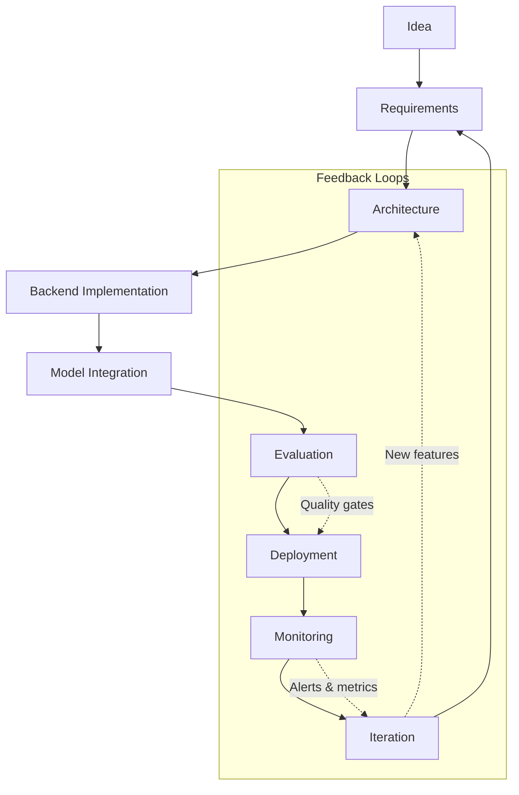

| Stage | Primary Output | Gate Question |
|-------|---------------|---------------|
| Idea | Problem hypothesis | Is this worth solving? |
| Requirements | PRD, success metrics, constraints | Do we know what "good" means? |
| Architecture | System design, ADRs | Can the system survive failure? |
| Backend | APIs, data layer, auth | Is non-AI infrastructure solid? |
| Model Integration | LLM/RAG/agent pipeline | Is inference reliable and bounded? |
| Evaluation | Eval suite, baselines | Can we detect quality regression? |
| Deployment | CI/CD, infra, rollback | Can we ship safely? |
| Monitoring | Dashboards, alerts, traces | Can we see problems before users? |
| Iteration | Prioritized improvements | Are we learning from production? |

---

## Stage 1: Idea

**Goal:** Validate that a problem exists, that AI is an appropriate solution, and that the effort is justified before writing production code.

### Activities

- Identify the user pain point and current workaround.
- Assess whether AI adds unique value versus rules, search, or human workflow.
- Estimate rough cost envelope (tokens per request, expected volume).
- Build a **spike** or notebook prototype — explicitly disposable.
- Define a one-page hypothesis: who, what problem, why AI, success signal.

### Decision Framework: Should AI Solve This?

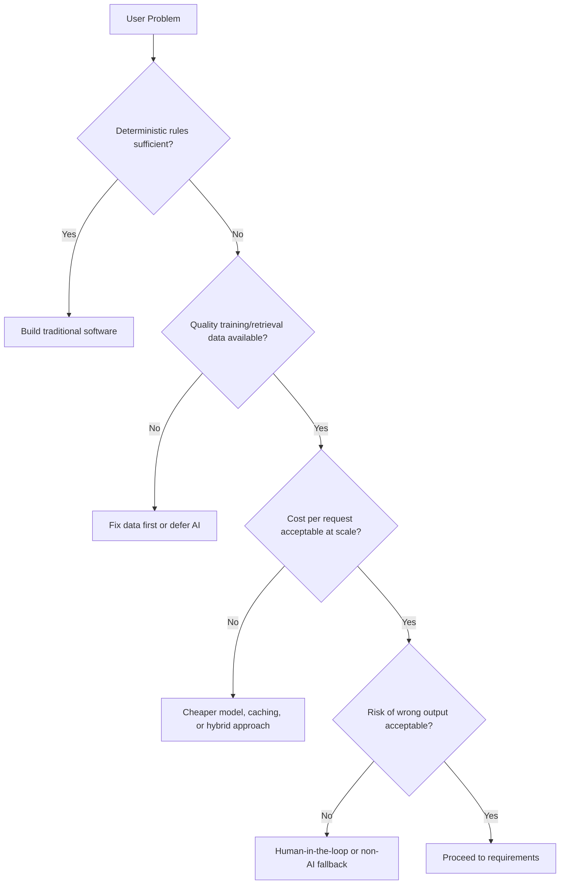

### Artifacts

| Artifact | Purpose |
|----------|---------|
| Problem statement | Aligns team on the "why" |
| AI fit assessment | Documents build vs rules vs buy |
| Spike results | Informs feasibility and cost |
| Kill criteria | Defines when to abandon the idea |

### Production Considerations

- Treat spikes as **throwaway** — do not merge notebook code into production.
- Document assumptions from the spike (latency, cost, quality) for requirements.
- Involve security and compliance early if PII or regulated data is involved.

### Common Mistakes

| Mistake | Consequence |
|---------|-------------|
| "Let's just use GPT for everything" | Expensive solutions to simple problems |
| Skipping user research | Building features nobody needs |
| Promoting spike code to production | Unmaintainable architecture |
| No kill criteria | Sunk-cost projects that drain team capacity |

---

## Stage 2: Requirements

**Goal:** Define measurable success, functional and non-functional requirements, and constraints before architecture or implementation.

### Activities

- Write user stories with acceptance criteria.
- Define **success metrics** — both product (engagement, task completion) and AI-specific (accuracy, hallucination rate, latency p95).
- Specify non-functional requirements: latency SLA, availability, cost budget, data retention.
- Identify compliance constraints (GDPR, HIPAA, SOC 2).
- Define scope boundaries — what is in v1 and explicitly out of scope.

### Requirements Layers

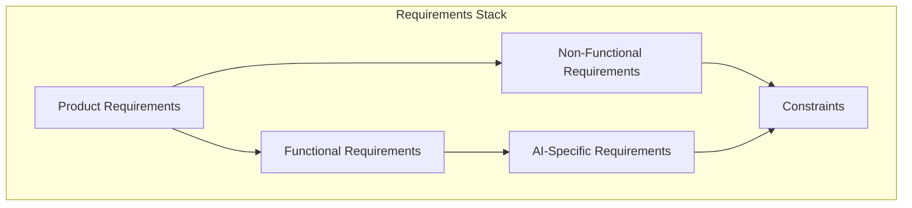

### AI-Specific Requirements Checklist

| Category | Example Requirements |
|----------|---------------------|
| Quality | "Answers must cite source documents for factual claims" |
| Latency | "First token streamed within 800ms p95" |
| Cost | "Max $0.02 per user query at current volume" |
| Safety | "Reject jailbreak attempts; no PII in logs" |
| Fallback | "Degrade to cached FAQ if LLM provider unavailable" |
| Observability | "Log prompt hash, model, tokens, latency per request" |

### Artifacts

- Product requirements document (PRD) or equivalent.
- Success metrics dashboard spec.
- Risk register (model failures, cost overruns, data leakage).
- Evaluation criteria draft (feeds Stage 6).

### Production Considerations

- Requirements must be **testable** — vague goals like "good answers" are not requirements.
- Separate must-have from nice-to-have; AI features often need phased rollout.
- Align with [Development Workflow](development-workflow.md) requirements practices.

---

## Stage 3: Architecture

**Goal:** Design a system that meets requirements, handles failure modes, and can evolve without rewrite.

### Activities

- Draw component diagram: client, API, AI orchestration, data stores, external services.
- Define boundaries and interfaces (ports/adapters per [Software Engineering for AI](software-engineering-for-ai.md)).
- Document failure modes and mitigation at each layer.
- Choose build vs buy for each component.
- Write Architecture Decision Records (ADRs).
- Plan for horizontal scaling, caching, and async processing where needed.

### Reference Architecture

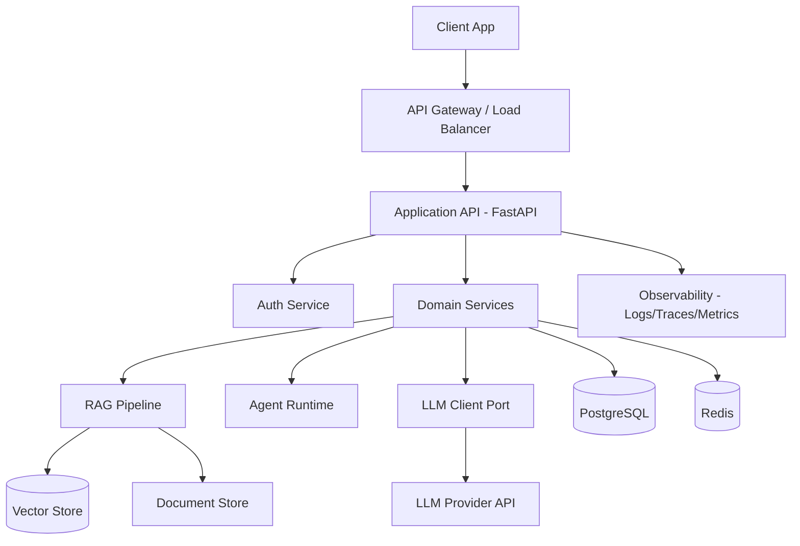

### Architecture Decision Checklist

| Decision | Options to Consider |
|----------|-------------------|
| LLM access | Direct API, proxy gateway, self-hosted |
| Retrieval | In-process, separate microservice, managed RAG |
| State | Stateless API vs conversation store |
| Async work | Sync response vs background jobs for long tasks |
| Multi-tenancy | Shared vs isolated vector indexes |

### Artifacts

- System context diagram and component diagram.
- ADRs for major decisions.
- Interface contracts (API schemas, port definitions).
- Threat model sketch (prompt injection, data exfiltration).

### Production Considerations

- Design for **provider failure** — circuit breakers, fallbacks, queue-based retry.
- Separate sync user path from async batch/indexing path.
- Plan evaluation and monitoring hooks into architecture from day one.

### Common Mistakes

| Mistake | Impact |
|---------|--------|
| Monolithic "AI module" with no boundaries | Untestable, unscalable |
| No fallback path | Total outage when provider fails |
| Vector DB as only data store | Lost metadata, no audit trail |
| Ignoring prompt injection in design | Security incident waiting to happen |

---

## Stage 4: Backend

**Goal:** Build reliable non-AI infrastructure — APIs, persistence, authentication, configuration — so the AI layer sits on solid ground.

### Activities

- Implement API routes with validation (Pydantic models).
- Build service layer and repository pattern.
- Set up database schema, migrations, and caching.
- Implement authentication and authorization.
- Configure environment-based secrets management.
- Add health checks and readiness probes.
- Write unit and integration tests for non-AI paths.

### Layered Implementation

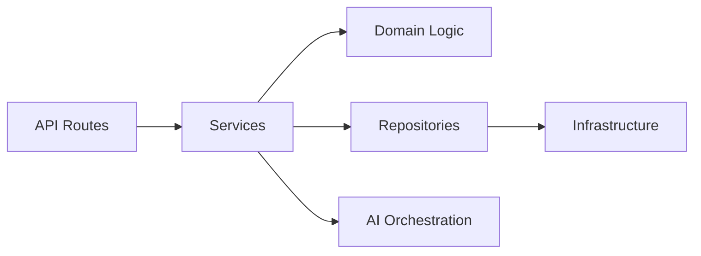

Follow [Software Engineering for AI](software-engineering-for-ai.md) and [Engineering Best Practices](engineering-best-practices.md) for structure and quality standards.

### Backend Checklist Before AI Integration

| Item | Status Target |
|------|---------------|
| Auth on all protected endpoints | Required |
| Input validation on all requests | Required |
| Structured error responses | Required |
| Database migrations versioned | Required |
| Config externalized (no secrets in code) | Required |
| Health endpoint (`/health`, `/ready`) | Required |
| CI runs tests on every PR | Required |

### Artifacts

- Working API with OpenAPI documentation.
- Database schema and migration history.
- Test suite with meaningful coverage on services.
- Dependency injection wiring (composition root).

### Production Considerations

- **No AI logic in route handlers** — routes validate and delegate.
- Backend must work when LLM provider is down (graceful errors, cached responses).
- Rate limiting at API layer protects against cost explosions.

---

## Stage 5: Model Integration

**Goal:** Integrate LLMs, embeddings, retrieval, and agents behind clean interfaces with resilience, cost controls, and observability.

### Activities

- Abstract LLM access behind a port (`LLMClient` interface).
- Implement retry logic, timeouts, and circuit breakers.
- Add streaming support where UX requires it.
- Build RAG pipeline (ingest, chunk, embed, retrieve, generate) if applicable.
- Implement prompt templates as versioned assets.
- Add token counting and cost tracking per request.
- Configure model selection (primary + fallback models).

### Model Integration Flow

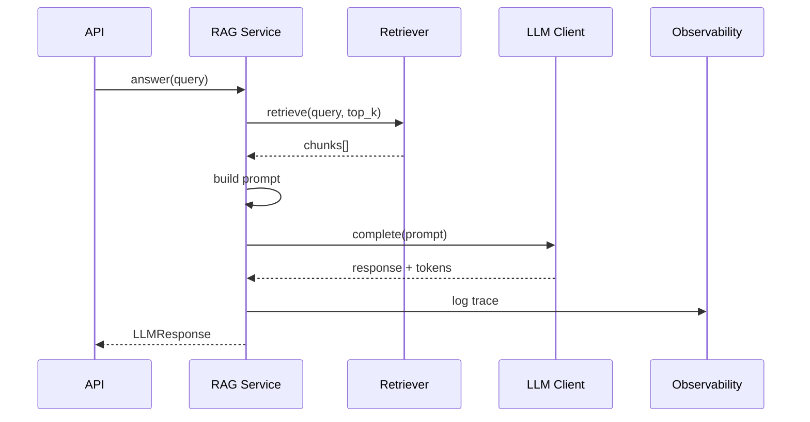

### Integration Patterns

| Pattern | When to Use |
|---------|-------------|
| Direct API call | Simple completions, low volume |
| Streaming | Chat UX, long responses |
| RAG | Domain-specific Q&A over documents |
| Agent with tools | Multi-step tasks requiring external actions |
| Model routing | Cost optimization by query complexity |

### Deep Dives (Future Phases)

- [LLM Engineering](../llm-engineering/README.md) — tokens, APIs, function calling, streaming
- [RAG Systems](../rag/README.md) — chunking, embedding, retrieval strategies
- [Model Integration](../model-integration/README.md) — provider comparison, fallbacks

### Artifacts

- LLM client implementation with interface.
- Prompt library (versioned).
- RAG ingestion pipeline (if applicable).
- Cost estimation spreadsheet or dashboard.

### Production Considerations

- Set **max tokens** and **timeout** on every call.
- Never log raw prompts containing PII — hash or redact.
- Test with mocked LLM in unit tests; evaluate quality separately.
- Implement idempotency for retried requests where side effects exist.

### Common Mistakes

| Mistake | Impact |
|---------|--------|
| Hardcoded OpenAI calls everywhere | Vendor lock-in, untestable |
| No timeout on LLM calls | Hung requests, resource exhaustion |
| Unbounded context injection | Cost blowups, latency spikes |
| Prompts scattered in code | No versioning, no A/B testing |

---

## Stage 6: Evaluation

**Goal:** Measure output quality systematically so regressions are caught before users see them.

### Activities

- Build a golden dataset of representative queries and expected behaviors.
- Define metrics: accuracy, relevance, faithfulness, toxicity, latency, cost.
- Implement automated eval pipeline (CI or scheduled).
- Establish baselines before launch.
- Add LLM-as-judge where human labels are expensive.
- Gate deployments on eval thresholds.

### Evaluation Pipeline

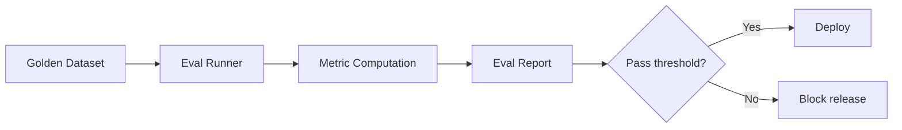

### Metric Categories

| Type | Examples | When to Use |
|------|----------|-------------|
| Retrieval | Precision@k, MRR, recall | RAG systems |
| Generation | Faithfulness, relevance, coherence | All generative features |
| Safety | Toxicity, PII leakage, jailbreak success | User-facing chat |
| Operational | p50/p95 latency, error rate, cost/request | Always |
| Business | Task completion, user thumbs up/down | Post-launch |

See [Testing Fundamentals](testing-fundamentals.md) for how evals fit into the broader test pyramid.

### Artifacts

- Golden dataset (versioned, curated).
- Eval scripts runnable in CI.
- Baseline scores document.
- Quality threshold definitions per release.

### Production Considerations

- Evals are **not optional** for production AI — they are your regression test suite for nondeterministic output.
- Separate retrieval evals from generation evals to localize failures.
- Re-run evals when changing prompts, models, or chunking strategy.
- Human review on a sample remains valuable for calibration.

---

## Stage 7: Deployment

**Goal:** Ship the application reliably with rollback capability, environment parity, and automated pipelines.

### Activities

- Containerize application (Docker).
- Define infrastructure (cloud, Kubernetes, or PaaS).
- Set up CI/CD: test → build → deploy → smoke test.
- Configure secrets management in deployment environment.
- Implement blue-green or rolling deployment strategy.
- Run pre-production eval gate.
- Document runbooks for common failures.

### Deployment Pipeline

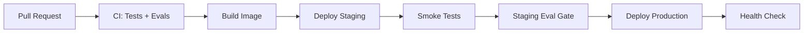

See [AI Deployment](../ai-deployment/README.md) for production deployment patterns, scaling, and infrastructure choices.

### Deployment Checklist

| Item | Required |
|------|----------|
| Environment variables documented | Yes |
| Secrets in vault, not in image | Yes |
| Health and readiness probes | Yes |
| Rollback procedure tested | Yes |
| Database migrations automated | Yes |
| Rate limits configured | Yes |
| Cost alerts configured | Yes |

### Production Considerations

- Staging must use the same model providers and similar data as production.
- Feature flags enable gradual rollout of AI changes.
- Never deploy prompt changes without running eval suite.

---

## Stage 8: Monitoring

**Goal:** Detect failures, quality degradation, cost anomalies, and security issues before users report them.

### Activities

- Instrument structured logging (request ID, model, tokens, latency).
- Add distributed tracing for multi-step AI pipelines.
- Build dashboards: latency, error rate, token usage, cost.
- Configure alerts on SLO breaches.
- Track business metrics (completion rate, user feedback).
- Sample and review production outputs periodically.

### Observability Stack

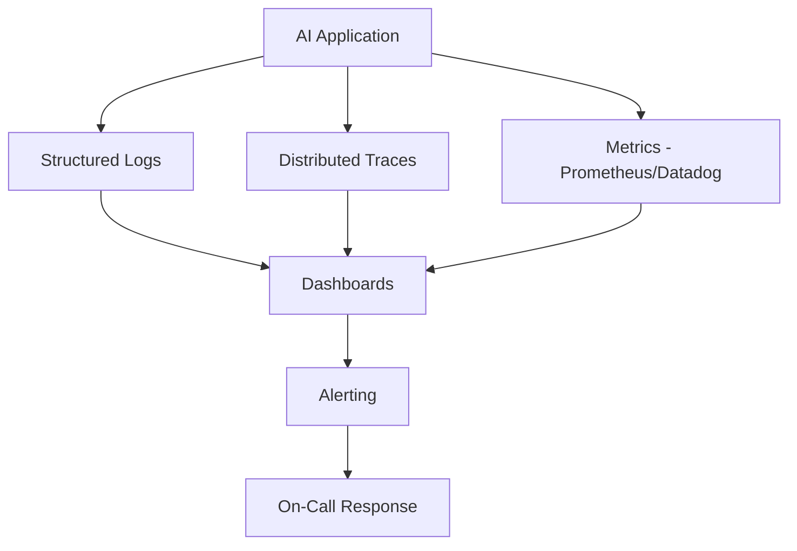

### Key Metrics to Track

| Metric | Why It Matters |
|--------|----------------|
| Request latency (p50, p95, p99) | User experience |
| Error rate by type | Reliability |
| Tokens in/out per request | Cost forecasting |
| Cost per day/week | Budget control |
| Retrieval hit rate | RAG effectiveness |
| User feedback (thumbs up/down) | Quality signal |
| Fallback activation rate | Provider health |

### Artifacts

- Dashboard templates.
- Alert runbooks.
- SLO definitions.
- Log retention and PII policy.

### Production Considerations

- Log metadata, not raw prompts, unless explicitly approved and secured.
- Alert on **cost anomalies** — a bug that loops LLM calls can bankrupt a project overnight.
- Correlate traces across retrieval → generation → response for debugging.

---

## Stage 9: Iteration

**Goal:** Use production data and feedback to prioritize improvements and feed the next development cycle.

### Activities

- Analyze user feedback and failure cases.
- Review monitoring data for trends.
- Prioritize backlog: quality, cost, latency, new features.
- Update golden dataset with new edge cases from production.
- Re-run architecture review for major changes.
- Close the loop back to requirements.

### Iteration Loop

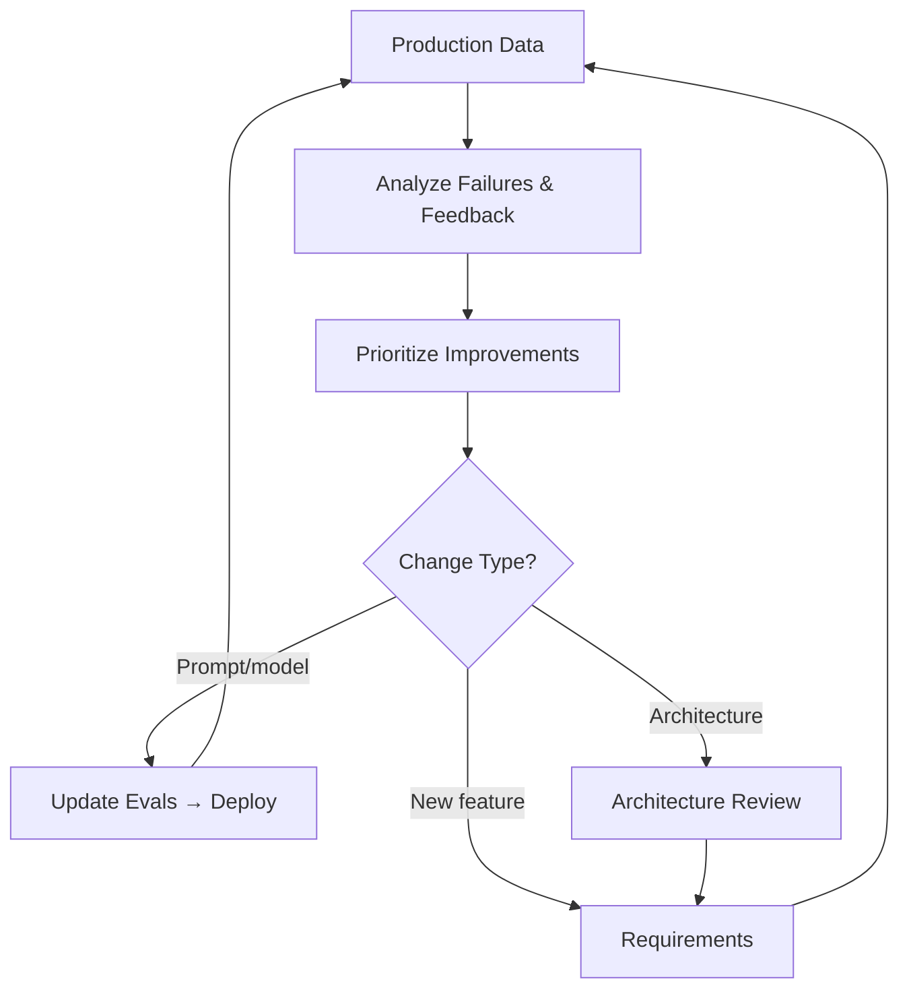

### Iteration Categories

| Category | Example Actions |
|----------|----------------|
| Quality | Better prompts, fine-tuning, improved retrieval |
| Cost | Caching, model routing, smaller models for simple queries |
| Latency | Streaming, parallel retrieval, edge caching |
| Reliability | Better fallbacks, retry policies |
| Features | New tools for agents, expanded document corpus |

### Production Considerations

- Every iteration that touches AI output must update evals first.
- Document what changed and why (changelog, ADRs).
- Measure impact of changes against baseline metrics.

---

## Cross-Stage Concerns

These concerns span every lifecycle stage and must not be deferred to "later."

| Concern | Applies From | Reference |
|---------|-------------|-----------|
| Security | Idea → Iteration | Input validation, prompt injection, PII |
| Cost management | Requirements → Monitoring | Budgets, alerts, token limits |
| Observability | Architecture → Iteration | Logs, traces, metrics |
| Testing | Backend → Iteration | Unit, integration, eval |
| Documentation | All stages | ADRs, runbooks, API docs |

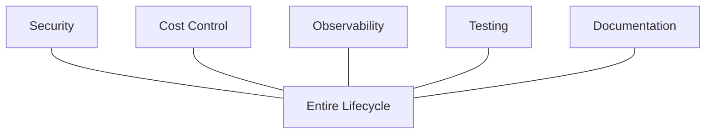

---

## Production Considerations

### Lifecycle Gates

Define explicit gates between stages. A gate is a checklist that must pass before proceeding.

| Gate | Minimum Criteria |
|------|-----------------|
| Idea → Requirements | Problem validated, AI fit confirmed, spike complete |
| Requirements → Architecture | Metrics defined, scope bounded, risks documented |
| Architecture → Backend | ADRs approved, interfaces defined |
| Backend → Model Integration | API tests pass, auth works, health checks live |
| Model Integration → Evaluation | Integration tests pass, cost per request estimated |
| Evaluation → Deployment | Eval thresholds met on golden dataset |
| Deployment → Monitoring | Dashboards live, alerts configured |
| Monitoring → Iteration | SLOs defined, feedback channel exists |

### Team Roles Across the Lifecycle

| Role | Primary Stages |
|------|---------------|
| Product | Idea, Requirements, Iteration |
| AI Engineer | Architecture through Monitoring |
| Backend Engineer | Backend, Deployment |
| ML/Eval Specialist | Evaluation, Iteration |
| SRE / Platform | Deployment, Monitoring |

---

## Common Mistakes

| Mistake | Stage | Fix |
|---------|-------|-----|
| Building before defining success metrics | Requirements | Write measurable acceptance criteria first |
| Skipping architecture for "simple" AI features | Architecture | Even simple features need failure planning |
| AI logic in API routes | Backend | Service layer + dependency injection |
| No eval suite before launch | Evaluation | Golden dataset + CI eval gate |
| Manual production deploys | Deployment | CI/CD with rollback |
| No cost alerts | Monitoring | Token and spend dashboards from day one |
| Ignoring production failures | Iteration | Weekly review of bad outputs and traces |
| Treating lifecycle as linear | All | Embrace feedback loops at every stage |

---

## Best Practices

- Start with [AI Engineering Overview](ai-engineering-overview.md) for context, then use this document as your stage-by-stage checklist.
- Follow [Development Workflow](development-workflow.md) for day-to-day execution within each stage.
- Apply [Software Engineering for AI](software-engineering-for-ai.md) patterns from architecture through deployment.
- Use [Engineering Best Practices](engineering-best-practices.md) for code review, git workflow, and quality bars.
- Build eval infrastructure in parallel with model integration — not after launch.
- Write ADRs at architecture stage; update them during iteration.
- Keep a living risk register from requirements through production.

---

## Interview Preparation

### Frequently Asked Questions

**Q1: Walk me through the lifecycle of building an AI application.**

> **Strong answer:** Describe each stage from idea through iteration. Emphasize that requirements and evaluation are often skipped in demos but are critical in production. Mention feedback loops — monitoring feeds iteration, iteration updates requirements. Draw the lifecycle diagram if possible.

**Q2: What is the most commonly skipped stage, and what happens when you skip it?**

> **Strong answer:** Evaluation is the most skipped. Without evals, prompt changes, model upgrades, and retrieval tweaks cause silent quality regression. Users notice before the team does. Cost monitoring is a close second — teams discover runaway bills weeks later.

**Q3: How do backend engineering and AI integration relate in the lifecycle?**

> **Strong answer:** Backend comes first. Auth, validation, persistence, and error handling must work independently of the LLM. AI integration sits on top of a solid service layer. If the backend is fragile, adding AI multiplies failure modes.

**Q4: How do you decide when an AI feature is ready for production?**

> **Strong answer:** Checklist approach: eval thresholds met, fallbacks tested, monitoring live, cost within budget, security review done, rollback tested. Quality is not "looks good in demo" — it is measured against a golden dataset.

### Follow-Up Questions

- How would you design eval metrics for a RAG-based support bot?
- What gates would you put in CI for an AI application?
- How do you handle a model provider outage in production?

### Real-World Scenarios

**Scenario:** A team shipped a RAG chatbot in two weeks. Initial user feedback is positive, but after a prompt tweak, answer quality drops 30% and nobody notices for two weeks.

> **Discussion points:** Missing eval gate in deployment pipeline. No baseline metrics. Prompt changes not versioned. Fix: golden dataset, CI eval on prompt changes, alerting on feedback score drops.

**Scenario:** Your AI feature works in staging but costs 10x more than projected in production.

> **Discussion points:** Staging did not mirror production traffic patterns. No per-request cost tracking. Missing rate limits and caching. Fix: cost dashboards, token budgets, model routing for simple queries.

---

## Navigation

### Prerequisites

- [AI Engineering Overview](ai-engineering-overview.md)

### Related Topics

- [Software Engineering for AI](software-engineering-for-ai.md)
- [Development Workflow](development-workflow.md)
- [Engineering Best Practices](engineering-best-practices.md)
- [Testing Fundamentals](testing-fundamentals.md)

### Next Topics

- [Development Workflow](development-workflow.md) — day-to-day execution
- [Python for AI Engineering](../python-engineering/python-for-ai-engineering.md)
- [Backend Fundamentals for AI](../backend-engineering/backend-fundamentals-for-ai.md)

### Future Reading

- [LLM Engineering](../llm-engineering/README.md): model APIs, streaming, function calling
- [RAG Systems](../rag/README.md): retrieval-augmented generation
- [AI Deployment](../ai-deployment/README.md) — production infrastructure and scaling
- [AI Evaluation](../ai-evaluation/README.md) — advanced evaluation strategies
- [Observability](../observability/README.md) — logging, tracing, and metrics

---

## See Also

- [Foundations Index](README.md)
- [Learning Roadmap](../../meta/roadmap.md)
- [Glossary](../../meta/glossary.md)

## Changelog

| Version | Date | Changes |
|---------|------|---------|
| 1.0 | 2026-07-13 | Initial version |
