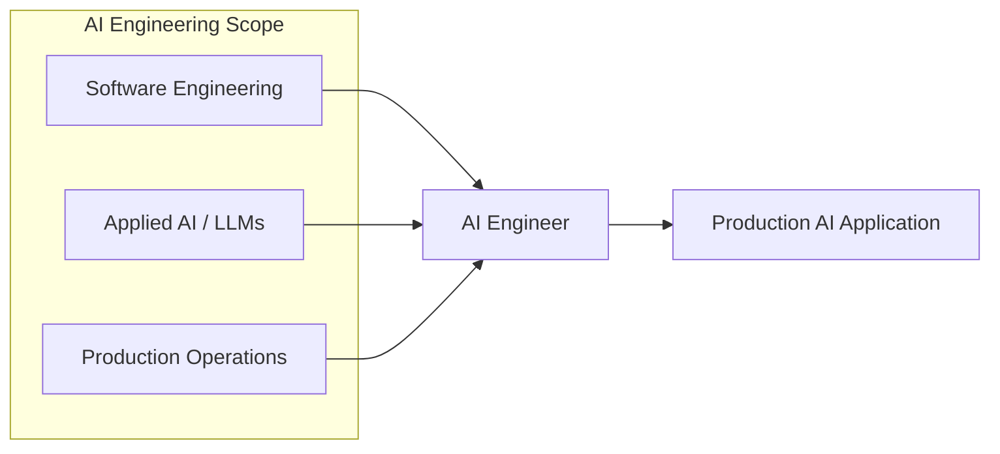
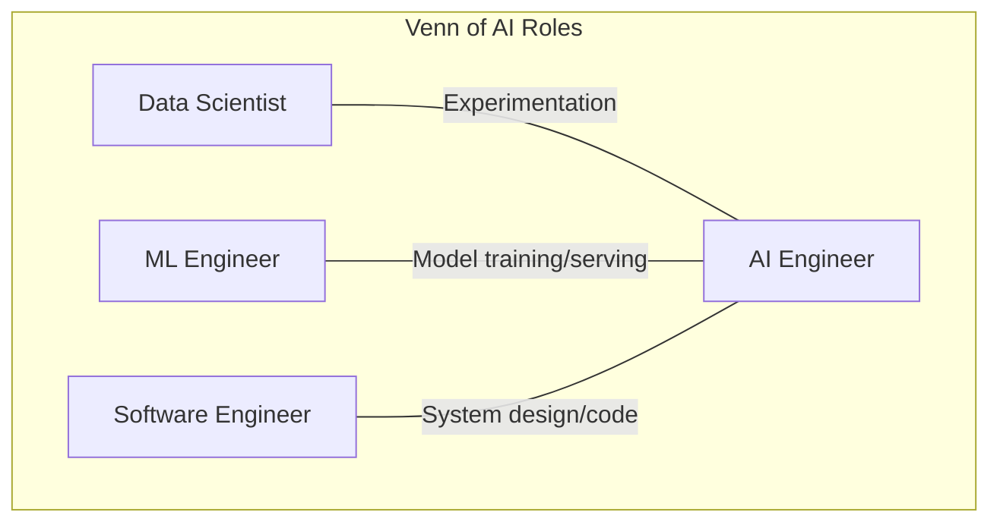
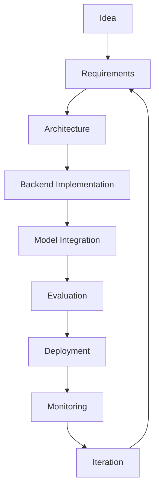
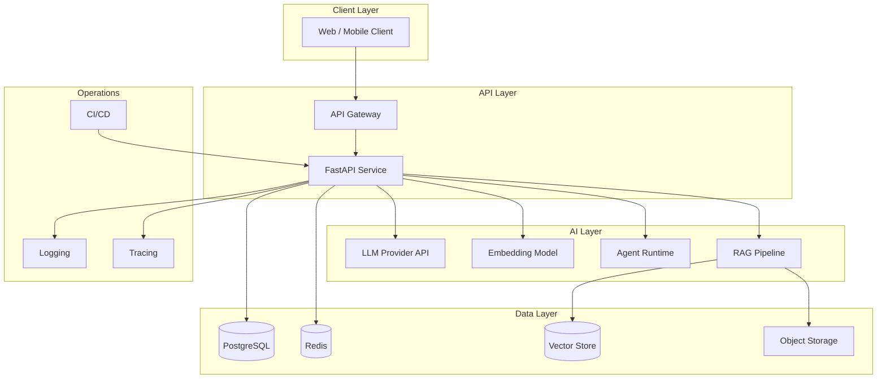
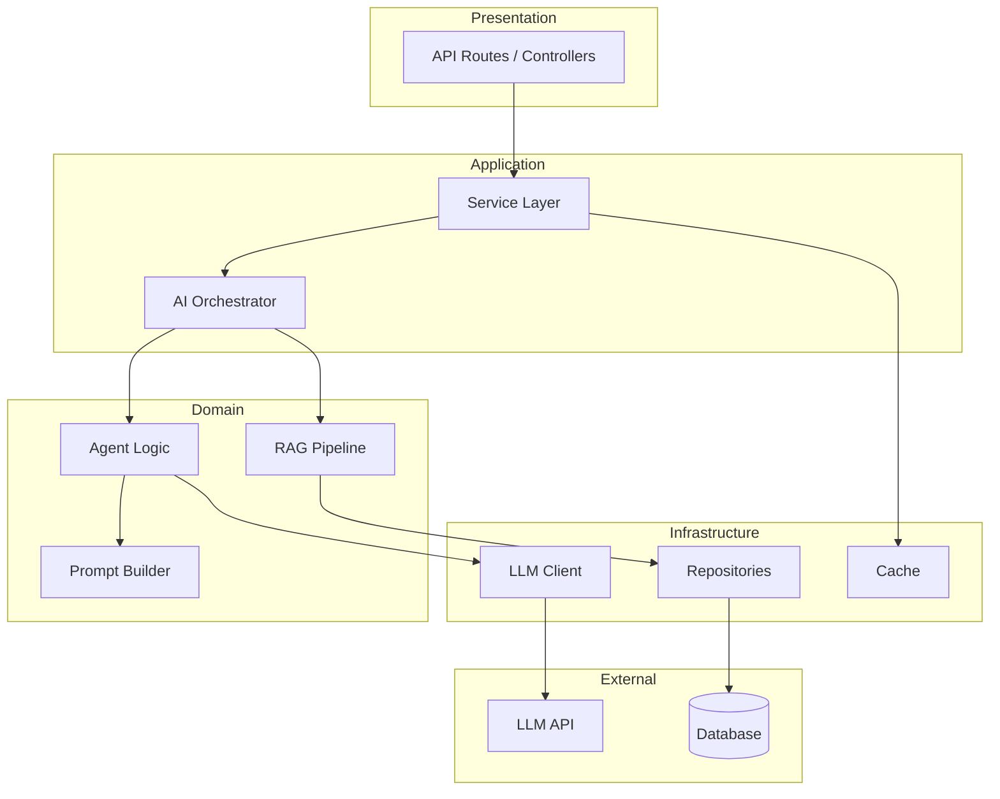
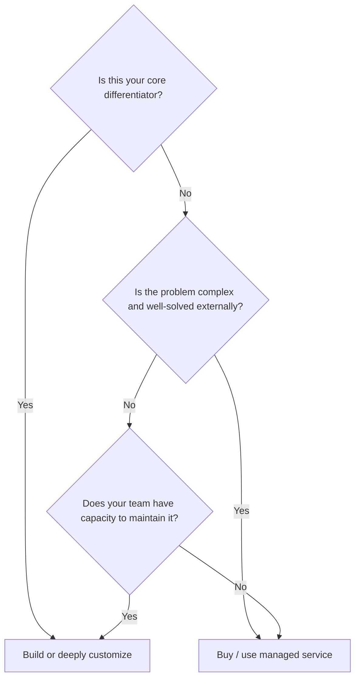

# AI Engineering Overview

> A practitioner's map of AI engineering — what the role is, how it differs from adjacent disciplines, and the engineering principles that separate prototypes from production systems.

## Table of Contents

- [What Is AI Engineering](#what-is-ai-engineering)
- [AI Engineer vs Related Roles](#ai-engineer-vs-related-roles)
- [The AI Application Lifecycle](#the-ai-application-lifecycle)
- [The Modern AI Stack](#the-modern-ai-stack)
- [Typical AI System Architecture](#typical-ai-system-architecture)
- [AI Engineering Roadmap](#ai-engineering-roadmap)
- [Build vs Buy Decisions](#build-vs-buy-decisions)
- [Common AI Products](#common-ai-products)
- [The AI Engineering Mindset](#the-ai-engineering-mindset)
- [Production AI Principles](#production-ai-principles)
- [Common Mistakes](#common-mistakes)
- [Best Practices](#best-practices)
- [Interview Preparation](#interview-preparation)
- [Navigation](#navigation)

---

## What Is AI Engineering

**AI engineering** is the discipline of designing, building, deploying, evaluating, and maintaining software systems that integrate AI models — primarily large language models (LLMs) — into production applications.

An AI engineer sits at the intersection of software engineering and applied AI. The job is not training foundation models from scratch. It is taking models that already exist and making them reliable, observable, secure, and valuable inside real products.

### What AI Engineers Actually Do

| Activity | Example |
|----------|---------|
| Integrate LLM APIs | Streaming chat completions with retry logic |
| Build RAG pipelines | Ingest documents, embed, retrieve, generate |
| Design agent systems | Tool use, orchestration, state management |
| Deploy AI services | Docker containers, CI/CD, health checks |
| Evaluate quality | Automated evals, regression testing |
| Optimize cost and latency | Caching, model selection, batching |
| Handle failures | Fallbacks, circuit breakers, graceful degradation |
| Secure systems | API key management, input validation, PII redaction |

### What AI Engineering Is Not

- **Not ML research** — you are not publishing papers or inventing architectures.
- **Not data science** — you are not primarily building dashboards or running A/B tests on tabular data.
- **Not prompt hacking** — prompts are one tool; the system around them is the engineering work.
- **Not notebook prototyping** — notebooks explore ideas; AI engineering ships maintainable code.

> **Production Standard:** If it cannot be deployed, monitored, tested, and maintained by a team, it is a demo — not an AI engineering deliverable.

---

## AI Engineer vs Related Roles

Understanding role boundaries helps you focus on the right skills and communicate effectively in teams and interviews.

| Dimension | AI Engineer | ML Engineer | Data Scientist | Software Engineer |
|-----------|-------------|-------------|----------------|-------------------|
| **Primary output** | AI-powered applications | ML models and pipelines | Insights and models | General software systems |
| **Model work** | Integrate pre-trained models via API | Train, fine-tune, deploy models | Experiment with models for analysis | Rarely touches models |
| **Code focus** | Backend APIs, agents, RAG, infra | Training pipelines, feature stores | Notebooks, SQL, visualization | Full-stack or backend systems |
| **Data work** | Embeddings, chunking, retrieval | Feature engineering, datasets | Statistical analysis, EDA | Schema design, CRUD |
| **Production concern** | High — deployment is core | High — model serving | Low to medium | High |
| **Typical stack** | FastAPI, LangGraph, vector DBs | PyTorch, MLflow, Kubeflow | Pandas, Jupyter, SQL | Java, Go, Python, etc. |

### Where Roles Overlap

In practice, small teams blur these lines. A strong AI engineer borrows from all three adjacent disciplines but optimizes for **shipping reliable AI applications**.

### Hiring Signal

When interviewing or being interviewed for AI engineering roles, expect questions that test:

1. Can you build a production API that calls an LLM?
2. Can you design a RAG system and explain tradeoffs?
3. Do you understand failure modes, cost, and latency?
4. Can you write clean, testable, maintainable code?

---

## The AI Application Lifecycle

Every AI application moves through a predictable lifecycle. Skipping stages is the most common source of production failures.

See [AI Application Lifecycle](ai-application-lifecycle.md) for a detailed breakdown of each stage.

| Stage | Key Question | Failure Mode If Skipped |
|-------|-------------|------------------------|
| Requirements | What problem are we solving and how do we measure success? | Building impressive tech that solves nothing |
| Architecture | How do components interact and where do failures occur? | Fragile systems that break under load |
| Backend | Is the non-AI infrastructure solid? | AI layer built on sand |
| Model Integration | Which model, what fallback, what cost budget? | Vendor lock-in, runaway bills |
| Evaluation | How do we know output quality is acceptable? | Silent quality degradation |
| Deployment | Can we ship, roll back, and scale? | Manual deploys, downtime |
| Monitoring | Can we detect problems before users do? | Discovering failures via Twitter |
| Iteration | How do we improve based on data? | Stagnant product |

---

## The Modern AI Stack

The modern AI engineering stack layers general software infrastructure with AI-specific components.

### Stack Layers Explained

| Layer | Purpose | Common Technologies |
|-------|---------|-------------------|
| **Client** | User interaction | React, Next.js, mobile apps |
| **API** | Request handling, auth, business logic | FastAPI, Express, Go |
| **AI** | Model inference, retrieval, agents | OpenAI, Anthropic, LangGraph |
| **Data** | Persistence, caching, vectors | PostgreSQL, Redis, pgvector |
| **Operations** | Deploy, monitor, debug | Docker, GitHub Actions, structured logs |

> **Tip:** Master the API and Data layers before diving deep into agents. Most AI application failures are backend failures, not model failures.

---

## Typical AI System Architecture

A production AI system typically follows a layered architecture with clear separation between transport, business logic, AI orchestration, and data access.

This maps directly to [Clean Architecture](software-engineering-for-ai.md#clean-architecture) principles — AI logic is a domain concern, not something smeared across route handlers.

---

## AI Engineering Roadmap

This repository's learning path is organized in phases. Phase 2 (this module) is the prerequisite for everything that follows.

| Phase | Focus | Unlocks |
|-------|-------|---------|
| **Phase 2** | Foundations (this module) | All subsequent phases |
| Phase 3 | LLM integration | Prompt engineering, streaming |
| Phase 4 | Embeddings and retrieval | RAG systems |
| Phase 5 | Agents and workflows | MCP, multi-agent systems |
| Phase 6 | Evaluation | Quality assurance at scale |
| Phase 7 | Production deployment | Docker, CI/CD, monitoring |

See the full [Learning Roadmap](../../meta/roadmap.md) for detailed milestones.

---

## Build vs Buy Decisions

AI engineers constantly decide whether to build a component or use an existing service. Use this framework:

### Common Build vs Buy Decisions

| Component | Typical Decision | Rationale |
|-----------|-----------------|-----------|
| LLM inference | **Buy** (API) | Training is not your job; APIs are mature |
| Embeddings | **Buy** (API) or buy + cache | Cheap via API; cache aggressively |
| Vector database | **Depends** | pgvector if you have PostgreSQL; Pinecone if you want managed |
| Agent framework | **Buy** (LangGraph, etc.) | Orchestration is solved; focus on your domain logic |
| API layer | **Build** | Your business logic lives here |
| Auth | **Buy** (Auth0, Clerk) | Security-critical; don't roll your own |
| Observability | **Buy** (managed) | LangSmith, Datadog — instrument, don't build |
| RAG pipeline | **Build** | Domain-specific; this is often your differentiator |
| Evaluation framework | **Build** on open tools | Your quality criteria are unique |

> **Warning:** "Build" does not mean "write everything from scratch." It means owning the integration and customization. Use libraries aggressively.

---

## Common AI Products

Understanding common AI product patterns helps you recognize architecture templates in the wild.

| Product Type | Architecture Pattern | Example |
|-------------|---------------------|---------|
| **Chat assistant** | LLM + conversation memory | ChatGPT, Claude |
| **Knowledge base Q&A** | RAG pipeline | Notion AI, Glean |
| **Code assistant** | LLM + IDE integration + context | GitHub Copilot, Cursor |
| **Agent platform** | Multi-tool agent + orchestration | Devin-style agents |
| **Document processing** | Ingestion + extraction + LLM | Invoice parsers, contract analysis |
| **Search augmentation** | Hybrid search + LLM synthesis | Perplexity-style products |
| **Workflow automation** | Agent + integrations + triggers | Zapier AI, n8n AI nodes |
| **Copilot / sidebar** | Embeddings + RAG + inline generation | Intercom Fin, Zendesk AI |

Each pattern reuses the same foundational components: API layer, LLM client, data store, and observability. The differentiation is in domain logic and evaluation.

---

## The AI Engineering Mindset

### Think in Systems, Not Prompts

A prompt is 5% of a production AI feature. The other 95% is retrieval, error handling, caching, auth, logging, testing, deployment, and iteration.

### Embrace Probabilistic Outputs

Traditional software is deterministic: same input, same output. AI systems are probabilistic. Your architecture must account for:

- Variable latency (200ms to 30s)
- Variable quality (good answer to hallucination)
- Variable cost (tokens consumed per request)
- External dependency failures (provider outages)

Design for **ranges**, not **exact values**.

### Optimize for Iteration Speed

The teams that win ship fast and measure. Build evaluation into your workflow from day one, not as an afterthought.

### Default to Boring Technology

PostgreSQL, Redis, FastAPI, and Docker solve most AI application infrastructure needs. Reach for exotic technology only when you have measured evidence it is necessary.

---

## Production AI Principles

These principles apply to every AI system you build:

1. **Every LLM call has a timeout** — default ≤ 30 seconds.
2. **Every LLM call has a retry strategy** — exponential backoff with jitter.
3. **Every LLM call has a fallback** — cheaper model, cached response, or graceful error.
4. **Never log raw prompts with PII** — redact before logging.
5. **Never hardcode API keys** — use environment variables or secrets managers.
6. **Measure cost per request** — token usage is a billing meter.
7. **Evaluate before you ship** — automated evals catch regressions.
8. **Design for failure** — LLM providers go down; your app should not.
9. **Separate AI logic from transport** — routes should not contain prompt strings.
10. **Version your prompts** — treat prompts as code with change history.

---

## Common Mistakes

| Mistake | Why It Happens | Prevention |
|---------|---------------|------------|
| Jumping to agents before mastering APIs | Hype cycle | Build a solid chat API first |
| Ignoring cost until the bill arrives | Demos are free | Track tokens from day one |
| No evaluation strategy | "We'll eyeball it" | Automated eval suite in CI |
| Monolithic route handlers | Fast prototyping | Service layer + clean architecture |
| Treating LLM output as truth | Trust in model quality | Validation, citations, guardrails |
| Skipping observability | Focus on features | Structured logs and tracing from sprint one |

See [Common Engineering Mistakes](../common-mistakes/common-engineering-mistakes.md) for a comprehensive guide.

---

## Best Practices

- Start with the [development workflow](development-workflow.md) — requirements before code.
- Learn [software engineering for AI](software-engineering-for-ai.md) before building complex systems.
- Build a solid [Python](../python-engineering/python-for-ai-engineering.md) and [API](../apis/http-fundamentals-for-ai.md) foundation.
- Document architecture decisions in [knowledge/architecture-decisions/](../../knowledge/architecture-decisions/).
- Follow this repository's [style guide](../../meta/style-guide.md) for all documentation.

---

## Interview Preparation

### Frequently Asked Questions

**Q1: What is the difference between an AI engineer and an ML engineer?**

> **Strong answer:** An ML engineer focuses on training, fine-tuning, and serving models — the model itself is the product. An AI engineer focuses on integrating pre-trained models into applications — the application is the product. AI engineers spend more time on APIs, RAG, agents, and production infrastructure; ML engineers spend more time on data pipelines, training loops, and model optimization. In practice, the roles overlap, especially in smaller teams.

**Q2: Describe a typical AI system architecture.**

> **Strong answer:** Walk through the layers: client → API gateway → application service → AI orchestration (LLM client, RAG, agents) → data layer (PostgreSQL, Redis, vector store). Emphasize separation of concerns, observability, and failure handling at each layer. Draw the diagram if possible.

**Q3: How do you decide between building and buying AI components?**

> **Strong answer:** Use core differentiator as the primary criterion. Buy commodity components (LLM inference, auth, observability). Build domain-specific logic (RAG pipelines, evaluation, business rules). Factor in team capacity to maintain what you build.

**Q4: What are the biggest risks when shipping AI to production?**

> **Strong answer:** Cost overruns (unbounded token usage), quality degradation (no evals), reliability (provider outages with no fallback), security (PII in logs, prompt injection), and latency (no caching or streaming).

### Follow-Up Questions

- How would you handle an LLM provider outage?
- How do you estimate the cost of an AI feature before building it?
- What metrics would you track for a RAG-based Q&A system?

### Real-World Scenarios

**Scenario:** Your team built a chat feature in a week. Users love it, but the AWS bill tripled and response quality varies wildly.

> **Discussion points:** Implement token budgeting, add response caching for common queries, introduce automated evaluation, add a fallback to a cheaper model for simple queries, set up cost alerts.

---

## Navigation

### Prerequisites

None — this is the entry point for the foundations module.

### Related Topics

- [Software Engineering for AI](software-engineering-for-ai.md)
- [AI Application Lifecycle](ai-application-lifecycle.md)
- [Development Workflow](development-workflow.md)
- [Engineering Best Practices](engineering-best-practices.md)

### Next Topics

- [Software Engineering for AI](software-engineering-for-ai.md)
- [Python for AI Engineering](../python-engineering/python-for-ai-engineering.md)
- [HTTP Fundamentals for AI](../apis/http-fundamentals-for-ai.md)

### Future Reading

- [LLM Engineering](../llm-engineering/README.md) — Phase 3
- [RAG Systems](../rag/README.md) — Phase 4
- [AI Agents](../ai-agents/README.md) — Phase 5
- [AI System Design](../ai-system-design/README.md) — Advanced architecture

---

## See Also

- [Foundations Index](README.md)
- [Glossary: AI Engineering](../../meta/glossary.md)
- [Learning Roadmap](../../meta/roadmap.md)

## Changelog

| Version | Date | Changes |
|---------|------|---------|
| 1.0 | 2026-07-13 | Initial version |
