# Development Workflow

> How professional teams build AI applications — a repeatable workflow from requirements to production improvement, with tooling, gates, and practices that separate demos from maintainable systems.

## Table of Contents

- [Overview](#overview)
- [Workflow at a Glance](#workflow-at-a-glance)
- [Requirements](#)
- [Design](#)
- [Implementation](#)
- [Testing](#)
- [Review](#)
- [Deployment](#)
- [Monitoring](#)
- [Improvement](#)
- [Tooling Reference](#tooling-reference)
- [Workflow for AI-Specific Work](#workflow-for-ai-specific-work)
- [Production Considerations](#production-considerations)
- [Common Mistakes](#common-mistakes)
- [Best Practices](#best-practices)
- [Interview Preparation](#interview-preparation)
- [Navigation](#navigation)

---

## Overview

A development workflow is the repeatable process a team follows to turn an idea into shipped, maintained software. For AI applications, the workflow is the same as for any production system — with additional gates for evaluation, cost control, and nondeterministic output quality.

This document describes **how teams execute** day to day. The [AI Application Lifecycle](ai-application-lifecycle.md) describes **what stages** a product passes through from conception to iteration. Read both together: lifecycle is the map; workflow is how you walk it.

Foundation references:

- [AI Engineering Overview](ai-engineering-overview.md) — role, principles, mindset
- [Software Engineering for AI](software-engineering-for-ai.md) — architecture and code structure
- [Engineering Best Practices](engineering-best-practices.md) — quality bars and conventions
- [Testing Fundamentals](testing-fundamentals.md) — test pyramid and AI eval patterns

---

## Workflow at a Glance

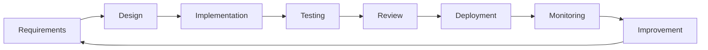

| Phase | Primary Question | Key Output |
|-------|-----------------|------------|
| Requirements | What are we building and why? | Tickets, acceptance criteria, metrics |
| Design | How will it work? | Design doc, ADRs, API contracts |
| Implementation | Does the code match the design? | PR with tests |
| Testing | Does it work correctly? | Passing CI, eval results |
| Review | Is it maintainable and safe? | Approved PR |
| Deployment | Is it live and healthy? | Released artifact |
| Monitoring | Is it behaving in production? | Dashboards, alerts |
| Improvement | What should we change next? | Prioritized backlog |

### Workflow vs Lifecycle

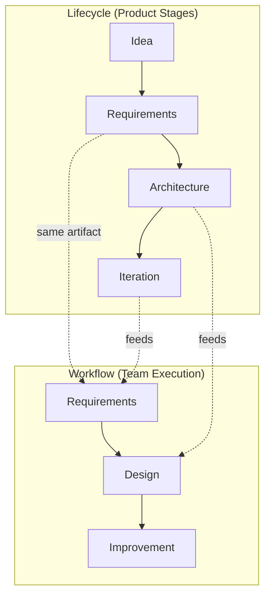

The lifecycle is product-oriented and spans months. The workflow is team-oriented and repeats every sprint or feature.

---

## Stage 1: Requirements

**Goal:** Translate user needs into clear, testable work items before design or code begins.

### Activities

- Gather input from product, users, support, and stakeholders.
- Write user stories: "As a [user], I want [action], so that [benefit]."
- Define acceptance criteria — specific, testable conditions for "done."
- Identify dependencies, risks, and out-of-scope items.
- Estimate effort and prioritize in backlog.
- For AI features: define quality expectations and cost constraints upfront.

### User Story Template

```markdown
## Story: [Title]

**As a** support agent
**I want** AI-suggested replies based on knowledge base articles
**So that** I can respond to customers faster with accurate information

### Acceptance Criteria
- [ ] Suggestions cite the source article URL
- [ ] Response generated within 2 seconds p95
- [ ] Agent can accept, edit, or dismiss suggestion
- [ ] No customer PII sent to external LLM without redaction
- [ ] Fallback to manual reply if LLM unavailable

### AI-Specific Notes
- Model: gpt-4o-mini for cost; gpt-4o for complex queries
- Eval: faithfulness ≥ 0.85 on golden dataset
- Max cost: $0.01 per suggestion
```

### Requirements Checklist

| Item | AI-Specific? |
|------|-------------|
| User story with clear beneficiary | No |
| Testable acceptance criteria | No |
| Success metrics defined | Yes — include quality metrics |
| Cost/latency budget | Yes |
| Security and privacy constraints | Yes — PII, prompt injection |
| Fallback behavior specified | Yes |
| Out of scope documented | No |

### Artifacts

- Groomed backlog items (Jira, Linear, GitHub Issues).
- Requirements doc or PRD for larger features.
- Success metrics linked to each story.

### Common Mistakes

| Mistake | Fix |
|---------|-----|
| Vague acceptance criteria ("good answers") | Quantify: latency, faithfulness score, citation requirement |
| No out-of-scope list | Scope creep destroys sprint predictability |
| Skipping stakeholder review | Align before design investment |

---

## Stage 2: Design

**Goal:** Plan the technical approach, document decisions, and align the team before writing production code.

### Activities

- Write a design doc for non-trivial features (see template below).
- Update or create ADRs for significant decisions.
- Define API contracts (request/response schemas).
- Identify components to build vs reuse.
- Plan test strategy (unit, integration, eval).
- Review design with peers before implementation.

### Design Doc Structure

```markdown
# Design: [Feature Name]

## Problem
[What user problem does this solve?]

## Proposed Solution
[High-level approach — 1-2 paragraphs]

## Architecture
[Mermaid diagram or component list]

## API Changes
[New endpoints, schema changes]

## Data Model
[Schema additions, migrations]

## AI Components
[Model choice, prompts, retrieval strategy, fallbacks]

## Testing Strategy
[Unit, integration, eval approach]

## Rollout Plan
[Feature flag, phased rollout, rollback]

## Open Questions
[Unresolved decisions]
```

### Design Review Flow

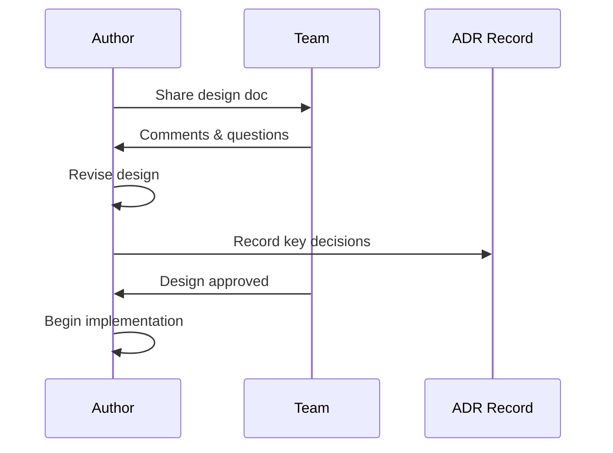

Apply patterns from [Software Engineering for AI](software-engineering-for-ai.md): layered architecture, ports and adapters, service layer separation.

### Artifacts

- Design document (linked from ticket).
- ADRs in `knowledge/architecture-decisions/`.
- API contract (OpenAPI spec or Pydantic models).
- Test plan outline.

### Production Considerations

- Design for failure: what happens when the LLM is slow, down, or returns garbage?
- Design for observability: what will you log and measure?
- Design for cost: estimate tokens per request at expected volume.

---

## Stage 3: Implementation

**Goal:** Write clean, tested code that matches the approved design.

### Activities

- Create a feature branch from `main`.
- Implement in small, logical commits.
- Follow project structure and coding standards.
- Write tests alongside implementation (not after).
- Keep PRs focused and reviewable (< 400 lines when possible).
- Update documentation as code changes.

### Branch and Commit Workflow

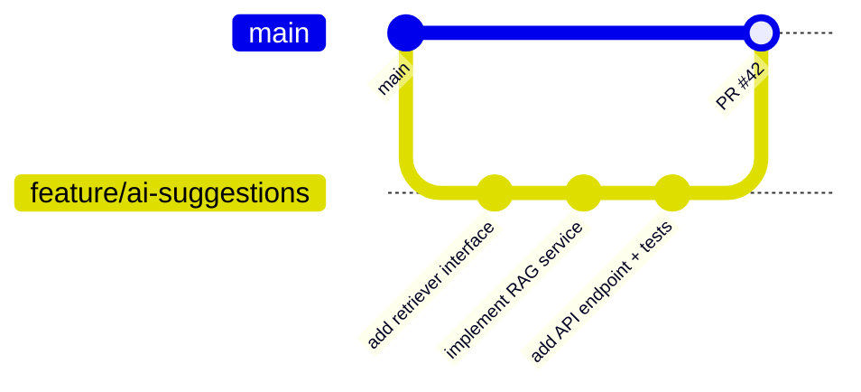

### Implementation Standards

| Standard | Detail |
|----------|--------|
| Branch naming | `feature/`, `fix/`, `chore/` prefixes |
| Commit messages | Conventional commits: `feat:`, `fix:`, `test:` |
| Code structure | Layered architecture per project conventions |
| Type hints | Required on all public interfaces |
| AI logic location | Domain/service layer, never in routes |
| Prompts | Versioned files in `domain/prompts/`, not inline |
| Secrets | Environment variables only |

### Implementation Checklist

- [ ] Matches approved design
- [ ] Follows [Engineering Best Practices](engineering-best-practices.md)
- [ ] Unit tests for services and domain logic
- [ ] Integration tests for API endpoints
- [ ] No hardcoded secrets or API keys
- [ ] Error handling with structured responses
- [ ] Logging at appropriate levels (no PII in logs)

### Common Mistakes

| Mistake | Impact |
|---------|--------|
| Large PRs (> 800 lines) | Poor review quality, hidden bugs |
| Implementation without design | Rework, architectural drift |
| Tests written only at the end | Untestable code, gaps |
| Copy-paste from spike/notebook | Wrong abstractions, no error handling |

---

## Stage 4: Testing

**Goal:** Verify correctness, prevent regressions, and measure AI output quality before review and deployment.

### Activities

- Run unit tests locally before pushing.
- Run integration tests against test database and mocked externals.
- Run AI evaluation suite against golden dataset.
- Check linting and type checking (ruff, mypy).
- Verify acceptance criteria manually for UX flows.
- Ensure CI passes on the PR branch.

### Test Pyramid for AI Applications

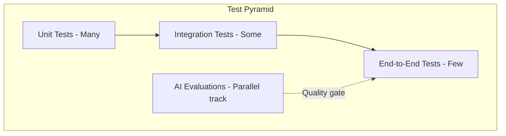

| Layer | What to Test | Tools |
|-------|-------------|-------|
| Unit | Services, domain logic, prompt builders | pytest, mocked ports |
| Integration | API routes, DB, cache | pytest, TestClient, testcontainers |
| E2E | Critical user paths | Playwright, API integration tests |
| AI Eval | Output quality, retrieval accuracy | Custom eval runner, LLM-as-judge |

See [Testing Fundamentals](testing-fundamentals.md) for detailed patterns.

### AI Testing Principles

1. **Do not unit test exact LLM output** — test orchestration and inputs.
2. **Do evaluate output quality** — separate pipeline from metrics.
3. **Mock LLM in unit/integration tests** — deterministic, fast CI.
4. **Run evals on prompt/model changes** — treat as regression tests.
5. **Test fallbacks** — simulate provider failure.

### Test Gate Before Review

| Check | Pass Criteria |
|-------|--------------|
| Unit tests | 100% pass |
| Integration tests | 100% pass |
| Lint + type check | No errors |
| Eval suite | Meets or exceeds baseline thresholds |
| Manual smoke test | Acceptance criteria verified |

---

## Stage 5: Review

**Goal:** Ensure code quality, security, maintainability, and alignment with design through peer review.

### Activities

- Open a pull request with clear description and linked ticket.
- Request review from at least one teammate.
- Address feedback with follow-up commits.
- Resolve all comments before merge.
- Verify CI is green after final changes.
- Squash or merge per team convention.

### PR Description Template

```markdown
## Summary
[What does this PR do?]

## Related
- Closes #123
- Design doc: [link]

## Changes
- Added `SuggestionService` with RAG pipeline
- New endpoint `POST /api/v1/suggestions`
- Eval baseline updated for faithfulness metric

## Test Plan
- [ ] Unit tests pass locally
- [ ] Integration tests pass in CI
- [ ] Eval suite: faithfulness 0.87 (baseline 0.85)
- [ ] Manual test: suggestion cites source article

## AI-Specific Notes
- Prompt version: `suggestion_v2.txt`
- Model: gpt-4o-mini
- No PII in logs (verified)
```

### Code Review Checklist

| Area | Reviewer Checks |
|------|----------------|
| Correctness | Logic matches requirements and design |
| Architecture | Follows layered structure, no AI in routes |
| Security | No secrets, input validation, PII handling |
| Testing | Adequate coverage, evals updated if needed |
| Observability | Appropriate logging and metrics |
| Cost | Token limits, no unbounded loops |
| Maintainability | Clear naming, no unnecessary complexity |

### Review Workflow

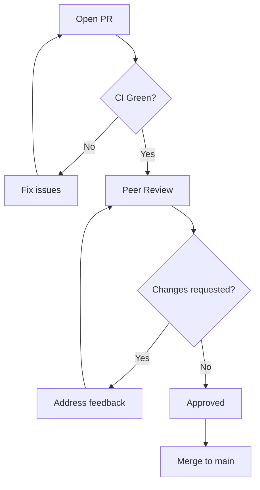

### Production Considerations

- Require at least one approval for all production code.
- AI prompt changes should trigger eval review — reviewer checks eval results in PR.
- Security-sensitive changes (auth, PII handling) need explicit security review.

---

## Stage 6: Deployment

**Goal:** Release merged code to production safely with rollback capability.

### Activities

- CI/CD pipeline builds and tests on merge to `main`.
- Deploy to staging environment automatically.
- Run smoke tests and staging eval gate.
- Promote to production (manual approval or automated).
- Verify health checks post-deploy.
- Monitor for errors in first 30 minutes.

### CI/CD Pipeline

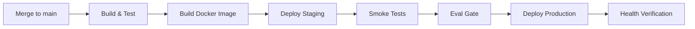

### Deployment Practices

| Practice | Description |
|----------|-------------|
| Immutable artifacts | Same Docker image from staging to production |
| Environment parity | Staging mirrors production config structure |
| Feature flags | Gradual rollout for risky AI changes |
| Database migrations | Run before or during deploy, never manual |
| Rollback plan | Documented and tested — revert image or flag |
| Deploy windows | Avoid Friday deploys for major AI changes |

See [AI Deployment](../ai-deployment/README.md) for infrastructure patterns, scaling, and environment setup.

### Deployment Checklist

- [ ] CI green on `main`
- [ ] Staging smoke tests pass
- [ ] Eval gate passes on staging
- [ ] Database migrations applied
- [ ] Secrets configured in target environment
- [ ] Feature flag default set appropriately
- [ ] Rollback procedure confirmed
- [ ] On-call aware of deploy

---

## Stage 7: Monitoring

**Goal:** Confirm the deployment is healthy and establish ongoing visibility into system behavior.

### Activities

- Watch dashboards for 30–60 minutes post-deploy.
- Check error rates, latency, and token usage.
- Verify alerts are firing correctly (not too noisy, not silent).
- Sample production outputs for quality sanity check.
- Compare post-deploy metrics to pre-deploy baseline.
- Document any anomalies in deploy log or incident channel.

### Post-Deploy Monitoring Window

```mermaid
gantt
  title Post-Deploy Monitoring
  dateFormat X
  axisFormat %M min

  section Critical
  Error rate watch           :0, 30
  Latency watch              :0, 30
  section Extended
  Cost anomaly check         :30, 60
  Quality sample review      :30, 60
  section Ongoing
  Dashboard monitoring       :60, 120
```

### Metrics to Watch After Deploy

| Metric | Alert Threshold Example |
|--------|------------------------|
| Error rate | > 1% for 5 minutes |
| p95 latency | > 2x baseline |
| Token usage per hour | > 150% of forecast |
| Fallback activation | > 10% of requests |
| User negative feedback | Spike vs 7-day average |

### Production Considerations

- Define SLOs before launch, not after an incident.
- Post-deploy monitoring is part of the workflow — not optional.
- If metrics degrade, roll back before debugging in production.

---

## Stage 8: Improvement

**Goal:** Learn from production data, retrospectives, and incidents to improve the product and the workflow itself.

### Activities

- Review production metrics weekly.
- Triage user feedback and support tickets.
- Add failure cases to golden eval dataset.
- Run retrospectives after incidents or major releases.
- Refine workflow based on team pain points.
- Feed prioritized items back into requirements.

### Improvement Loop

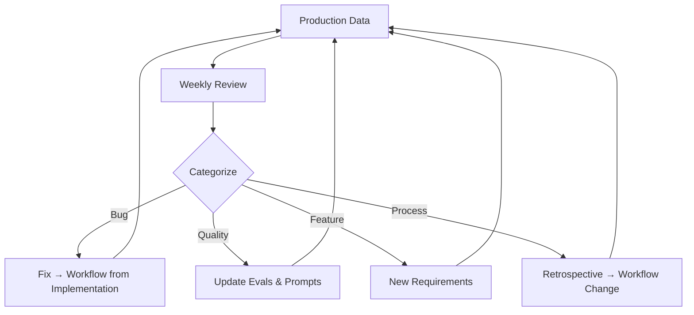

### Improvement Sources

| Source | Action |
|--------|--------|
| User feedback (thumbs up/down) | Prioritize quality improvements |
| Support tickets | Identify gaps in knowledge base or prompts |
| Cost reports | Optimize model routing, caching |
| Incident postmortems | Fix root cause, update runbooks |
| Retrospectives | Improve team workflow |
| Eval failures | Expand golden dataset |

### Workflow Meta-Improvement

Periodically ask the team:

- Are PRs too large? Tighten scope per story.
- Are evals too slow? Optimize or parallelize.
- Are designs skipped? Enforce design review gate.
- Are deploys scary? Invest in rollback automation and staging parity.

---

## Tooling Reference

### Recommended Toolchain

| Category | Tools | Purpose |
|----------|-------|---------|
| Version control | Git, GitHub/GitLab | Source control, PRs |
| Project management | Linear, Jira, GitHub Issues | Backlog, sprints |
| CI/CD | GitHub Actions, GitLab CI | Automated test and deploy |
| Linting | ruff, mypy | Code quality |
| Testing | pytest, pytest-asyncio | Unit and integration tests |
| API dev | FastAPI, httpx | Application and test client |
| Containers | Docker, docker-compose | Local dev and deployment |
| Observability | Structured logging, OpenTelemetry | Logs, traces, metrics |
| Secrets | Environment vars, vault | Credential management |
| Docs | Markdown, ADRs, OpenAPI | Design and API documentation |

### Local Development Workflow

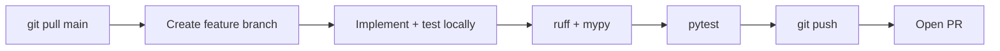

### AI-Specific Tooling (Future Phases)

| Need | Phase | Domain |
|------|-------|--------|
| LLM APIs, streaming | [LLM Engineering](../llm-engineering/README.md) | 
| RAG pipelines | [RAG Systems](../rag/README.md) | 
| Production deploy | Later | [AI Deployment](../ai-deployment/README.md) |
| Advanced evals | Ongoing | [AI Evaluation](../ai-evaluation/README.md) |

---

## Workflow for AI-Specific Work

AI features add steps to the standard workflow. Integrate these into the phases above — do not treat them as optional extras.

### Prompt Changes

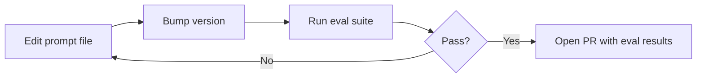

### Model Upgrades

1. Requirements: document why upgrading (cost, quality, capability).
2. Design: assess breaking changes, fallback plan.
3. Implementation: update config, adapter if needed.
4. Testing: full eval suite + latency/cost comparison.
5. Review: include eval diff in PR description.
6. Deployment: feature flag or canary rollout.
7. Monitoring: watch quality and cost metrics closely.

### New Document Ingestion (RAG)

1. Requirements: document types, update frequency, access control.
2. Design: chunking strategy, embedding model, index structure.
3. Implementation: ingestion pipeline, separate from query path.
4. Testing: retrieval evals on new corpus.
5. Deployment: index rebuild procedure, zero-downtime if possible.
6. Monitoring: retrieval hit rate, index freshness.

---

## Production Considerations

### Workflow Gates Summary

| Gate | Location | Blocks |
|------|----------|--------|
| Requirements review | Before design | Unclear scope |
| Design review | Before implementation | Architectural mistakes |
| CI green | Before merge | Broken code |
| Eval pass | Before merge (AI changes) | Quality regression |
| Code review approval | Before merge | Quality and security issues |
| Staging verification | Before production | Environment-specific bugs |
| Post-deploy watch | After production | Undetected deploy issues |

### Sprint Cadence Example

| Day | Activity |
|-----|----------|
| Monday | Sprint planning, requirements grooming |
| Tue–Thu | Design, implementation, testing |
| Thursday | PR reviews, merge to main |
| Friday | Deploy to staging, production deploy if ready |
| Ongoing | Monitoring, improvement backlog grooming |

Adjust cadence to team size and release frequency. The workflow phases remain the same whether you ship daily or weekly.

---

## Common Mistakes

| Mistake | Phase | Fix |
|---------|-------|-----|
| Coding before requirements | Requirements | Groom backlog, define acceptance criteria |
| Skipping design for "small" AI changes | Design | Even prompt changes need eval planning |
| Giant PRs | Implementation | Split by component or layer |
| No eval in CI | Testing | Add eval gate to pipeline |
| Rubber-stamp reviews | Review | Use checklist, require eval results for AI PRs |
| Deploy without staging | Deployment | Staging parity and smoke tests |
| Deploy and forget | Monitoring | Mandatory post-deploy watch window |
| No retrospectives | Improvement | Monthly team retro, incident postmortems |

---

## Best Practices

- Align workflow phases with [AI Application Lifecycle](ai-application-lifecycle.md) stages — they reinforce each other.
- Follow [Engineering Best Practices](engineering-best-practices.md) for commits, PRs, and code style.
- Structure code per [Software Engineering for AI](software-engineering-for-ai.md) from the first implementation PR.
- Treat eval results like test results — they block merge when below threshold.
- Keep design docs short and decision-focused; link ADRs for detail.
- Automate everything repeatable: lint, test, build, deploy.
- Document deploys in a changelog or release notes channel.

---

## Interview Preparation

### Frequently Asked Questions

**Q1: Describe your development workflow for an AI feature.**

> **Strong answer:** Walk through requirements → design → implementation → testing → review → deployment → monitoring → improvement. Highlight AI-specific additions: eval suite in testing, eval results in PR review, cost monitoring post-deploy. Mention CI/CD gates and feature flags for gradual rollout.

**Q2: How is testing different for AI applications?**

> **Strong answer:** Standard test pyramid still applies for code correctness. AI adds a parallel evaluation track for output quality — golden datasets, faithfulness metrics, LLM-as-judge. Unit tests mock the LLM; evals measure real output against baselines. Both must pass before merge.

**Q3: What should be in an AI feature design doc?**

> **Strong answer:** Problem statement, architecture diagram, API contracts, data model, AI components (model, prompts, retrieval, fallbacks), testing strategy including evals, rollout plan with feature flags, and open questions. Emphasize failure modes and observability.

**Q4: How do you handle code review for prompt changes?**

> **Strong answer:** Prompts are versioned files, not inline edits. PR includes eval results showing quality impact vs baseline. Reviewer checks for PII leakage, injection vulnerabilities, and cost implications (token count). No merge without eval pass.

### Follow-Up Questions

- How would you set up CI for a RAG application?
- What gates would you add for a team new to AI development?
- How do you balance speed and quality when product wants to ship fast?

### Real-World Scenarios

**Scenario:** A developer merges a prompt change on Friday afternoon without running evals. Monday morning, support tickets spike about wrong answers.

> **Discussion points:** Missing eval gate in CI. No post-deploy monitoring. Friday deploy risk. Fix: eval in CI, mandatory reviewer check for AI PRs, post-deploy watch, feature flags for prompt versions.

**Scenario:** PRs consistently take 5 days to review because they are 2000+ lines.

> **Discussion points:** Workflow breakdown at implementation phase. Fix: smaller stories, design review before coding, split PRs by layer (domain, API, infra).

---

## Navigation

### Prerequisites

- [AI Engineering Overview](ai-engineering-overview.md)

### Related Topics

- [AI Application Lifecycle](ai-application-lifecycle.md)
- [Software Engineering for AI](software-engineering-for-ai.md)
- [Engineering Best Practices](engineering-best-practices.md)
- [Testing Fundamentals](testing-fundamentals.md)

### Next Topics

- [AI Application Lifecycle](ai-application-lifecycle.md) — product stage perspective
- [Testing Fundamentals](testing-fundamentals.md) — detailed test patterns
- [CI/CD](../cicd/README.md) — pipeline configuration

### Future Reading

- [LLM Engineering](../llm-engineering/README.md): integrating model APIs in implementation
- [RAG Systems](../rag/README.md): retrieval workflow patterns
- [AI Deployment](../ai-deployment/README.md) — production deployment phase deep dive
- [Observability](../observability/README.md) — monitoring tooling and practices

---

## See Also

- [Foundations Index](README.md)
- [Contributing Guide](../../CONTRIBUTING.md)
- [Style Guide](../../meta/style-guide.md)
- [Learning Roadmap](../../meta/roadmap.md)

## Changelog

| Version | Date | Changes |
|---------|------|---------|
| 1.0 | 2026-07-13 | Initial version |
