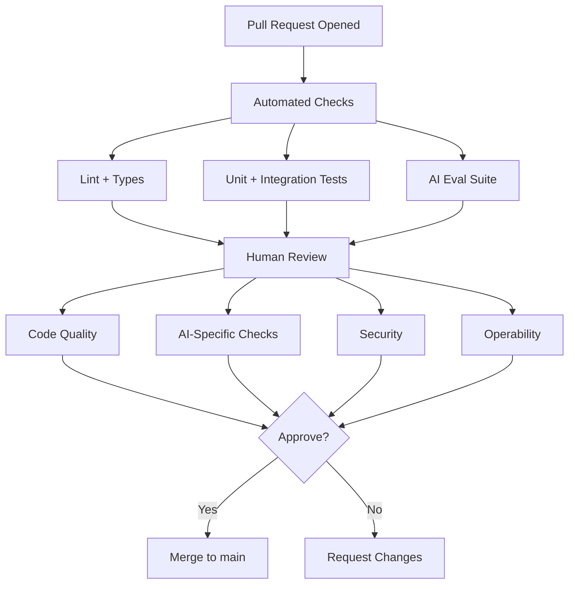
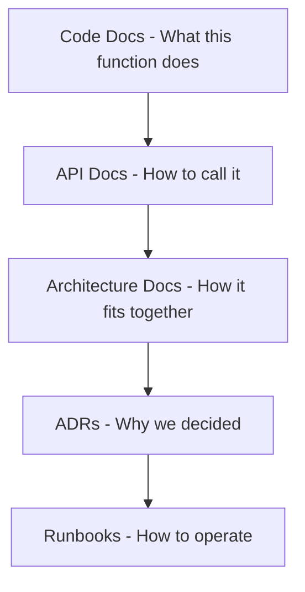
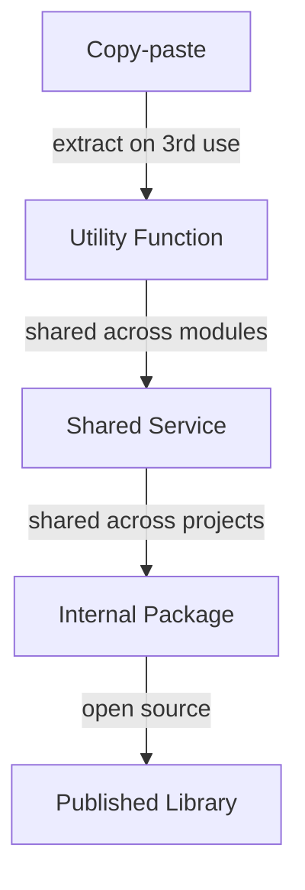
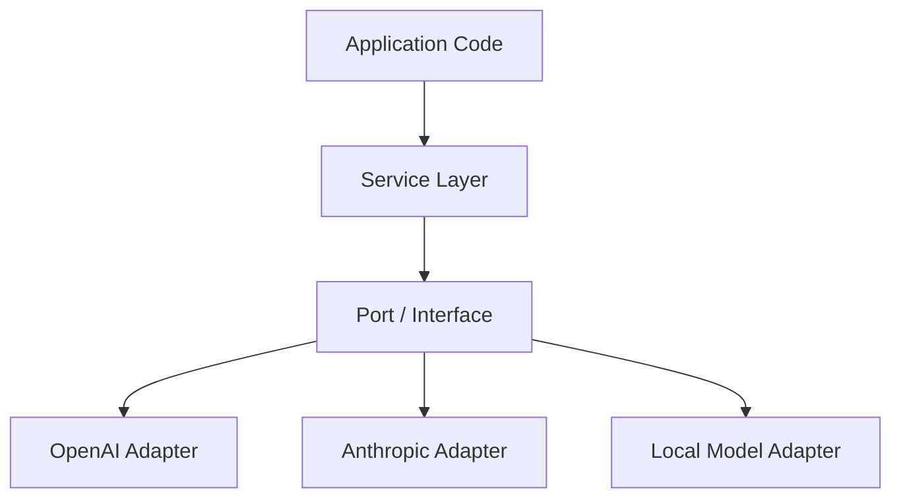
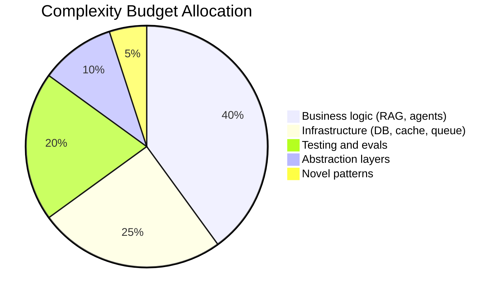
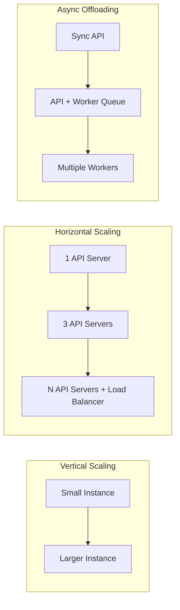
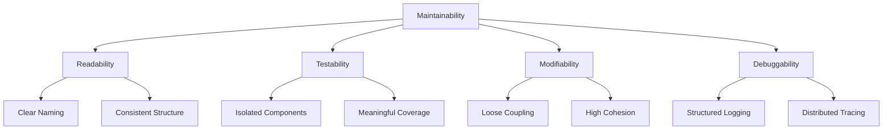

# Engineering Best Practices

> Best practices are not bureaucracy — they are the habits that keep AI codebases readable, reviewable, and operable as they grow from prototype to production. This guide covers the daily engineering disciplines that compound over time.

## Table of Contents

- [Why Best Practices Matter for AI Engineering](#why-best-practices-matter-for-ai-engineering)
- [Code Reviews](#code-reviews)
- [Naming Conventions](#naming-conventions)
- [Documentation](#documentation)
- [Reusable Code](#reusable-code)
- [Abstraction](#abstraction)
- [Simplicity](#simplicity)
- [Scalability](#scalability)
- [Maintainability](#maintainability)
- [Production Considerations](#production-considerations)
- [Common Mistakes](#common-mistakes)
- [Interview Preparation](#interview-preparation)
- [Navigation](#navigation)

---

## Why Best Practices Matter for AI Engineering

AI codebases have unique entropy sources: prompt strings scattered across files, non-deterministic outputs that resist traditional testing, rapidly changing dependencies, and the temptation to skip engineering discipline because "it's just a prototype."

| Without Best Practices | With Best Practices |
|------------------------|---------------------|
| Prompts copied across 12 files | Centralized, versioned prompt library |
| Functions named `process_data()` | `embed_document_chunks()` — intent is clear |
| No review for "quick fixes" | Every change reviewed, including prompt tweaks |
| Abstractions for 1 provider | Hardcoded until second provider arrives |
| 800-line route handlers | Service layer with testable units |

> **Production Standard:** The cost of best practices is paid upfront. The cost of skipping them is paid continuously — in debugging time, onboarding friction, and incident response.

See [Software Engineering for AI](software-engineering-for-ai.md) for architectural patterns and [Git and GitHub Workflow](git-github-workflow.md) for review workflow integration.

---

## Code Reviews

Code review is the primary quality gate between individual work and shared codebase. In AI projects, reviews must cover both traditional code quality and AI-specific concerns.

### What to Review



### Review Checklist

**General code quality:**

- [ ] Logic is correct and handles edge cases
- [ ] No unnecessary complexity
- [ ] Tests cover new behavior
- [ ] Naming is clear and consistent
- [ ] No hardcoded secrets or credentials
- [ ] Error handling is appropriate (not swallowed)

**AI-specific:**

- [ ] Prompt changes include eval results or test cases
- [ ] LLM calls go through the service layer, not route handlers
- [ ] Token limits and timeouts are configured
- [ ] Fallback behavior exists for LLM failures
- [ ] PII handling is correct (redaction, logging)
- [ ] Cost impact considered (model choice, caching)

**Operability:**

- [ ] Logging sufficient for debugging production issues
- [ ] Metrics/traces added for new code paths
- [ ] Configuration externalized (not hardcoded)
- [ ] Migration plan if schema or API changed

### Review Principles

| Principle | Application |
|-----------|-------------|
| **Review code, not people** | "This function could be simpler" not "You wrote this wrong" |
| **Ask questions** | "What happens if retrieval returns zero results?" |
| **Distinguish severity** | `[blocking]` vs `[nit]` vs `[suggestion]` |
| **Approve when good enough** | Perfection is the enemy of progress |
| **Respond promptly** | Review within 24 hours; author responds within 24 hours |
| **Keep PRs small** | Under 400 lines for meaningful review |

### AI-Specific Review Scenarios

**Prompt change review:**

```
# Bad: "LGTM" on a prompt diff without reading it
# Good: "Tested with eval suite? I see the system prompt now
#        restricts to company docs — does the eval set cover
#        off-topic queries to verify the guardrail?"
```

**Model swap review:**

```
# Check: Is the new model compatible with existing prompt format?
# Check: Token limits differ — are max_tokens updated?
# Check: Cost per request — is there budget approval?
# Check: Eval regression results attached to PR?
```

### Review Anti-Patterns

| Anti-Pattern | Why It Fails |
|-------------|-------------|
| Rubber-stamping | Defeats the purpose of review |
| Bike-shedding on style | Lint handles formatting; focus on logic |
| Reviewing 1000-line PRs | Cannot catch real bugs at that scale |
| Blocking on preferences | "I'd name it differently" is not blocking |
| Skipping prompt reviews | Silent quality regressions in production |

---

## Naming Conventions

Names are the primary documentation in code. In AI codebases, clear naming is especially critical because logic often involves non-obvious concepts (embeddings, chunks, tokens, agents, tools).

### General Rules

| Rule | Good | Bad |
|------|------|-----|
| Reveal intent | `retrieve_relevant_chunks()` | `get_data()` |
| Be specific | `openai_chat_completion()` | `call_api()` |
| Use domain language | `embedding_dimension` | `vec_size` |
| Avoid abbreviations | `document_repository` | `doc_repo` |
| Boolean prefixes | `is_streaming`, `has_citations` | `streaming`, `citations` |
| Consistent casing | Python: `snake_case` | Mixed: `getData`, `fetch_data` |

### AI-Specific Naming

| Concept | Recommended Name | Avoid |
|---------|-----------------|-------|
| User input | `query`, `user_message` | `input`, `text`, `data` |
| LLM output | `completion`, `response` | `result`, `output` |
| Retrieved docs | `retrieved_chunks`, `context_documents` | `docs`, `stuff` |
| Embedding vector | `embedding`, `embedding_vector` | `vec`, `emb` |
| Prompt template | `system_prompt`, `rag_prompt_template` | `prompt1`, `p` |
| Agent action | `tool_call`, `agent_step` | `action`, `do_thing` |
| Token count | `input_tokens`, `output_tokens` | `tokens`, `count` |

### File and Module Naming

```
# Clear module names reflecting domain
services/
├── chat_service.py          # not chat.py or handler.py
├── rag_service.py           # not rag.py or process.py
└── ingestion_service.py     # not ingest.py or pipeline.py

domain/
├── entities/
│   ├── document.py          # Document entity
│   └── conversation.py      # Conversation entity
├── ports/
│   ├── llm_client.py        # LLM interface
│   └── vector_store.py      # Vector store interface
└── prompts/
    ├── rag_system_v2.txt    # Versioned prompt
    └── chat_system_v1.txt
```

### Variable Scope and Lifetime

| Scope | Convention | Example |
|-------|-----------|---------|
| Module-level constant | `UPPER_SNAKE_CASE` | `MAX_RETRIEVAL_RESULTS = 10` |
| Function parameter | `snake_case`, descriptive | `query: str, top_k: int` |
| Loop variable | Single letter only for trivial loops | `for chunk in chunks:` |
| Class name | `PascalCase` | `RAGService`, `DocumentChunk` |
| Private member | Leading underscore | `_llm_client`, `_cache` |

---

## Documentation

Documentation exists at three levels: code-level (docstrings, types), architecture-level (ADRs, diagrams), and operational-level (runbooks, API docs).

### Documentation Pyramid



### Code-Level Documentation

Document **why**, not **what**. The code shows what; comments explain non-obvious reasoning.

```python
# Bad: increments counter
counter += 1

# Good: docstring on public interface
async def retrieve_chunks(
    self,
    query: str,
    top_k: int = 5,
    min_score: float = 0.7,
) -> list[DocumentChunk]:
    """Retrieve document chunks relevant to the query.

    Uses hybrid search (BM25 + vector similarity) with score
    threshold filtering. Chunks below min_score are excluded
    to reduce hallucination from irrelevant context.

    Args:
        query: User's natural language question.
        top_k: Maximum chunks to return.
        min_score: Minimum relevance score (0.0-1.0).

    Returns:
        Ordered list of relevant chunks, highest score first.

    Raises:
        VectorStoreError: If the vector database is unreachable.
    """
```

### Architecture Decision Records (ADRs)

Store in `knowledge/architecture-decisions/` for significant decisions:

```markdown
# ADR-007: Use pgvector over dedicated vector database

## Status
Accepted

## Context
We need vector similarity search for RAG. Team knows PostgreSQL.
Document volume < 1M chunks for foreseeable future.

## Decision
Use pgvector extension on existing PostgreSQL instance.

## Consequences
- Positive: Single database, simpler ops, team expertise
- Negative: May need migration to Pinecone/Weaviate at >5M chunks
- Risk: pgvector performance untested at our target scale
```

### What to Document in AI Projects

| Artifact | Content | Location |
|----------|---------|----------|
| Prompt templates | Purpose, variables, version history | `domain/prompts/` |
| Eval suites | Metrics, golden datasets, thresholds | `tests/evals/README.md` |
| Model configs | Model name, parameters, cost | `configs/models.yaml` |
| API endpoints | Request/response schemas | Auto-generated OpenAPI |
| Runbooks | Incident response, rollback steps | `docs/runbooks/` |
| Architecture | System diagrams, data flows | `docs/architecture/` |

### Documentation Anti-Patterns

- Documenting obvious code (`# import os` → `# import the os module`)
- Stale docs that contradict current code (worse than no docs)
- Docs only in wikis separate from the repo (they drift)
- Prompt changes without updating prompt documentation

---

## Reusable Code

Reusable code reduces duplication and encodes team knowledge. The goal is not maximum reuse — it is appropriate reuse at the right level of abstraction.

### Reuse Hierarchy



### When to Extract

| Signal | Action |
|--------|--------|
| Same logic in 2 places | Note it; wait for third |
| Same logic in 3+ places | Extract to shared utility or service |
| Logic needed by another team | Extract to internal package |
| Generic, domain-agnostic utility | Consider publishing |

### Reusable Patterns for AI Code

**Shared retry decorator:**

```python
import functools
from tenacity import retry, stop_after_attempt, wait_exponential


def with_llm_retry(max_attempts: int = 3):
    def decorator(func):
        @functools.wraps(func)
        @retry(
            stop=stop_after_attempt(max_attempts),
            wait=wait_exponential(multiplier=1, min=1, max=30),
            reraise=True,
        )
        async def wrapper(*args, **kwargs):
            return await func(*args, **kwargs)
        return wrapper
    return decorator


@with_llm_retry(max_attempts=3)
async def call_llm(client, prompt: str) -> str:
    return await client.complete(prompt)
```

**Shared prompt loader:**

```python
from pathlib import Path


class PromptLoader:
    def __init__(self, prompts_dir: Path):
        self._dir = prompts_dir
        self._cache: dict[str, str] = {}

    def load(self, name: str, version: str = "latest") -> str:
        key = f"{name}:{version}"
        if key not in self._cache:
            path = self._dir / f"{name}_{version}.txt"
            self._cache[key] = path.read_text()
        return self._cache[key]
```

### When NOT to Reuse

- Logic that looks similar but has different failure modes
- Code reused once — premature extraction adds indirection
- "Utils" modules that become dumping grounds for unrelated functions
- Abstracting before you have two concrete implementations

---

## Abstraction

Abstraction hides implementation details behind a simpler interface. Good abstractions reduce coupling; bad abstractions add complexity without reducing it.

### The Rule of Three

> Abstract on the **third** similar implementation, not the first.

| Stage | Action |
|-------|--------|
| First use case | Write concrete code |
| Second similar case | Copy and adapt; note the pattern |
| Third similar case | Extract the abstraction |

### Good vs Bad Abstractions in AI

| Good Abstraction | Bad Abstraction |
|-----------------|----------------|
| `LLMClient` interface with `complete()` | Generic `Processor` that handles everything |
| `VectorStore` with `search()` and `upsert()` | `AIHandler` that wraps all AI operations |
| `DocumentParser` per file type | Single `parse_anything()` with 50 if/elif branches |
| `PromptTemplate` with variable substitution | String formatting scattered everywhere |

### Abstraction Layers for AI



```python
# Good: focused interface
class VectorStore(ABC):
    @abstractmethod
    async def search(self, query_vector: list[float], top_k: int) -> list[SearchResult]:
        ...

    @abstractmethod
    async def upsert(self, ids: list[str], vectors: list[list[float]]) -> None:
        ...


# Bad: kitchen-sink interface
class AIProvider(ABC):
    @abstractmethod
    async def do_everything(self, input_data: dict) -> dict:
        ...
```

### Cost of Abstraction

Every abstraction has a cost:

- **Indirection** — harder to follow execution flow
- **Maintenance** — interface must evolve with all implementations
- **Overhead** — wrapper layers add latency (usually negligible)
- **Wrong boundary** — abstractions at the wrong level are harder to change than no abstraction

> See [Architecture Patterns Foundation](../software-architecture/architecture-patterns-foundation.md#plugin-architecture) for plugin-based abstraction patterns.

---

## Simplicity

Simplicity is the most underrated engineering virtue. The best code is the code you did not write — and the second best is code that any teammate can understand in five minutes.

### Simplicity Principles

| Principle | Application |
|-----------|-------------|
| **YAGNI** | You Aren't Gonna Need It — don't build for hypothetical futures |
| **KISS** | Keep It Simple — prefer boring, proven solutions |
| **Do the simplest thing that works** | Hardcode config until you need dynamic config |
| **Delete code** | Unused code is liability, not asset |
| **One level of abstraction per function** | Don't mix HTTP handling with embedding logic |

### Complexity Budget

Every project has a finite complexity budget. Spend it on what matters:



### Simplicity in AI Context

| Temptation | Simpler Alternative |
|-----------|-------------------|
| Custom agent framework | LangGraph or simple loop with max iterations |
| Multi-model routing on day one | Single model, swap when needed |
| Real-time embedding pipeline | Batch processing overnight |
| Custom vector DB wrapper | Direct SDK calls until second provider needed |
| Microservices | Modular monolith |

### The Simplicity Test

Before adding complexity, ask:

1. **Does this solve a problem we have today?** (Not "might have someday")
2. **Is there a simpler approach we haven't tried?**
3. **Can a new team member understand this in one reading?**
4. **What is the cost of removing this later?**

---

## Scalability

Scalability is the ability of a system to handle increased load by adding resources. For AI systems, scalability has unique dimensions beyond traditional web apps.

### Scalability Dimensions for AI

| Dimension | What Scales | Bottleneck Signal |
|-----------|------------|-------------------|
| **Request throughput** | API servers | High p99 latency, queue buildup |
| **Concurrent users** | Connection pools, workers | Connection refused errors |
| **Document volume** | Ingestion pipeline, storage | Ingestion backlog growing |
| **Query complexity** | Retrieval, reranking | Retrieval latency increasing |
| **Token volume** | LLM API rate limits | 429 errors from provider |
| **Embedding throughput** | Embedding workers | Queue depth increasing |
| **Cost** | Model selection, caching | Budget alerts firing |

### Scaling Strategies



### Scaling Patterns by Component

| Component | Scale Strategy | Technology |
|-----------|---------------|------------|
| API servers | Horizontal (stateless) | Load balancer + replicas |
| LLM calls | Rate limiting + caching | Redis cache, request queuing |
| Document ingestion | Worker queue | Celery, SQS |
| Vector search | Index partitioning, read replicas | Sharded vector DB |
| Embeddings | Batch processing, GPU workers | Batch API, dedicated workers |
| Database | Read replicas, connection pooling | PgBouncer, read replicas |

### Premature Scaling Anti-Patterns

- Kubernetes for a single-service MVP with 10 users
- Database sharding at 10K rows
- Custom load balancer before hitting single-server limits
- Multi-region deployment before product-market fit

> **Scale when metrics demand it, not when architecture diagrams suggest it.**

---

## Maintainability

Maintainability is the ease with which a system can be modified, extended, and repaired. It is the compound interest of all other best practices.

### Maintainability Pillars



### Metrics of Maintainability

| Metric | Healthy | Unhealthy |
|--------|---------|-----------|
| Time to understand a module | < 30 minutes | > 2 hours |
| Time to add a feature | Days | Weeks |
| Test suite runtime | < 5 minutes | > 30 minutes |
| Deploy frequency | Daily+ | Monthly |
| Mean time to recovery | < 1 hour | > 4 hours |
| Onboarding time | < 1 week | > 1 month |

### Practices That Compound

1. **Consistent project structure** — every module follows the same layout
2. **Type hints everywhere** — mypy catches errors before runtime
3. **Automated formatting** — ruff/black eliminate style debates
4. **Meaningful test names** — `test_retrieval_returns_empty_on_no_match`
5. **Small functions** — under 30 lines, single responsibility
6. **Dependency injection** — swap implementations without rewriting
7. **Changelog discipline** — every release documents what changed

### Technical Debt Management

| Type | Example | Strategy |
|------|---------|----------|
| **Deliberate** | "Ship MVP, refactor retrieval later" | Track in issues, schedule paydown |
| **Accidental** | Quick fix that bypassed service layer | Fix in next PR touching that area |
| **Bit rot** | Outdated dependencies | Regular dependency update PRs |
| **AI-specific** | Stale prompts after model upgrade | Prompt review in model swap checklist |

### The Boy Scout Rule

> Leave the codebase cleaner than you found it.

- Rename a unclear variable while working in a file
- Add a missing type hint to a function you call
- Delete dead code you encounter
- Fix a misleading comment you notice

Small improvements compound. A 1% improvement per PR across 200 PRs transforms a codebase.

---

## Production Considerations

- **Review prompts like code** — they are code; they change system behavior
- **Eval gates in CI** — automated quality checks before merge
- **Structured logging from day one** — JSON logs with request IDs, not print statements
- **Type safety** — Pydantic models for all data boundaries
- **Consistent error types** — domain exceptions, not generic `Exception`
- **Configuration externalization** — environment variables, not hardcoded values
- **Dependency pinning** — lock files committed, updated via PR
- **Regular dependency updates** — weekly or biweekly chore PRs

---

## Common Mistakes

| Mistake | Impact | Fix |
|---------|--------|-----|
| Skipping code review for "small changes" | Bugs and regressions slip through | Review everything via PR |
| Vague naming (`data`, `result`, `process`) | Unreadable code, slow onboarding | Name by domain concept |
| Over-abstracting early | Complexity without benefit | Rule of three |
| Under-abstracting late | Copy-paste across 10 files | Extract on third duplication |
| No docstrings on public interfaces | Teammates guess at behavior | Document public APIs |
| Giant functions (100+ lines) | Untestable, unreadable | Extract helper functions |
| Premature optimization | Complex code, no perf gain | Profile first, optimize hot paths |
| Ignoring linter warnings | Accumulated debt | Zero warnings policy |
| "Utils" dumping ground modules | Unrelated code coupled | Domain-specific modules |
| Not updating docs with code changes | Misleading documentation | Docs in same PR as code |
| Reviewing only code, not prompts | Silent AI quality regression | AI-specific review checklist |
| No eval suite for prompt changes | Cannot detect quality regression | Eval CI gate |

---

## Interview Preparation

### Frequently Asked Questions

**Q1: What makes a good code review?**

> **Strong answer:** Focus on correctness, edge cases, and maintainability. Ask questions rather than dictate. Distinguish blocking from non-blocking feedback. For AI code, also review prompt changes, eval coverage, error handling for LLM failures, and cost implications. Review within 24 hours.

**Q2: How do you decide when to abstract?**

> **Strong answer:** Rule of three — abstract on the third similar implementation. Before that, tolerate duplication. Good abstractions have a single, clear purpose (LLMClient, VectorStore). Bad abstractions wrap everything (AIHandler). Consider the cost of maintaining the abstraction.

**Q3: How do you balance simplicity vs scalability?**

> **Strong answer:** Start simple (modular monolith, single model, sync processing). Scale when metrics show pain — latency, queue depth, error rates. Don't pre-optimize. The complexity budget should go to business logic, not infrastructure. Cite specific triggers: "We moved ingestion to a worker queue when API p99 exceeded 2s."

**Q4: How do you maintain an AI codebase long-term?**

> **Strong answer:** Consistent structure, type hints, automated formatting, meaningful tests, regular dependency updates, ADRs for decisions, prompt versioning, eval suites in CI. Boy Scout Rule — leave code cleaner. Track technical debt in issues.

**Q5: What naming conventions do you follow?**

> **Strong answer:** Reveal intent, use domain language, Python snake_case for functions/variables, PascalCase for classes. AI-specific: `query` not `input`, `retrieved_chunks` not `docs`, `embedding_vector` not `vec`. Versioned prompt files: `rag_system_v2.txt`.

### Real-World Scenario

**Scenario:** You join a team where the AI codebase has 2000-line files, no type hints, prompts inline in route handlers, and no code review process. The team ships fast but production incidents are weekly.

> **Discussion points:** Introduce PR-based workflow incrementally. Add type hints to new code (don't rewrite everything). Extract prompts to versioned files. Add linting CI gate. Start code review with AI-specific checklist. Prioritize extracting the most-changed files into service layer first.

---

## Navigation

### Prerequisites

- [AI Engineering Overview](ai-engineering-overview.md)
- [Software Engineering for AI](software-engineering-for-ai.md)

### Related Topics

- [Git and GitHub Workflow](git-github-workflow.md)
- [Architecture Patterns Foundation](../software-architecture/architecture-patterns-foundation.md)
- [Common Mistakes](../common-mistakes/README.md)

### Next Topics

- [Testing Fundamentals](testing-fundamentals.md)
- [Python for AI Engineering](../python-engineering/python-for-ai-engineering.md)

### Future Reading

- [Design Patterns](../design-patterns/README.md)
- [Observability](../observability/README.md)
- [Performance Optimization](../performance-optimization/README.md)

---

## See Also

- [Style Guide](../../meta/style-guide.md)
- [Contributing Guide](../../CONTRIBUTING.md)
- [Software Engineering for AI](software-engineering-for-ai.md)

## Changelog

| Version | Date | Changes |
|---------|------|---------|
| 1.0 | 2026-07-13 | Initial version |
