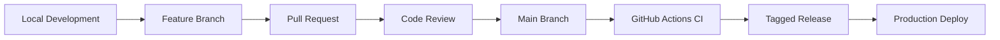
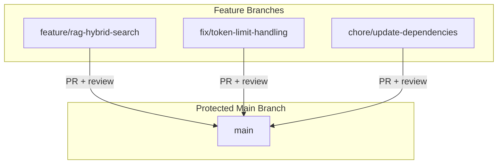
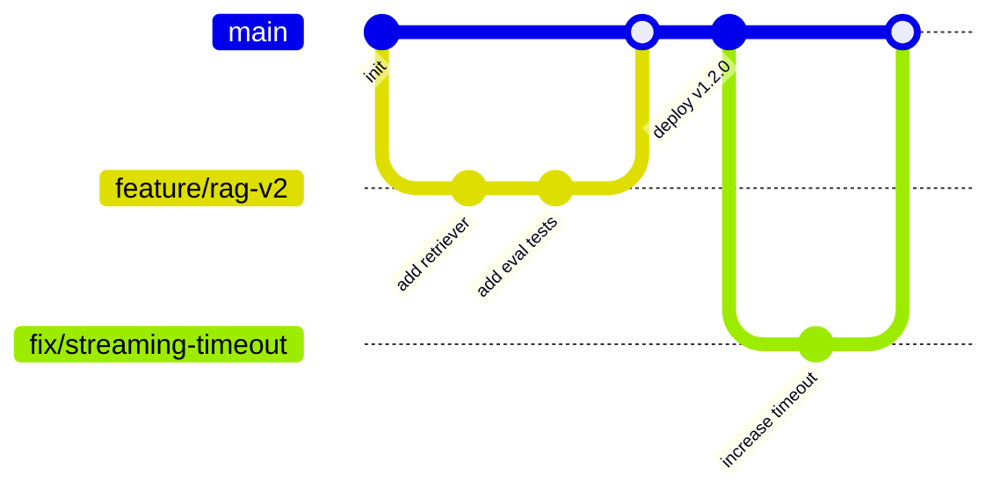
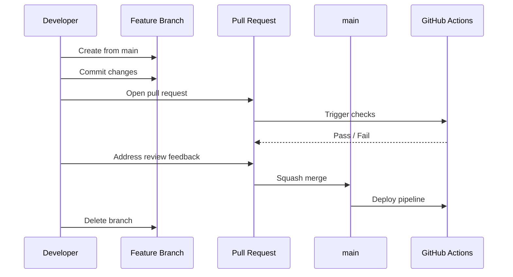
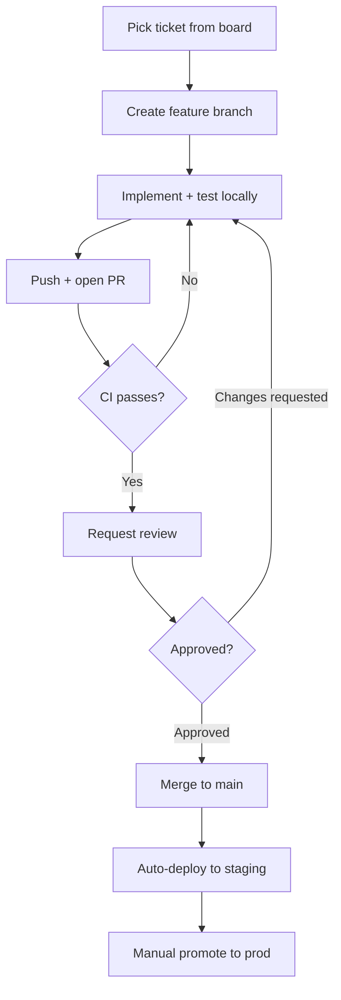
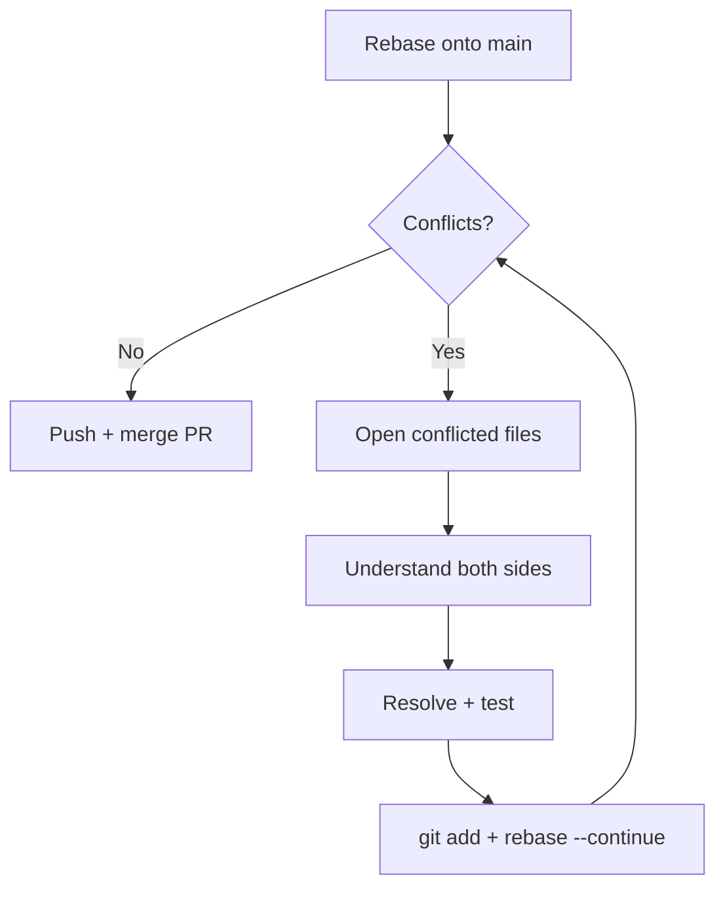
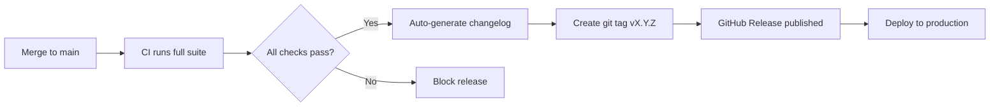
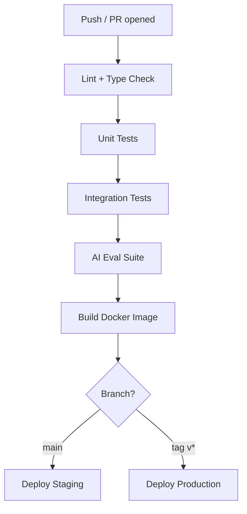

# Git and GitHub Workflow

> Version control is the backbone of every production AI system — from prompt changes to model-serving deployments. This guide covers the Git and GitHub practices that keep solo projects organized and team projects mergeable.

## Table of Contents

- [Why Git Workflow Matters for AI Engineering](#why-git-workflow-matters-for-ai-engineering)
- [Repository Organization](#repository-organization)
- [Branching Strategy](#branching-strategy)
- [Feature Branches](#feature-branches)
- [Solo Developer Workflow](#solo-developer-workflow)
- [Team Developer Workflow](#team-developer-workflow)
- [Pull Requests](#pull-requests)
- [Merge Conflicts](#merge-conflicts)
- [Semantic Commits](#semantic-commits)
- [Versioning](#versioning)
- [Tagging and Releases](#tagging-and-releases)
- [GitHub Actions Overview](#github-actions-overview)
- [Production Considerations](#production-considerations)
- [Common Mistakes](#common-mistakes)
- [Interview Preparation](#interview-preparation)
- [Navigation](#navigation)

---

## Why Git Workflow Matters for AI Engineering

AI codebases change faster and in more dimensions than typical web apps. You are versioning application code, prompt templates, evaluation datasets, model configurations, and infrastructure manifests — often in the same repository.

| Change Type | Without Discipline | With Good Git Workflow |
|-------------|-------------------|------------------------|
| Prompt update | Silent regression in production | PR with eval diff, tagged release |
| Model swap | Broken deploy, no rollback | Semantic version bump, changelog entry |
| RAG pipeline refactor | Merge hell across team | Feature branch, small PRs |
| Config change | Secret leaked in commit | Pre-commit hooks, review gate |

> **Production Standard:** Every change that reaches production should be traceable to a commit, reviewable in a PR, and reversible via a tag or release.



---

## Repository Organization

A well-organized repository makes branching, reviewing, and releasing predictable — especially when AI assets live alongside application code.

### Monorepo vs Multi-Repo

| Approach | Best For | Tradeoff |
|----------|----------|----------|
| **Monorepo** | Small teams, tightly coupled AI + app code | Larger clone size, needs path filters in CI |
| **Multi-repo** | Separate model training vs serving teams | Cross-repo versioning complexity |
| **Monorepo with packages** | Mature teams with shared libraries | Requires tooling (Nx, Turborepo, uv workspaces) |

### Recommended Directory Layout for AI Projects

```
ai-engineering-playbook/
├── .github/
│   ├── workflows/          # GitHub Actions CI/CD
│   ├── PULL_REQUEST_TEMPLATE.md
│   └── CODEOWNERS           # Review routing by path
├── src/                     # Application source code
├── domain/                  # Business logic, prompts, AI orchestration
├── tests/
│   ├── unit/
│   ├── integration/
│   └── evals/               # AI evaluation suites
├── prompts/                 # Versioned prompt templates
├── configs/                 # Non-secret configuration
├── docs/                    # Architecture and runbooks
├── scripts/                 # One-off automation
├── .env.example             # Never commit .env
├── CHANGELOG.md
└── pyproject.toml
```

### Branch Protection Rules

Configure on `main` (or `production`):

- Require pull request before merging
- Require at least one approving review
- Require status checks to pass (lint, test, eval)
- Require branches to be up to date before merging
- Restrict force pushes
- Require signed commits (optional, high-security environments)



> See [Software Engineering for AI](software-engineering-for-ai.md) for project structure conventions that complement this layout.

---

## Branching Strategy

There is no single "correct" branching model. Choose based on release cadence, team size, and deployment frequency.

### Trunk-Based Development (Recommended for Most AI Teams)

All developers integrate into `main` frequently via short-lived feature branches (hours to days, not weeks).

| Principle | Implementation |
|-----------|----------------|
| Short-lived branches | Merge within 1–3 days |
| Small PRs | One logical change per PR |
| Feature flags | Hide incomplete features behind flags |
| Continuous integration | Every push runs CI |



### Git Flow (Legacy, Larger Release Cycles)

Uses long-lived `develop` and `main` branches with `feature/`, `release/`, and `hotfix/` prefixes. Useful when releases are scheduled (e.g., quarterly enterprise deployments) but adds overhead for continuous delivery teams.

### Branch Naming Conventions

| Prefix | Use Case | Example |
|--------|----------|---------|
| `feature/` | New capability | `feature/agent-tool-calling` |
| `fix/` | Bug fix | `fix/hallucination-guardrail` |
| `chore/` | Maintenance, deps | `chore/bump-openai-sdk` |
| `docs/` | Documentation only | `docs/rag-architecture-adr` |
| `eval/` | Evaluation improvements | `eval/add-faithfulness-suite` |
| `hotfix/` | Urgent production fix | `hotfix/api-key-rotation` |

**Rules:**

- Use lowercase and hyphens, not underscores or spaces
- Include a ticket ID when using issue trackers: `feature/PROJ-142-hybrid-search`
- Delete branches after merge (enable auto-delete in GitHub repo settings)

---

## Feature Branches

A feature branch isolates one unit of work from `main` until it is reviewed, tested, and ready to merge.

### Creating and Syncing

```bash
# Start from latest main
git checkout main
git pull origin main

# Create feature branch
git checkout -b feature/add-citation-tracking

# Work, commit frequently with semantic messages
git add src/services/rag_service.py tests/test_rag_service.py
git commit -m "feat(rag): add citation metadata to retrieval results"

# Keep branch current with main (prefer rebase for linear history)
git fetch origin
git rebase origin/main

# Push and open PR
git push -u origin feature/add-citation-tracking
```

### When to Rebase vs Merge

| Situation | Strategy |
|-----------|----------|
| Updating your feature branch with latest `main` | `git rebase origin/main` |
| Merging PR into `main` (team preference: linear history) | Squash and merge |
| Merging PR into `main` (preserve commit history) | Merge commit |
| Shared branch with multiple contributors | Merge, not rebase |

> **Never rebase commits that have already been pushed and shared with others** unless the team explicitly coordinates it.

### Branch Lifecycle



---

## Solo Developer Workflow

Solo workflows still benefit from the same discipline — future you (and future collaborators) are the reviewers.

### Lightweight Solo Practices

1. **Always work on a branch** — even alone. Keeps `main` deployable.
2. **Write PR descriptions for yourself** — document intent before merging.
3. **Use semantic commits** — enables automated changelogs.
4. **Tag releases** — mark every production deploy.
5. **Run CI locally** — use `pre-commit` hooks before pushing.

```bash
# Solo daily loop
git checkout -b feature/improve-chunking
# ... work ...
git commit -m "feat(ingestion): implement semantic chunking strategy"
git push -u origin feature/improve-chunking
# Open PR, self-review diff, merge when CI passes
```

### Solo vs Team: What Changes

| Practice | Solo | Team |
|----------|------|------|
| PR reviews | Self-review checklist | Peer review required |
| Branch lifetime | Can be slightly longer | Keep under 3 days |
| CODEOWNERS | Optional | Required for critical paths |
| Commit signing | Optional | Often required |
| Protected branches | Recommended | Mandatory |

---

## Team Developer Workflow

Team workflows add coordination layers: code ownership, review SLAs, and merge queues.

### Daily Team Loop



### CODEOWNERS

Route reviews to domain experts. Critical for AI repos where prompt files, eval suites, and infra configs need specialized review:

```
# .github/CODEOWNERS
/prompts/           @ai-team-lead
/tests/evals/       @ai-quality-team
/.github/workflows/ @platform-team
/src/services/      @backend-team
```

### Merge Queues and Batch Merging

For high-velocity teams, GitHub merge queues test PRs in sequence against the latest `main` before merging — preventing "green PR breaks main" races.

---

## Pull Requests

Pull requests are the quality gate between development and production.

### Anatomy of a Good PR

| Section | Content |
|---------|---------|
| **Title** | Semantic prefix + concise description: `feat(rag): add hybrid BM25 + vector search` |
| **Summary** | What changed and why (link to issue/ticket) |
| **Test plan** | Steps to verify; eval results if AI behavior changed |
| **Screenshots/logs** | For UI or API response changes |
| **Breaking changes** | Migration steps if applicable |
| **Checklist** | Tests added, docs updated, changelog entry |

### PR Size Guidelines

| Size | Lines Changed | Review Quality |
|------|---------------|----------------|
| Small | < 200 | High — reviewers catch real issues |
| Medium | 200–400 | Acceptable with good description |
| Large | 400+ | Split if possible — review quality drops |

> **AI-specific tip:** Separate prompt changes from code changes when possible. Prompt diffs are hard to review mixed with refactors.

### Review Etiquette

**Authors:**

- Respond to every comment (resolve or explain)
- Push fix commits; avoid force-push during active review
- Mark conversations resolved only after agreement

**Reviewers:**

- Review within 24 hours (team SLA)
- Distinguish blocking vs non-blocking feedback
- Test locally for risky changes (auth, billing, model routing)

---

## Merge Conflicts

Merge conflicts occur when two branches modify the same lines. They are normal — resolving them carefully matters more than avoiding them.

### Common Conflict Scenarios in AI Repos

| Scenario | Typical Conflict Location |
|----------|--------------------------|
| Two features update the same prompt file | `prompts/system_prompt.txt` |
| Dependency bumps overlap | `pyproject.toml`, `uv.lock` |
| Config changes | `configs/*.yaml` |
| Generated files | Lock files, OpenAPI specs |

### Resolution Workflow

```bash
# Update your branch with latest main
git fetch origin
git rebase origin/main

# Git marks conflicts — open affected files
# Look for markers:
# <<<<<<< HEAD
# your changes
# =======
# their changes
# >>>>>>> origin/main

# After manual resolution
git add <resolved-files>
git rebase --continue

# Run tests before pushing
pytest tests/
git push --force-with-lease
```



### Conflict Resolution Principles

1. **Understand both changes** — do not blindly accept "ours" or "theirs."
2. **Run tests after resolution** — conflict markers removed ≠ logic correct.
3. **For lock files** — regenerate rather than hand-merge: `uv lock`, `npm install`.
4. **For prompts** — involve the prompt owner; merging two prompt edits can silently degrade quality.
5. **Use `--force-with-lease`** — never bare `--force` on shared branches.

---

## Semantic Commits

[Conventional Commits](https://www.conventionalcommits.org/) provide a machine-readable commit format that powers changelogs, version bumps, and release automation.

### Format

```
<type>(<scope>): <description>

[optional body]

[optional footer(s)]
```

### Types

| Type | Purpose | Version Bump |
|------|---------|--------------|
| `feat` | New feature | Minor |
| `fix` | Bug fix | Patch |
| `docs` | Documentation only | None |
| `style` | Formatting, no logic change | None |
| `refactor` | Code change, no feature/fix | None |
| `perf` | Performance improvement | Patch |
| `test` | Adding or fixing tests | None |
| `chore` | Maintenance, deps, CI | None |
| `eval` | Evaluation suite changes | None |
| `prompt` | Prompt template changes | Patch (behavioral) |

### Examples for AI Projects

```
feat(agent): add tool-calling loop with max iteration guard
fix(rag): handle empty retrieval results without hallucinating
prompt(chat): tighten system prompt to reduce off-topic responses
eval(qa): add faithfulness benchmark with 50 golden Q&A pairs
chore(deps): bump openai SDK to 1.40.0
```

### Breaking Changes

Append `!` after type or include `BREAKING CHANGE:` in footer:

```
feat(api)!: rename /v1/chat to /v2/chat/completions

BREAKING CHANGE: clients must update endpoint URL and request schema
```

---

## Versioning

Use [Semantic Versioning (SemVer)](https://semver.org/): `MAJOR.MINOR.PATCH`

| Bump | When | AI Example |
|------|------|------------|
| **MAJOR** | Breaking API or behavior change | New response schema, removed endpoint |
| **MINOR** | New feature, backward compatible | Added RAG source citations |
| **PATCH** | Bug fix, no new features | Fixed token counting off-by-one |

### Version Sources

| Artifact | Version Location |
|----------|-----------------|
| Python package | `pyproject.toml` → `[project].version` |
| Docker image | Tag matching git tag: `v1.4.2` |
| API | URL path: `/v1/`, `/v2/` |
| Prompts | Directory or filename: `prompts/v3/system.txt` |
| Model config | Config field: `model_version: "2026-04-01"` |

> Application version, API version, and model version are independent. Document which version changed in each release.

---

## Tagging and Releases

Tags mark specific commits as release points. GitHub Releases attach human-readable notes and artifacts to tags.

### Creating Tags

```bash
# Annotated tag (preferred — includes message and metadata)
git tag -a v1.4.0 -m "Release 1.4.0: hybrid search and citation tracking"
git push origin v1.4.0

# Or let GitHub Actions tag on merge to main (recommended)
```

### Release Workflow



### Release Checklist

- [ ] All CI checks green on `main`
- [ ] CHANGELOG.md updated (or auto-generated from semantic commits)
- [ ] Eval regression suite passed
- [ ] Database migrations tested (if applicable)
- [ ] Rollback plan documented
- [ ] Stakeholders notified for breaking changes

### Pre-Releases

Use `-alpha`, `-beta`, `-rc.1` suffixes for testing:

```
v2.0.0-beta.1
v2.0.0-rc.1
v2.0.0
```

---

## GitHub Actions Overview

GitHub Actions is the CI/CD engine for building, testing, and deploying directly from your repository.

### Core Concepts

| Concept | Description |
|---------|-------------|
| **Workflow** | YAML file in `.github/workflows/` triggered by events |
| **Job** | Set of steps running on the same runner |
| **Step** | Individual task (checkout, install, test) |
| **Action** | Reusable unit (e.g., `actions/checkout@v4`) |
| **Runner** | Machine that executes jobs (GitHub-hosted or self-hosted) |
| **Secret** | Encrypted env var for API keys, tokens |

### Typical AI Project Pipeline



### Example Workflow Skeleton

```yaml
# .github/workflows/ci.yml
name: CI

on:
  push:
    branches: [main]
  pull_request:
    branches: [main]

jobs:
  test:
    runs-on: ubuntu-latest
    steps:
      - uses: actions/checkout@v4

      - name: Set up Python
        uses: actions/setup-python@v5
        with:
          python-version: "3.12"

      - name: Install dependencies
        run: pip install -e ".[dev]"

      - name: Lint
        run: ruff check .

      - name: Type check
        run: mypy src/

      - name: Unit tests
        run: pytest tests/unit/

      - name: AI evals
        run: pytest tests/evals/ --timeout=300
        env:
          OPENAI_API_KEY: ${{ secrets.OPENAI_API_KEY }}
```

### Workflow Best Practices

- **Cache dependencies** — use `actions/cache` for pip/uv/npm
- **Path filters** — skip CI when only docs change
- **Concurrency groups** — cancel outdated PR runs
- **Required checks** — block merge until CI passes
- **Secrets in GitHub Secrets** — never in workflow YAML
- **Pin action versions** — use commit SHA or major version tags

See [CI/CD domain](../cicd/README.md) for deployment pipeline deep dives.

---

## Production Considerations

- **Every production deploy maps to a tag** — you must be able to roll back to `v1.3.2`.
- **Prompt changes are code changes** — same review and CI gates apply.
- **Eval suites gate releases** — a green unit test suite does not prove AI quality.
- **Protect secrets** — use `git-secrets`, `gitleaks`, or GitHub secret scanning.
- **Audit trail** — PR history is your compliance log for who changed what and when.
- **Immutable artifacts** — Docker images tagged with git SHA, not `latest`.

---

## Common Mistakes

| Mistake | Impact | Fix |
|---------|--------|-----|
| Committing directly to `main` | Untested code in production | Branch protection rules |
| Giant PRs (1000+ lines) | Superficial reviews, bugs slip through | Split into smaller PRs |
| Vague commit messages (`fix stuff`) | Unusable changelog and git blame | Semantic commits |
| Force pushing shared branches | Teammates lose work | `--force-with-lease`, communicate first |
| Hand-merging lock files | Broken dependency resolution | Regenerate lock files |
| No tags for releases | Cannot roll back | Tag every production deploy |
| Secrets in git history | Credential leak | Rotate secrets, add pre-commit hooks |
| Long-lived feature branches | Painful merges, integration debt | Trunk-based, merge within days |
| Skipping CI on "docs only" PRs | Broken links in generated docs | Path-aware but still validate |
| Mixing prompt + refactor in one PR | Unreviewable diffs | Separate PRs by concern |

---

## Interview Preparation

### Frequently Asked Questions

**Q1: Describe your branching strategy and why.**

> **Strong answer:** Trunk-based development with short-lived feature branches. Merge to `main` within 1–3 days via PR with required reviews and CI. Use feature flags for incomplete work. Tag `main` for releases. Explain why long-lived branches create merge debt.

**Q2: How do you handle a merge conflict in a critical file?**

> **Strong answer:** Fetch latest `main`, rebase feature branch, open conflicted files, understand both sides' intent, resolve manually, run full test suite, push with `--force-with-lease`. For lock files, regenerate. Never blindly accept one side.

**Q3: What is semantic versioning and how do you apply it?**

> **Strong answer:** MAJOR.MINOR.PATCH. Breaking changes bump major, new features bump minor, fixes bump patch. Connect to conventional commits for automation. Distinguish app version from API version from model version.

**Q4: How would you set up CI for an AI application?**

> **Strong answer:** GitHub Actions on PR: lint, type check, unit tests, integration tests, eval suite with golden datasets. Block merge on failure. On tag, build Docker image, deploy to staging, promote to prod. Secrets in GitHub Secrets. Cache deps for speed.

**Q5: Solo vs team Git workflow — what changes?**

> **Strong answer:** Solo still uses branches and semantic commits for traceability. Teams add CODEOWNERS, review SLAs, protected branches, merge queues. PR description quality matters more in teams.

### Real-World Scenario

**Scenario:** A production incident traced to a prompt change committed directly to `main` without review. The team cannot identify which commit caused the regression among 15 commits deployed together.

> **Discussion points:** Implement branch protection, require PRs for prompt files, add eval CI gate, tag releases so deploys map to single commits, use CODEOWNERS for `/prompts/`.

---

## Navigation

### Prerequisites

- [AI Engineering Overview](ai-engineering-overview.md)
- [Software Engineering for AI](software-engineering-for-ai.md)

### Related Topics

- [Engineering Best Practices](engineering-best-practices.md)
- [Architecture Patterns Foundation](../software-architecture/architecture-patterns-foundation.md)
- [CI/CD](../cicd/README.md)
- [Configuration and Secrets](configuration-and-secrets.md)

### Next Topics

- [Engineering Best Practices](engineering-best-practices.md)
- [Testing Fundamentals](testing-fundamentals.md)

### Future Reading

- [Observability](../observability/README.md)
- [Production Incidents](../production-incidents/README.md)
- [Cloud Deployment](../cloud-deployment/README.md)

---

## See Also

- [Contributing Guide](../../CONTRIBUTING.md)
- [Mermaid Conventions](../../meta/mermaid-conventions.md)
- [Engineering Best Practices](engineering-best-practices.md)

## Changelog

| Version | Date | Changes |
|---------|------|---------|
| 1.0 | 2026-07-13 | Initial version |
