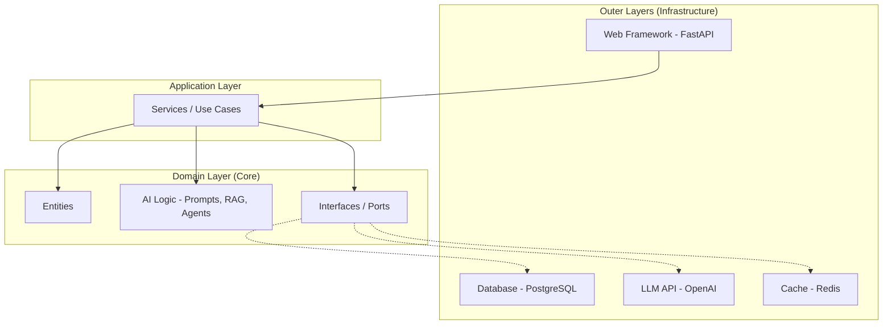
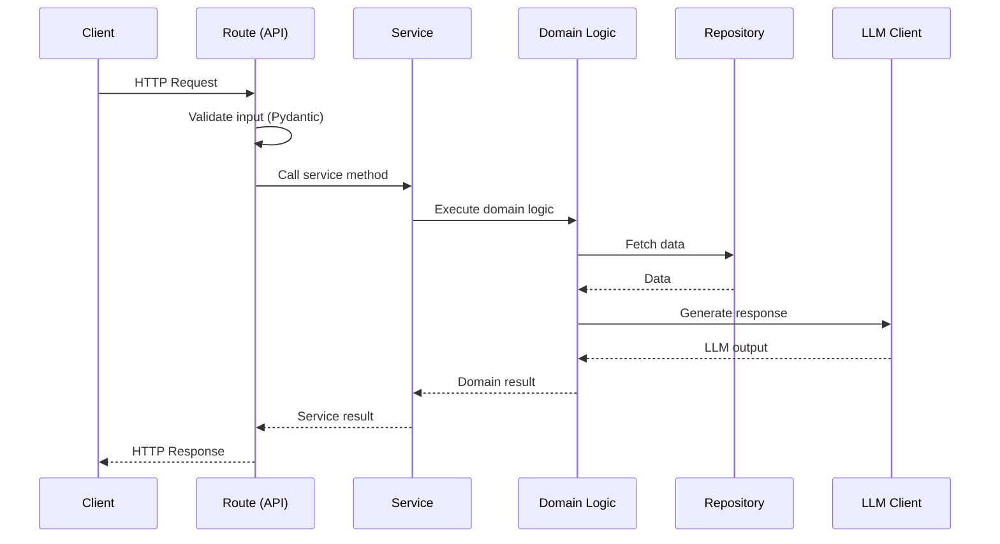

# Software Engineering for AI

> Why software engineering discipline separates AI demos from production systems — and the patterns every AI engineer must internalize.

## Table of Contents

- [Why Software Engineering Matters for AI](#why-software-engineering-matters-for-ai)
- [Clean Architecture](#clean-architecture)
- [Modular Design](#modular-design)
- [SOLID Principles](#solid-principles)
- [Separation of Concerns](#separation-of-concerns)
- [Layered Architecture](#layered-architecture)
- [Repository Pattern](#repository-pattern)
- [Service Layer](#service-layer)
- [Dependency Injection](#dependency-injection)
- [Configuration Management](#configuration-management)
- [Project Organization](#project-organization)
- [Code Quality](#code-quality)
- [Documentation](#documentation)
- [Testing Philosophy](#testing-philosophy)
- [Production Considerations](#production-considerations)
- [Common Mistakes](#common-mistakes)
- [Interview Preparation](#interview-preparation)
- [Navigation](#navigation)

---

## Why Software Engineering Matters for AI

AI codebases fail in production for predictable reasons — and most have nothing to do with the model.

| Failure | Root Cause | Engineering Fix |
|---------|-----------|----------------|
| Cannot add a new LLM provider | LLM calls hardcoded in routes | Abstract behind an interface |
| RAG quality changes silently | No tests, no evals | Test retrieval and generation separately |
| Deploy breaks everything | No separation of config | Environment-based configuration |
| One feature breaks another | Tight coupling | Service layer + dependency injection |
| Onboarding takes weeks | No project structure | Consistent layered architecture |

> **Production Standard:** Treat AI logic as domain code, not as scripts glued to an API. The same engineering standards that apply to payment processing apply to LLM orchestration.

---

## Clean Architecture

Clean Architecture organizes code so that business logic (including AI orchestration) is independent of frameworks, databases, and external APIs.



**Dependency rule:** Inner layers never import from outer layers. The domain defines interfaces; infrastructure implements them.

### AI-Specific Application

```python
# domain/ports/llm.py — interface defined in domain layer
from abc import ABC, abstractmethod
from dataclasses import dataclass


@dataclass
class LLMResponse:
    content: str
    model: str
    input_tokens: int
    output_tokens: int


class LLMClient(ABC):
    @abstractmethod
    async def complete(self, prompt: str, system: str = "") -> LLMResponse:
        ...


# infrastructure/llm/openai_client.py — implementation in outer layer
from openai import AsyncOpenAI
from domain.ports.llm import LLMClient, LLMResponse


class OpenAIClient(LLMClient):
    def __init__(self, api_key: str, model: str = "gpt-4o-mini"):
        self._client = AsyncOpenAI(api_key=api_key)
        self._model = model

    async def complete(self, prompt: str, system: str = "") -> LLMResponse:
        messages = []
        if system:
            messages.append({"role": "system", "content": system})
        messages.append({"role": "user", "content": prompt})

        response = await self._client.chat.completions.create(
            model=self._model,
            messages=messages,
            timeout=30.0,
        )
        choice = response.choices[0]
        return LLMResponse(
            content=choice.message.content or "",
            model=response.model,
            input_tokens=response.usage.prompt_tokens if response.usage else 0,
            output_tokens=response.usage.completion_tokens if response.usage else 0,
        )
```

The domain layer depends on `LLMClient` (interface), not on OpenAI. Swapping providers means writing a new implementation, not rewriting business logic.

---

## Modular Design

Break your AI application into modules with clear boundaries:

```
ai-app/
├── domain/           # Business rules, entities, AI logic
│   ├── entities/
│   ├── services/
│   ├── ports/        # Interfaces
│   └── prompts/      # Prompt templates (versioned)
├── infrastructure/   # External system implementations
│   ├── llm/
│   ├── database/
│   └── cache/
├── api/              # HTTP routes, request/response models
│   ├── routes/
│   └── schemas/
├── config/           # Settings and environment
└── tests/
```

Each module has a single reason to change. When OpenAI changes their API, you update `infrastructure/llm/`. When your RAG strategy changes, you update `domain/services/`.

---

## SOLID Principles

### Single Responsibility

Each class does one thing.

```python
# Bad — one class does retrieval, prompting, and LLM calls
class RAGHandler:
    async def handle(self, query: str) -> str:
        chunks = await self.db.search(query)
        prompt = f"Context: {chunks}\nQuestion: {query}"
        return await self.llm.complete(prompt)


# Good — separated responsibilities
class Retriever:
    async def retrieve(self, query: str, top_k: int = 5) -> list[str]: ...

class PromptBuilder:
    def build_rag_prompt(self, query: str, context: list[str]) -> str: ...

class RAGService:
    def __init__(self, retriever: Retriever, prompt_builder: PromptBuilder, llm: LLMClient):
        self._retriever = retriever
        self._prompt_builder = prompt_builder
        self._llm = llm

    async def answer(self, query: str) -> LLMResponse:
        context = await self._retriever.retrieve(query)
        prompt = self._prompt_builder.build_rag_prompt(query, context)
        return await self._llm.complete(prompt)
```

### Open/Closed

Open for extension, closed for modification. Add new LLM providers without changing `RAGService`.

### Liskov Substitution

Any `LLMClient` implementation must be interchangeable without breaking callers.

### Interface Segregation

Keep interfaces small. An embedding client does not need chat completion methods.

```python
class EmbeddingClient(ABC):
    @abstractmethod
    async def embed(self, texts: list[str]) -> list[list[float]]: ...


class LLMClient(ABC):
    @abstractmethod
    async def complete(self, prompt: str, system: str = "") -> LLMResponse: ...
```

### Dependency Inversion

High-level modules depend on abstractions, not concretions. `RAGService` depends on `LLMClient`, not `OpenAIClient`.

---

## Separation of Concerns

| Concern | Layer | Should Not Know About |
|---------|-------|----------------------|
| HTTP routing | API | Prompt templates, database queries |
| Request validation | API schemas | Business rules |
| Business logic | Service | HTTP status codes, SQL syntax |
| AI orchestration | Domain | FastAPI, PostgreSQL driver |
| Data access | Repository | LLM providers |
| External APIs | Infrastructure | Business rules |

---

## Layered Architecture



---

## Repository Pattern

Repositories abstract data access behind a domain-friendly interface.

```python
# domain/ports/document_repository.py
from abc import ABC, abstractmethod
from domain.entities.document import Document


class DocumentRepository(ABC):
    @abstractmethod
    async def get_by_id(self, doc_id: str) -> Document | None: ...

    @abstractmethod
    async def search_by_title(self, query: str, limit: int = 10) -> list[Document]: ...

    @abstractmethod
    async def save(self, document: Document) -> Document: ...


# infrastructure/database/postgres_document_repo.py
class PostgresDocumentRepository(DocumentRepository):
    def __init__(self, pool: asyncpg.Pool):
        self._pool = pool

    async def get_by_id(self, doc_id: str) -> Document | None:
        row = await self._pool.fetchrow(
            "SELECT id, title, content, created_at FROM documents WHERE id = $1",
            doc_id,
        )
        return Document(**dict(row)) if row else None
```

**Why for AI:** RAG systems need document storage. Vector search may live in a separate repository (`VectorRepository`). Keeping them behind interfaces lets you swap pgvector for Pinecone without touching service code.

---

## Service Layer

Services orchestrate domain logic. They are the entry point for use cases.

```python
# domain/services/chat_service.py
class ChatService:
    def __init__(
        self,
        llm: LLMClient,
        conversation_repo: ConversationRepository,
        logger: logging.Logger,
    ):
        self._llm = llm
        self._conversation_repo = conversation_repo
        self._logger = logger

    async def send_message(self, conversation_id: str, user_message: str) -> str:
        conversation = await self._conversation_repo.get_by_id(conversation_id)
        if not conversation:
            raise ConversationNotFoundError(conversation_id)

        conversation.add_message(role="user", content=user_message)

        system_prompt = "You are a helpful assistant."
        response = await self._llm.complete(
            prompt=user_message,
            system=system_prompt,
        )

        conversation.add_message(role="assistant", content=response.content)
        await self._conversation_repo.save(conversation)

        self._logger.info(
            "chat_message_processed",
            extra={
                "conversation_id": conversation_id,
                "model": response.model,
                "input_tokens": response.input_tokens,
                "output_tokens": response.output_tokens,
            },
        )
        return response.content
```

Routes become thin:

```python
@router.post("/conversations/{id}/messages")
async def send_message(
    id: str,
    body: MessageRequest,
    chat_service: ChatService = Depends(get_chat_service),
):
    try:
        response = await chat_service.send_message(id, body.message)
        return {"response": response}
    except ConversationNotFoundError:
        raise HTTPException(status_code=404, detail="Conversation not found")
```

---

## Dependency Injection

FastAPI's `Depends()` is the primary DI mechanism. Wire dependencies in a composition root:

```python
# api/dependencies.py
from functools import lru_cache
from config.settings import Settings


@lru_cache
def get_settings() -> Settings:
    return Settings()


def get_llm_client(settings: Settings = Depends(get_settings)) -> LLMClient:
    return OpenAIClient(api_key=settings.openai_api_key, model=settings.llm_model)


def get_chat_service(
    llm: LLMClient = Depends(get_llm_client),
    repo: ConversationRepository = Depends(get_conversation_repo),
) -> ChatService:
    return ChatService(llm=llm, conversation_repo=repo, logger=logging.getLogger("chat"))
```

**Production benefit:** In tests, override dependencies with mocks:

```python
app.dependency_overrides[get_llm_client] = lambda: MockLLMClient()
```

---

## Configuration Management

Never hardcode environment-specific values. Use a settings class:

```python
# config/settings.py
from pydantic_settings import BaseSettings, SettingsConfigDict


class Settings(BaseSettings):
    model_config = SettingsConfigDict(env_file=".env", env_file_encoding="utf-8")

    app_env: str = "development"
    log_level: str = "info"
    database_url: str
    redis_url: str = "redis://localhost:6379/0"
    openai_api_key: str
    llm_model: str = "gpt-4o-mini"
    llm_timeout_seconds: float = 30.0
    max_retries: int = 3
```

See [Configuration and Secrets](configuration-and-secrets.md) for the full guide.

---

## Project Organization

### Recommended Layout for AI Applications

```
my-ai-app/
├── src/
│   └── my_ai_app/
│       ├── __init__.py
│       ├── main.py              # FastAPI app factory
│       ├── config/
│       │   └── settings.py
│       ├── api/
│       │   ├── routes/
│       │   ├── schemas/
│       │   └── dependencies.py
│       ├── domain/
│       │   ├── entities/
│       │   ├── services/
│       │   ├── ports/
│       │   └── prompts/
│       └── infrastructure/
│           ├── llm/
│           ├── database/
│           └── cache/
├── tests/
│   ├── unit/
│   ├── integration/
│   └── conftest.py
├── alembic/                     # Database migrations
├── pyproject.toml
├── Dockerfile
├── .env.example
└── README.md
```

---

## Code Quality

| Practice | Tool | Purpose |
|----------|------|---------|
| Linting | `ruff` | Style and error detection |
| Type checking | `mypy` or `pyright` | Catch type errors before runtime |
| Formatting | `ruff format` | Consistent code style |
| Pre-commit hooks | `pre-commit` | Enforce checks before commit |

```toml
# pyproject.toml (excerpt)
[tool.ruff]
target-version = "py312"
line-length = 100

[tool.ruff.lint]
select = ["E", "F", "I", "N", "UP", "B", "SIM"]
```

---

## Documentation

Document at three levels:

1. **Code** — docstrings on public interfaces, type hints everywhere.
2. **Architecture** — ADRs in `knowledge/architecture-decisions/`.
3. **API** — auto-generated via FastAPI's OpenAPI docs.

```python
async def answer(self, query: str, top_k: int = 5) -> LLMResponse:
    """Answer a user query using retrieval-augmented generation.

    Args:
        query: The user's natural language question.
        top_k: Number of document chunks to retrieve for context.

    Returns:
        LLMResponse with the generated answer and token usage.

    Raises:
        RetrievalError: If the vector store is unreachable.
        LLMError: If the LLM provider returns an error after retries.
    """
```

---

## Testing Philosophy

| Layer | What to Test | How |
|-------|-------------|-----|
| Domain services | Business logic | Unit tests with mocked ports |
| Repositories | Data access | Integration tests with test DB |
| API routes | HTTP contract | TestClient with dependency overrides |
| AI outputs | Quality, not exact match | Evaluation metrics, LLM-as-judge |
| End-to-end | Critical paths | Integration tests |

> **Key insight:** Do not unit test that an LLM returns a specific string. Test that your service calls the right components with the right inputs, and evaluate output quality separately.

See [Testing Fundamentals](testing-fundamentals.md).

---

## Production Considerations

- **Composition root** — wire all dependencies in one place (`dependencies.py` or `main.py`).
- **Interface boundaries** — every external system (LLM, DB, cache) behind a port.
- **No AI logic in routes** — routes validate and delegate.
- **Prompts as versioned assets** — store in `domain/prompts/`, not inline strings.
- **Config from environment** — no secrets in code, ever.

---

## Common Mistakes

| Mistake | Impact | Fix |
|---------|--------|-----|
| LLM calls in route handlers | Untestable, unswappable | Service layer + DI |
| God classes | Unmaintainable | Single responsibility |
| No interfaces for external deps | Vendor lock-in | Port/adapter pattern |
| Flat project structure | Navigation chaos | Layered directories |
| Skipping type hints | Runtime surprises | Pydantic + mypy |

---

## Interview Preparation

### Frequently Asked Questions

**Q1: How would you structure an AI application codebase?**

> **Strong answer:** Describe layered architecture: API routes → services → domain logic → repositories/infrastructure. Explain that AI orchestration (RAG, agents) lives in the domain/service layer, not in routes. Mention dependency injection for swappable LLM providers.

**Q2: Explain the repository pattern and why it matters for AI apps.**

> **Strong answer:** Repositories abstract data access. For AI apps, you often have multiple data stores (PostgreSQL for metadata, vector DB for embeddings, Redis for cache). Repositories let you swap implementations and test services with in-memory fakes.

**Q3: How do SOLID principles apply to LLM integration?**

> **Strong answer:** Single responsibility — separate retrieval, prompting, and generation. Open/closed — add providers without changing services. Dependency inversion — services depend on `LLMClient` interface, not OpenAI SDK.

### Real-World Scenario

**Scenario:** A teammate put all RAG logic — chunking, embedding, retrieval, prompting, and LLM calls — in a single 600-line FastAPI route handler.

> **Discussion points:** Identify SRP violations. Propose refactoring into Retriever, PromptBuilder, RAGService. Show how DI enables testing each component independently.

---

## Navigation

### Prerequisites

- [AI Engineering Overview](ai-engineering-overview.md)

### Related Topics

- [Python for AI Engineering](../python-engineering/python-for-ai-engineering.md)
- [Backend Fundamentals](../backend-engineering/backend-fundamentals-for-ai.md)
- [Architecture Patterns](../software-architecture/architecture-patterns-foundation.md)
- [Configuration and Secrets](configuration-and-secrets.md)

### Next Topics

- [Python for AI Engineering](../python-engineering/python-for-ai-engineering.md)
- [Testing Fundamentals](testing-fundamentals.md)

### Future Reading

- [Design Patterns](../design-patterns/README.md)
- [AI Application Architecture](../ai-application-architecture/README.md)

---

## See Also

- [Example: Layered Architecture](../../examples/python/example-layered-architecture.py)
- [Engineering Best Practices](engineering-best-practices.md)

## Changelog

| Version | Date | Changes |
|---------|------|---------|
| 1.0 | 2026-07-13 | Initial version |
