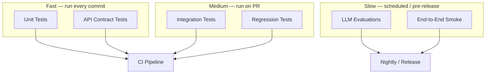
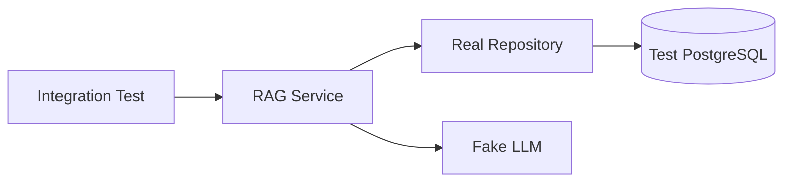
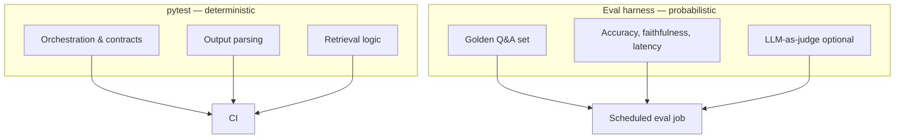

# Testing Fundamentals

> How to test AI applications with the same rigor as any production backend — unit tests for logic, integration tests for wiring, mocks for external providers, and separate evaluation for non-deterministic model outputs.

## Table of Contents

- [Why Testing Matters for AI](#why-testing-matters-for-ai)
- [Testing Pyramid for AI Apps](#testing-pyramid-for-ai-apps)
- [pytest Fundamentals](#pytest-fundamentals)
- [Fixtures](#fixtures)
- [Mocking and Fakes](#mocking-and-fakes)
- [Unit Testing Services](#unit-testing-services)
- [Integration Testing](#integration-testing)
- [API Testing with FastAPI](#api-testing-with-fastapi)
- [Testing Async Code](#testing-async-code)
- [Testing Configuration](#testing-configuration)
- [Regression Testing](#regression-testing)
- [Testing AI Systems (High Level)](#testing-ai-systems-high-level)
- [CI and Test Organization](#ci-and-test-organization)
- [Best Practices](#best-practices)
- [Production Considerations](#production-considerations)
- [Common Mistakes](#common-mistakes)
- [Interview Preparation](#interview-preparation)
- [Navigation](#navigation)

---

## Why Testing Matters for AI

AI demos ship fast because notebooks skip tests.
Production AI services fail when:

- A refactor breaks retrieval but generation still "works" (wrong answers).
- A new LLM provider is wired incorrectly (silent SDK default changes).
- Prompt template changes alter JSON output shape (downstream parsers break).
- Rate-limit retry logic never gets exercised until production.

Testing AI apps is not about asserting `response == "Paris"` from an LLM.
It is about proving **your code** orchestrates components correctly, handles failures gracefully, and preserves contracts.

| What to Test | What Not to Unit Test |
|--------------|----------------------|
| Service calls retriever with correct `top_k` | Exact wording of LLM prose |
| API returns 400 on invalid input | Whether answer is "creative enough" |
| Retry logic fires on 429 | Embedding vector values |
| Parser handles malformed tool JSON | Semantic similarity of paraphrases |
| Repository persists metadata | Provider model intelligence |

> **Production Standard:** Unit test orchestration and contracts. Evaluate model quality separately with eval harnesses. See [Software Engineering for AI](software-engineering-for-ai.md#testing-philosophy).



---

## Testing Pyramid for AI Apps

Adapt the classic pyramid — AI adds an **evaluation layer** above integration tests.

| Layer | Scope | Tools | Speed |
|-------|-------|-------|-------|
| Unit | Single function/class, mocked deps | pytest, unittest.mock | ms |
| API / contract | HTTP request/response shape | FastAPI TestClient, httpx | ms–s |
| Integration | Real DB/cache, fake LLM | pytest, testcontainers | s |
| Regression | Golden outputs for deterministic steps | snapshot files, CI diff | s–min |
| Evaluation | Model quality metrics | custom harness, LLM-as-judge | min |

Cross-reference [Backend Fundamentals for AI](../backend-engineering/backend-fundamentals-for-ai.md) for API patterns under test, and [Logging and Error Handling](../logging/logging-and-error-handling.md) for asserting error responses.

---

## pytest Fundamentals

pytest is the standard test runner for Python AI services.

### Project Layout

```
tests/
  conftest.py           # shared fixtures
  unit/
    test_rag_service.py
    test_prompt_builder.py
  integration/
    test_document_repo.py
  api/
    test_chat_routes.py
  regression/
    test_chunking_snapshots.py
```

### `pyproject.toml` Configuration

```toml
[tool.pytest.ini_options]
testpaths = ["tests"]
asyncio_mode = "auto"
filterwarnings = [
    "ignore::DeprecationWarning",
]
markers = [
    "integration: hits real database or external services",
    "slow: long-running tests",
    "eval: LLM quality evaluations — not run in default CI",
]
```

### Basic Test Structure

```python
# tests/unit/test_prompt_builder.py
from domain.prompts.builder import PromptBuilder


def test_build_includes_context_blocks():
    builder = PromptBuilder(system="You are helpful.")
    prompt = builder.build(query="What is RAG?", context=["RAG retrieves documents."])
    assert "What is RAG?" in prompt
    assert "RAG retrieves documents." in prompt
    assert "You are helpful." in prompt


def test_build_truncates_long_context():
    builder = PromptBuilder(max_context_chars=50)
    long_chunk = "x" * 200
    prompt = builder.build(query="q", context=[long_chunk])
    assert len(prompt) < 250
```

### Running Tests

```bash
# All unit + api tests (default CI)
pytest -m "not integration and not eval"

# With coverage
pytest --cov=app --cov-report=term-missing

# Single file
pytest tests/unit/test_rag_service.py -v

# Stop on first failure
pytest -x
```

---

## Fixtures

Fixtures provide reusable setup — the backbone of maintainable test suites.

### `conftest.py` Hierarchy

pytest discovers fixtures from `conftest.py` files upward — place shared fixtures in `tests/conftest.py`, domain-specific ones in `tests/unit/conftest.py`.

```python
# tests/conftest.py
import pytest
from unittest.mock import AsyncMock

from app.config.settings import Settings
from domain.ports.llm import LLMResponse


@pytest.fixture
def settings() -> Settings:
  return Settings(
      app_env="development",
      database_url="sqlite+aiosqlite:///:memory:",
      redis_url="redis://localhost:6379/15",
      openai_api_key="sk-test-fake-key-not-real",
      llm_model="gpt-4o-mini",
      log_level="warning",
      max_retries=1,
  )


@pytest.fixture
def mock_llm_response() -> LLMResponse:
    return LLMResponse(
        content="The capital of France is Paris.",
        model="gpt-4o-mini",
        input_tokens=10,
        output_tokens=8,
    )


@pytest.fixture
def mock_llm_client(mock_llm_response: LLMResponse) -> AsyncMock:
    client = AsyncMock()
    client.complete.return_value = mock_llm_response
    return client
```

### Fixture Scopes

| Scope | Use Case |
|-------|----------|
| `function` (default) | Isolated state per test |
| `class` | Shared setup for test class |
| `module` | Expensive mock wiring |
| `session` | Test database engine, app factory |

```python
@pytest.fixture(scope="session")
def event_loop_policy():
    import asyncio
    return asyncio.DefaultEventLoopPolicy()
```

### Factory Fixtures

```python
@pytest.fixture
def make_chunk():
    def _factory(text: str, score: float = 0.9, doc_id: str = "doc-1"):
        from domain.models import Chunk
        return Chunk(text=text, score=score, document_id=doc_id)
    return _factory


def test_reranker_orders_by_score(make_chunk):
    chunks = [make_chunk("b", 0.5), make_chunk("a", 0.9)]
    result = rerank(chunks)
    assert result[0].text == "a"
```

---

## Mocking and Fakes

### When to Mock vs. Fake

| Approach | Use When |
|----------|----------|
| `unittest.mock` / `pytest-mock` | Verify call counts, raise errors, return canned data |
| Fake implementation | Need working in-memory behavior (InMemoryRepo) |
| VCR / recorded HTTP | Test HTTP client parsing with real response shapes |
| Real service (integration) | Test SQL queries, migrations, vector index config |

### Mocking the LLM Port

Align with the port/adapter pattern from [Software Engineering for AI](software-engineering-for-ai.md):

```python
# tests/unit/test_rag_service.py
import pytest
from unittest.mock import AsyncMock

from services.rag_service import RAGService


@pytest.fixture
def mock_retriever():
    retriever = AsyncMock()
    retriever.search.return_value = [
        {"text": "France is in Europe.", "score": 0.92, "id": "c1"},
    ]
    return retriever


@pytest.fixture
def rag_service(mock_retriever, mock_llm_client) -> RAGService:
    return RAGService(retriever=mock_retriever, llm=mock_llm_client)


async def test_answer_retrieves_then_generates(rag_service, mock_retriever, mock_llm_client):
    result = await rag_service.answer("Capital of France?")

    mock_retriever.search.assert_awaited_once_with("Capital of France?", top_k=5)
    mock_llm_client.complete.assert_awaited_once()
    assert "Paris" in result.content


async def test_answer_handles_empty_retrieval(rag_service, mock_retriever, mock_llm_client):
    mock_retriever.search.return_value = []
    await rag_service.answer("Obscure question?")
    call_args = mock_llm_client.complete.await_args
    assert "Obscure question?" in call_args.args[0]
```

### `pytest-mock` (`mocker` fixture)

```python
def test_openai_client_maps_rate_limit(mocker):
    from openai import RateLimitError
    from infrastructure.llm.openai_client import OpenAIClient
    from domain.exceptions import RateLimitError as AppRateLimit

    mock_create = mocker.patch.object(
        OpenAIClient, "_raw_complete", side_effect=RateLimitError("rate", response=mocker.Mock(), body=None)
    )
    client = OpenAIClient(api_key="sk-test", model="gpt-4o-mini")

    with pytest.raises(AppRateLimit):
        await client.complete("hi")  # use pytest-asyncio
```

### Prefer Fakes for Complex Behavior

```python
# tests/fakes/llm_fake.py
class FakeLLMClient:
    def __init__(self, responses: dict[str, str] | None = None):
        self._responses = responses or {}
        self.calls: list[str] = []

    async def complete(self, prompt: str, system: str = "") -> LLMResponse:
        self.calls.append(prompt)
        content = self._responses.get(prompt, "default response")
        return LLMResponse(content=content, model="fake", input_tokens=1, output_tokens=1)
```

---

## Unit Testing Services

Unit tests target **business logic** in the service layer — not FastAPI routes, not SQL.

### Testing Pure Functions

```python
from domain.chunking import chunk_text


def test_chunk_text_respects_size():
    text = "word " * 500
    chunks = chunk_text(text, chunk_size=100, overlap=10)
    assert all(len(c.split()) <= 100 for c in chunks)
    assert len(chunks) > 1


def test_chunk_text_empty():
    assert chunk_text("", chunk_size=100) == []
```

### Testing Error Paths

Mirror exception hierarchy from [Logging and Error Handling](../logging/logging-and-error-handling.md):

```python
import pytest
from domain.exceptions import RetrievalError
from unittest.mock import AsyncMock


async def test_answer_raises_when_llm_fails_after_retries():
    retriever = AsyncMock()
    retriever.search.return_value = [{"text": "ctx", "score": 0.9}]
    llm = AsyncMock()
    llm.complete.side_effect = LLMError("provider down", retryable=False)

    service = RAGService(retriever=retriever, llm=llm)
    with pytest.raises(LLMError):
        await service.answer("test")
```

### Parametrize

```python
import pytest


@pytest.mark.parametrize(
    "query,expected_top_k",
    [
        ("short", 3),
        ("x" * 500, 10),  # long queries retrieve more
    ],
)
async def test_dynamic_top_k(rag_service, mock_retriever, query, expected_top_k):
    await rag_service.answer(query, top_k=expected_top_k)
    mock_retriever.search.assert_awaited_once_with(query, top_k=expected_top_k)
```

---

## Integration Testing

Integration tests verify **real wiring** — database, cache, message queues — with external AI providers still mocked or faked.



### Database with testcontainers

```python
import pytest
from testcontainers.postgres import PostgresContainer


@pytest.fixture(scope="session")
def postgres_url():
    with PostgresContainer("pgvector/pgvector:pg16") as pg:
        yield pg.get_connection_url()


@pytest.mark.integration
async def test_save_and_search_document(postgres_url, fake_embedder):
    repo = PgDocumentRepository(postgres_url)
    await repo.migrate()
    doc_id = await repo.insert_document(title="Test", content="France is in Europe.")
    chunks = await repo.similarity_search("France", top_k=3, embedder=fake_embedder)
    assert any(c.document_id == doc_id for c in chunks)
```

### Mark and Select

```python
@pytest.mark.integration
async def test_redis_cache_roundtrip(redis_client):
    cache = RedisSemanticCache(redis_client)
    await cache.set("key", "value", ttl=60)
    assert await cache.get("key") == "value"
```

```bash
pytest -m integration  # only integration
pytest -m "not integration"  # skip slow tests
```

---

## API Testing with FastAPI

Test HTTP contracts with `TestClient` or `httpx.AsyncClient` — override dependencies to inject fakes.

```python
# tests/api/test_chat_routes.py
import pytest
from fastapi.testclient import TestClient

from app.main import app
from app.dependencies import get_rag_service, get_settings
from tests.fakes.rag_fake import FakeRAGService


@pytest.fixture
def client(settings):
    fake_service = FakeRAGService(default_answer="Paris is the capital.")
    app.dependency_overrides[get_settings] = lambda: settings
    app.dependency_overrides[get_rag_service] = lambda: fake_service
    with TestClient(app) as c:
        yield c
    app.dependency_overrides.clear()


def test_chat_returns_200(client):
    response = client.post("/v1/chat", json={"message": "Capital of France?"})
    assert response.status_code == 200
    body = response.json()
    assert "Paris" in body["reply"]
    assert "session_id" in body


def test_chat_rejects_empty_message(client):
    response = client.post("/v1/chat", json={"message": ""})
    assert response.status_code == 422


def test_chat_returns_502_on_service_error(client, mocker):
    from domain.exceptions import LLMError

    failing = mocker.Mock()
    failing.answer = mocker.AsyncMock(side_effect=LLMError("down"))
    app.dependency_overrides[get_rag_service] = lambda: failing

    response = client.post("/v1/chat", json={"message": "hi"})
    assert response.status_code == 502
    app.dependency_overrides.clear()
```

See [Backend Fundamentals for AI](../backend-engineering/backend-fundamentals-for-ai.md) for route design and status code conventions.

### Testing Streaming (SSE)

```python
def test_stream_emits_tokens(client):
    with client.stream("POST", "/v1/chat/stream", json={"message": "hi"}) as response:
        assert response.status_code == 200
        lines = list(response.iter_lines())
        assert any("data:" in line for line in lines)
```

---

## Testing Async Code

Enable `pytest-asyncio`:

```toml
[tool.pytest.ini_options]
asyncio_mode = "auto"
```

```python
import pytest


@pytest.mark.asyncio
async def test_async_llm_call(mock_llm_client):
    result = await mock_llm_client.complete("hello")
    assert result.content
```

### Async Fixtures

```python
import pytest


@pytest.fixture
async def async_db_session(test_engine):
    async with AsyncSession(test_engine) as session:
        yield session
        await session.rollback()
```

---

## Testing Configuration

Never depend on developer `.env` files in CI.
See [Configuration and Secrets](configuration-and-secrets.md).

```python
def test_settings_rejects_invalid_chunk_size(monkeypatch):
    monkeypatch.setenv("OPENAI_API_KEY", "sk-test")
    monkeypatch.setenv("DATABASE_URL", "sqlite:///test.db")
    monkeypatch.setenv("CHUNK_SIZE", "50")  # below minimum
    with pytest.raises(ValidationError):
        Settings()


def test_production_rejects_debug_logging(monkeypatch):
    monkeypatch.setenv("APP_ENV", "production")
    monkeypatch.setenv("LOG_LEVEL", "debug")
    monkeypatch.setenv("OPENAI_API_KEY", "sk-test")
    monkeypatch.setenv("DATABASE_URL", "postgresql://prod/db")
    with pytest.raises(ValidationError):
        Settings()
```

---

## Regression Testing

Regression tests catch **unintended changes** in deterministic pipeline stages.

### Snapshot Testing

```python
# tests/regression/test_chunking_snapshots.py
from pathlib import Path

SAMPLES = Path(__file__).parent / "data" / "samples"


def test_chunking_regression(snapshot):
    text = (SAMPLES / "policy_doc.txt").read_text()
    chunks = chunk_text(text, chunk_size=256, overlap=32)
    snapshot.assert_match([c[:80] for c in chunks], "policy_doc_chunks.json")
```

### Golden Files for Parsers

```python
def test_tool_call_parser_regression():
    raw = load_fixture("tool_call_malformed.json")
    result = parse_tool_calls(raw)
    assert result == load_expected("tool_call_malformed_expected.json")
```

### Prompt Template Regression

When prompts are versioned assets, test structure — not LLM output:

```python
def test_json_prompt_includes_schema_block():
    prompt = build_extraction_prompt(schema=InvoiceSchema)
    assert '"type": "object"' in prompt
    assert "{{document}}" not in prompt  # template fully rendered
```

---

## Testing AI Systems (High Level)

Model outputs are non-deterministic.
Separate **code tests** from **quality evaluations**.



### What Evaluations Cover

| Metric | Question Answered |
|--------|-------------------|
| Retrieval recall@k | Did we find the right document? |
| Answer faithfulness | Is answer grounded in retrieved context? |
| Tool selection accuracy | Did agent pick correct tool? |
| Latency p95 | Within SLO? |
| Cost per request | Within budget? |

### Eval Test Sketch (Not Default CI)

```python
import pytest

EVAL_CASES = [
    {"query": "Refund policy?", "must_contain": ["30 days"], "must_not_contain": ["lawsuit"]},
]


@pytest.mark.eval
@pytest.mark.slow
async def test_rag_quality_live(rag_service_live):
    for case in EVAL_CASES:
        response = await rag_service_live.answer(case["query"])
        for phrase in case["must_contain"]:
            assert phrase.lower() in response.content.lower()
```

### LLM-as-Judge (Caution)

Use only in eval pipelines with human-labeled calibration — not as a unit test gate on every PR.

See [AI Evaluation Domain](../ai-evaluation/README.md) for comprehensive guidance.

---

## CI and Test Organization

### Recommended CI Stages

```yaml
# .github/workflows/test.yml (conceptual)
jobs:
  unit:
    runs-on: ubuntu-latest
    steps:
      - run: pytest -m "not integration and not eval" --cov=app

  integration:
    runs-on: ubuntu-latest
    services:
      postgres: ...
      redis: ...
    steps:
      - run: pytest -m integration

  eval:
    if: github.event_name == 'schedule'
    steps:
      - run: pytest -m eval
    env:
      OPENAI_API_KEY: ${{ secrets.EVAL_OPENAI_KEY }}
```

### Test Naming Conventions

```
test_<unit>_<scenario>_<expected>()
test_chat_rejects_empty_message_returns_422()
test_rag_service_empty_retrieval_still_calls_llm()
```

---

## Best Practices

| Practice | Rationale |
|----------|-----------|
| Test behavior, not implementation | Refactor-safe tests |
| Mock at port boundaries | Aligns with clean architecture |
| One assertion focus per test | Clear failure diagnosis |
| `dependency_overrides` for API tests | No real LLM calls in CI |
| Mark slow/integration/eval tests | Fast default CI feedback |
| Factory fixtures for test data | DRY without shared mutable state |
| Test error and edge paths | Production failures are rarely happy path |
| Keep evals separate from unit CI | Cost and flakiness isolation |
| Coverage on service layer | Highest ROI for AI apps |
| Clear `conftest.py` hierarchy | Discoverable fixtures |

---

## Production Considerations

- **Flaky tests** — never merge flaky LLM evals into required CI; quarantine and fix.
- **Test data** — use anonymized fixtures; no production PII in repos.
- **Parallel CI** — pytest-xdist for unit tests; isolate DB per worker for integration.
- **Contract tests** — when frontend depends on response shape, API tests are your contract.
- **Load testing** — separate from pytest; use k6/Locust for throughput SLOs.
- **Canary deploys** — complement tests with staged rollout; tests cannot catch all model drift.
- **Snapshot updates** — require explicit review; snapshots are code.

---

## Common Mistakes

| Mistake | Impact | Fix |
|---------|--------|-----|
| Calling real LLM in unit tests | Flaky, expensive, slow | Mock ports / fake clients |
| Asserting exact LLM strings | Breaks on model update | Assert structure, keywords in eval only |
| No `dependency_overrides.clear()` | Test pollution | `yield` fixture with cleanup |
| Shared mutable fixtures | Order-dependent failures | Factory fixtures, function scope |
| Testing private methods | Brittle tests | Test public interface |
| Skipping error path tests | Production surprises | `pytest.raises`, side_effect |
| Developer `.env` in CI | Non-reproducible builds | Explicit env in CI secrets |
| 100% coverage obsession | Low-value assertions | Cover services and contracts |
| Integration tests in every PR without marks | 30min CI | `pytest -m "not integration"` default |
| Evaluations blocking every commit | Cost + flakiness | Nightly eval job |

---

## Interview Preparation

### Frequently Asked Questions

**Q1: How do you test code that calls an LLM?**

> **Strong answer:** Abstract LLM behind a port interface. Unit tests inject fake/mock clients — assert correct prompts assembled, retries on 429, error mapping. API tests use dependency overrides. Quality of generated text is evaluated separately with golden datasets and metrics, not hardcoded string equality in unit tests.

**Q2: What's the difference between unit and integration tests in an AI app?**

> **Strong answer:** Unit tests isolate service logic with mocked retriever and LLM — fast, deterministic. Integration tests use real database/cache with fake LLM — verify SQL, migrations, indexing, wiring. Neither replaces LLM quality evaluation.

**Q3: How do pytest fixtures help with AI service tests?**

> **Strong answer:** Fixtures provide settings, fake clients, and service instances with consistent setup/teardown. `conftest.py` shares them across modules. Factory fixtures generate chunks/documents. Scoped session fixtures for test DB. `dependency_overrides` fixture for API tests.

**Q4: How do you prevent regressions when changing prompts?**

> **Strong answer:** Version prompts as files with `prompt_version` logged. Regression tests verify template structure and required sections. Snapshot tests for deterministic preprocessing (chunking, parsing). Full quality regression via eval harness comparing metrics to baseline on scheduled runs.

### Real-World Scenario

**Scenario:** CI passes but users report JSON tool calls from your agent frequently fail parsing after a prompt tweak.

> **Discussion points:** Unit tests only mocked LLM — add parser tests with golden malformed/success fixtures; add contract test for tool schema in prompt; add eval case for tool call format; log `prompt_version` in production to correlate incidents; rollback prompt version independently of code deploy.

---

## Navigation

### Prerequisites

- [Software Engineering for AI](software-engineering-for-ai.md) — testing philosophy, DI, ports
- [Python for AI Engineering](../python-engineering/python-for-ai-engineering.md) — project layout, typing
- [Configuration and Secrets](configuration-and-secrets.md) — test settings patterns

### Related Topics

- [Backend Fundamentals for AI](../backend-engineering/backend-fundamentals-for-ai.md) — TestClient, dependency injection
- [Logging and Error Handling](../logging/logging-and-error-handling.md) — testing error responses
- [FastAPI Foundation](../fastapi/fastapi-foundation.md) — advanced testing patterns

### Next Topics

- [Testing Backend for AI (Phase 3)](../backend-engineering/testing-backend-for-ai.md) — FastAPI test depth, test DB, coverage gates
- [AI Evaluation Domain](../ai-evaluation/README.md)
- [CICD Domain](../cicd/README.md)
- [Debugging Domain](../debugging/README.md)

### Future Reading

- [AI Safety](../ai-safety/README.md) — red-team testing
- [Backend Performance for AI](../performance-optimization/backend-performance-for-ai.md) — load testing complement

---

## See Also

- [Foundations Domain README](README.md)
- [Software Engineering for AI — Testing Philosophy](software-engineering-for-ai.md#testing-philosophy)
- [Master Index](../../meta/indexes/MASTER-INDEX.md)

## Changelog

| Version | Date | Changes |
|---------|------|---------|
| 1.0 | 2026-07-13 | Initial version |
