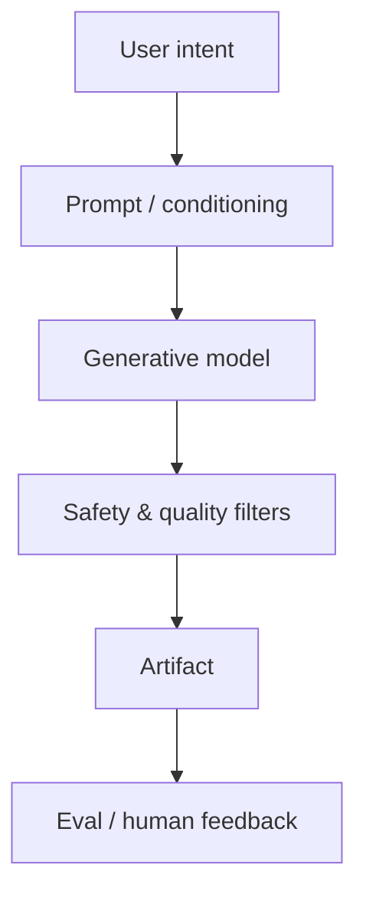

# Generative AI

> Systems that create new content — text, images, audio, code — and how to productize them safely.

**Prerequisites:** [Large Language Models](../llm-engineering/README.md) · [Deep Learning](../deep-learning/README.md)  
**Unlocks:** [Prompt Engineering](../prompt-engineering/README.md) · [LLM Application Development](../llm-application-development/README.md)

---

## Definition

**Generative AI** refers to models that synthesize new samples from learned data distributions: text (LLMs), images (diffusion), audio, video, and code. Engineering GenAI means controlling quality, safety, latency, and cost — not just calling an API.

---

## Learning path

---

## Documents

| # | Topic | Document |
|---|-------|----------|
| 1 | Generative AI overview | [generative-ai-overview.md](generative-ai-overview.md) |
| 2 | Modalities & model types | [modalities-and-model-types.md](modalities-and-model-types.md) |
| 3 | Productizing GenAI | [productizing-generative-ai.md](productizing-generative-ai.md) |

---

## Related topics

- [Large Language Models](../llm-engineering/README.md)
- [AI Security & Guardrails](../ai-security-guardrails/README.md)
- [AI System Design](../ai-system-design/README.md)

---

## See also

- [Domains overview](../README.md)
- [Learning Roadmap](../../meta/roadmap.md)
- [Master Index](../../meta/indexes/MASTER-INDEX.md)
