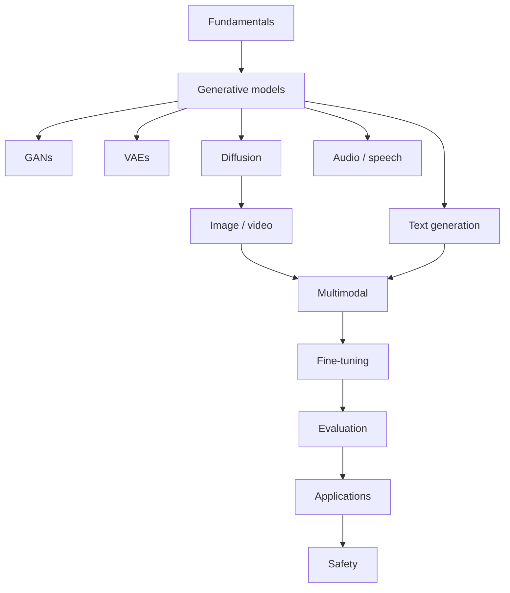

# Generative AI

> Create with models — fundamentals through GANs, VAEs, diffusion, multimodal generation, eval, apps, and safety.

**Prerequisites:** [Large Language Models](../llm-engineering/README.md) · [Deep Learning](../deep-learning/README.md)  
**Unlocks:** [Prompt Engineering](../prompt-engineering/README.md) · [LLM Application Development](../llm-application-development/README.md) · [AI Security & Guardrails](../ai-security-guardrails/README.md)

Start with a section hub below (or expand **9. Generative AI** in the left sidebar). Lessons are full handbook pages (definitions, Mermaid, Python, production/safety/eval) — updated 2026-08-12.

---

## Sections

| # | Section | What you will learn | Hub |
|---|---------|---------------------|-----|
| 1 | **Generative AI Fundamentals** | What GenAI is | [generative-ai-fundamentals/](generative-ai-fundamentals/README.md) |
| 2 | **Generative Models** | Model families | [generative-models/](generative-models/README.md) |
| 3 | **GANs** | Adversarial generators | [gans/](gans/README.md) |
| 4 | **VAEs** | Probabilistic autoencoders | [vaes/](vaes/README.md) |
| 5 | **Diffusion Models** | Noise and denoise | [diffusion-models/](diffusion-models/README.md) |
| 6 | **Text Generation** | Language as generation | [text-generation/](text-generation/README.md) |
| 7 | **Image Generation** | Pixels from prompts | [image-generation/](image-generation/README.md) |
| 8 | **Video Generation** | Temporal consistency | [video-generation/](video-generation/README.md) |
| 9 | **Audio & Speech Generation** | Waveforms and speech | [audio-speech-generation/](audio-speech-generation/README.md) |
| 10 | **Multimodal Generative AI** | Cross-modal models | [multimodal-generative-ai/](multimodal-generative-ai/README.md) |
| 11 | **Generative AI Fine-Tuning** | Adapt generators | [generative-ai-fine-tuning/](generative-ai-fine-tuning/README.md) |
| 12 | **Generative AI Evaluation** | Measure generators | [generative-ai-evaluation/](generative-ai-evaluation/README.md) |
| 13 | **Generative AI Applications** | Where GenAI ships | [generative-ai-applications/](generative-ai-applications/README.md) |
| 14 | **Generative AI Safety** | Misuse, provenance, and guardrails across modalities. | [generative-ai-safety/](generative-ai-safety/README.md) |

---

## Hierarchy

### 1. Generative AI Fundamentals

| # | Topic |
|---|-------|
| 1 | [What is Generative AI](generative-ai-fundamentals/01-what-is-generative-ai.md) |
| 2 | [Discriminative vs Generative](generative-ai-fundamentals/02-discriminative-vs-generative.md) |
| 3 | [Modalities Overview](generative-ai-fundamentals/03-modalities-overview.md) |
| 4 | [Conditioning & Control](generative-ai-fundamentals/04-conditioning-and-control.md) |
| 5 | [Sampling & Latent Space](generative-ai-fundamentals/05-sampling-and-latent-space.md) |
| 6 | [GenAI System Loop](generative-ai-fundamentals/06-genai-system-loop.md) |

### 2. Generative Models

| # | Topic |
|---|-------|
| 1 | [Generative Modeling Basics](generative-models/01-generative-modeling-basics.md) |
| 2 | [Likelihood-Based Models](generative-models/02-likelihood-based-models.md) |
| 3 | [Implicit Generative Models](generative-models/03-implicit-generative-models.md) |
| 4 | [Autoregressive Generators](generative-models/04-autoregressive-generators.md) |
| 5 | [Energy & Score-Based Models](generative-models/05-energy-and-score-based-models.md) |
| 6 | [Choosing a Generative Paradigm](generative-models/06-choosing-a-generative-paradigm.md) |

### 3. GANs

| # | Topic |
|---|-------|
| 1 | [GAN Basics](gans/01-gan-basics.md) |
| 2 | [Training Dynamics](gans/02-training-dynamics.md) |
| 3 | [Mode Collapse](gans/03-mode-collapse.md) |
| 4 | [DCGAN & StyleGAN](gans/04-dcgan-and-stylegan.md) |
| 5 | [Conditional GANs](gans/05-conditional-gans.md) |
| 6 | [GAN Evaluation](gans/06-gan-evaluation.md) |

### 4. VAEs

| # | Topic |
|---|-------|
| 1 | [VAE Basics](vaes/01-vae-basics.md) |
| 2 | [Encoder, Decoder & Latents](vaes/02-encoder-decoder-latents.md) |
| 3 | [ELBO & KL Regularization](vaes/03-elbo-and-kl.md) |
| 4 | [β-VAE & Disentangling](vaes/04-beta-vae-and-disentangling.md) |
| 5 | [VAE vs GAN vs Diffusion](vaes/05-vae-vs-gan-vs-diffusion.md) |

### 5. Diffusion Models

| # | Topic |
|---|-------|
| 1 | [Diffusion Basics](diffusion-models/01-diffusion-basics.md) |
| 2 | [Forward & Reverse Process](diffusion-models/02-forward-and-reverse-process.md) |
| 3 | [Noise Schedules](diffusion-models/03-noise-schedules.md) |
| 4 | [DDPM & DDIM](diffusion-models/04-ddpm-and-ddim.md) |
| 5 | [Latent Diffusion](diffusion-models/05-latent-diffusion.md) |
| 6 | [Conditioning & Guidance](diffusion-models/06-conditioning-and-guidance.md) |
| 7 | [Sampling Speed Tricks](diffusion-models/07-sampling-speed-tricks.md) |

### 6. Text Generation

| # | Topic |
|---|-------|
| 1 | [Text Generation Basics](text-generation/01-text-generation-basics.md) |
| 2 | [LLM Generators](text-generation/02-llm-generators.md) |
| 3 | [Decoding for Generation](text-generation/03-decoding-for-generation.md) |
| 4 | [Controllable Text Generation](text-generation/04-controllable-text-generation.md) |
| 5 | [Code & Structured Generation](text-generation/05-code-and-structured-generation.md) |

### 7. Image Generation

| # | Topic |
|---|-------|
| 1 | [Image Generation Basics](image-generation/01-image-generation-basics.md) |
| 2 | [Text-to-Image](image-generation/02-text-to-image.md) |
| 3 | [Image Editing & Inpainting](image-generation/03-image-editing-and-inpainting.md) |
| 4 | [Image Quality & Artifacts](image-generation/04-image-quality-and-artifacts.md) |
| 5 | [Safety for Images](image-generation/05-safety-for-images.md) |

### 8. Video Generation

| # | Topic |
|---|-------|
| 1 | [Video Generation Basics](video-generation/01-video-generation-basics.md) |
| 2 | [Text-to-Video](video-generation/02-text-to-video.md) |
| 3 | [Image-to-Video](video-generation/03-image-to-video.md) |
| 4 | [Temporal Consistency](video-generation/04-temporal-consistency.md) |
| 5 | [Video Eval & Cost](video-generation/05-video-eval-and-cost.md) |

### 9. Audio & Speech Generation

| # | Topic |
|---|-------|
| 1 | [Audio Generation Basics](audio-speech-generation/01-audio-generation-basics.md) |
| 2 | [Text-to-Speech](audio-speech-generation/02-text-to-speech.md) |
| 3 | [Music & Sound Generation](audio-speech-generation/03-music-and-sound-generation.md) |
| 4 | [Voice Cloning & Conversion](audio-speech-generation/04-voice-cloning-and-conversion.md) |
| 5 | [Audio Evaluation](audio-speech-generation/05-audio-evaluation.md) |

### 10. Multimodal Generative AI

| # | Topic |
|---|-------|
| 1 | [Multimodal Basics](multimodal-generative-ai/01-multimodal-basics.md) |
| 2 | [Vision-Language Models](multimodal-generative-ai/02-vision-language-models.md) |
| 3 | [Any-to-Any Generation](multimodal-generative-ai/03-any-to-any-generation.md) |
| 4 | [Alignment Across Modalities](multimodal-generative-ai/04-alignment-across-modalities.md) |
| 5 | [Multimodal Product Patterns](multimodal-generative-ai/05-multimodal-product-patterns.md) |

### 11. Generative AI Fine-Tuning

| # | Topic |
|---|-------|
| 1 | [Why Fine-Tune Generators](generative-ai-fine-tuning/01-why-finetune-generators.md) |
| 2 | [LoRA for Diffusion & LLMs](generative-ai-fine-tuning/02-lora-for-diffusion-and-llms.md) |
| 3 | [DreamBooth & Personalization](generative-ai-fine-tuning/03-dreambooth-and-personalization.md) |
| 4 | [Preference Tuning for GenAI](generative-ai-fine-tuning/04-preference-tuning-for-genai.md) |
| 5 | [Dataset Curation for GenAI](generative-ai-fine-tuning/05-dataset-curation-for-genai.md) |

### 12. Generative AI Evaluation

| # | Topic |
|---|-------|
| 1 | [Evaluation Challenges](generative-ai-evaluation/01-evaluation-challenges.md) |
| 2 | [Automatic Metrics](generative-ai-evaluation/02-automatic-metrics.md) |
| 3 | [Human Preference Eval](generative-ai-evaluation/03-human-preference-eval.md) |
| 4 | [Faithfulness & Grounding](generative-ai-evaluation/04-faithfulness-and-grounding.md) |
| 5 | [Online Evaluation](generative-ai-evaluation/05-online-evaluation.md) |

### 13. Generative AI Applications

| # | Topic |
|---|-------|
| 1 | [Content & Media](generative-ai-applications/01-content-and-media.md) |
| 2 | [Copilots & Assistants](generative-ai-applications/02-copilots-and-assistants.md) |
| 3 | [Enterprise Knowledge Apps](generative-ai-applications/03-enterprise-knowledge-apps.md) |
| 4 | [Synthetic Data](generative-ai-applications/04-synthetic-data.md) |
| 5 | [Creative Tools](generative-ai-applications/05-creative-tools.md) |

### 14. Generative AI Safety

| # | Topic |
|---|-------|
| 1 | [GenAI Risk Landscape](generative-ai-safety/01-genai-risk-landscape.md) |
| 2 | [Deepfakes & Misinformation](generative-ai-safety/02-deepfakes-and-misinformation.md) |
| 3 | [IP & Consent](generative-ai-safety/03-ip-and-consent.md) |
| 4 | [Content Filters & Policies](generative-ai-safety/04-content-filters-and-policies.md) |
| 5 | [Provenance & Watermarking](generative-ai-safety/05-provenance-and-watermarking.md) |
| 6 | [Secure GenAI Apps](generative-ai-safety/06-secure-genai-apps.md) |

---

## Definition

**Generative AI** synthesizes new artifacts from learned data distributions across modalities. Shipping GenAI means combining model choice, conditioning, evaluation, and safety — not only pretty demos.

---

## Learning path

| Stage | Sections | Focus |
|-------|----------|-------|
| Foundations | 1–2 | Concepts + model paradigms |
| Classic & modern gens | 3–5 | GANs, VAEs, diffusion |
| Modalities | 6–10 | Text/image/video/audio/multimodal |
| Ship | 11–14 | FT, eval, apps, safety |

---

## Reference notes (shorter overviews)

| Note | Document |
|------|----------|
| Generative AI overview | [generative-ai-overview.md](generative-ai-overview.md) |
| Modalities & model types | [modalities-and-model-types.md](modalities-and-model-types.md) |
| Productizing GenAI | [productizing-generative-ai.md](productizing-generative-ai.md) |

---

## Related topics

- [Large Language Models](../llm-engineering/README.md)
- [Deep Learning](../deep-learning/README.md)
- [Prompt Engineering](../prompt-engineering/README.md)
- [AI Security & Guardrails](../ai-security-guardrails/README.md)

---

## See also

- [Domains overview](../README.md)
- [Learning Roadmap](../../meta/roadmap.md)

---

## Continue learning

Next: [Prompt Engineering](../prompt-engineering/README.md)

