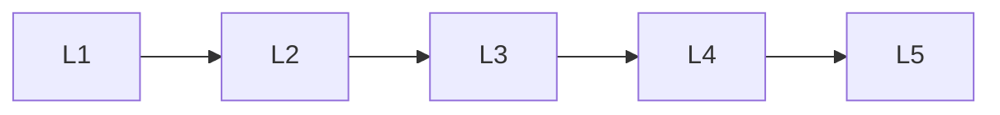

# Audio Speech Generation

> Deep lessons for the **Audio Speech Generation** section of the Generative AI handbook.

## Lessons

| # | Lesson |
|---|--------|
| 1 | [Audio Generation Basics](01-audio-generation-basics.md) |
| 2 | [Text-to-Speech](02-text-to-speech.md) |
| 3 | [Music & Sound Generation](03-music-and-sound-generation.md) |
| 4 | [Voice Cloning & Conversion](04-voice-cloning-and-conversion.md) |
| 5 | [Audio Evaluation](05-audio-evaluation.md) |

**Topic hub:** [../README.md](../README.md)
