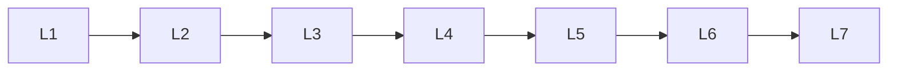

# Diffusion Models

> Deep lessons for the **Diffusion Models** section of the Generative AI handbook.

## Lessons

| # | Lesson |
|---|--------|
| 1 | [Diffusion Basics](01-diffusion-basics.md) |
| 2 | [Forward & Reverse Process](02-forward-and-reverse-process.md) |
| 3 | [Noise Schedules](03-noise-schedules.md) |
| 4 | [DDPM & DDIM](04-ddpm-and-ddim.md) |
| 5 | [Latent Diffusion](05-latent-diffusion.md) |
| 6 | [Conditioning & Guidance](06-conditioning-and-guidance.md) |
| 7 | [Sampling Speed Tricks](07-sampling-speed-tricks.md) |

**Topic hub:** [../README.md](../README.md)
