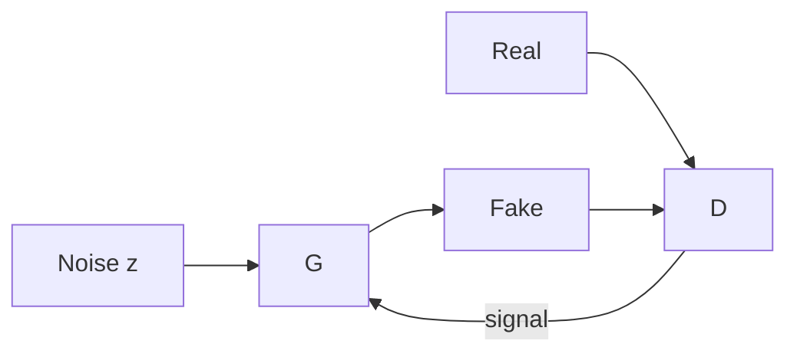

# GAN Basics

> A GAN pits a generator G(z) against a discriminator D(x) in a minimax game so G learns to produce realistic samples.

## Table of Contents

- [Overview](#overview)
- [Definition](#definition)
- [Why It Matters](#why-it-matters)
- [Uses](#uses)
- [Core Ideas](#core-ideas)
- [How It Works](#how-it-works)
- [Worked Example](#worked-example)
- [Python Examples](#python-examples)
- [Training & Data Notes](#training--data-notes)
- [Sampling & Inference](#sampling--inference)
- [Production Considerations](#production-considerations)
- [Performance Considerations](#performance-considerations)
- [Cost Considerations](#cost-considerations)
- [Security & Safety](#security--safety)
- [Evaluation](#evaluation)
- [Best Practices](#best-practices)
- [Common Mistakes](#common-mistakes)
- [Interview Preparation](#interview-preparation)
- [Navigation](#navigation)

---

## Overview

This lesson is part of the **Gans** section in the Generative AI handbook. It treats **GAN Basics** as an engineering topic: definitions, system shape, code you can adapt, and production constraints (quality, latency, cost, safety).

**Typical stack:** model + sampling + eval.

---

## Definition

**GAN Basics** — A GAN pits a generator G(z) against a discriminator D(x) in a minimax game so G learns to produce realistic samples.

---

## Why It Matters

GANs pioneered sharp image synthesis and still matter for low-latency generation and research literacy.

Generative systems fail loudly in UX when this topic is underspecified: wrong modality assumptions, uncontrolled sampling, or missing eval gates.

---

## Uses

| Use case | How this applies |
|----------|------------------|
| Product feature | Ship gan basics as a user-facing capability |
| Internal tool | Creative ops, synthetic data, or prototyping |
| Research transfer | Port papers into a controlled experiment |

---

## Core Ideas

1. Adversarial objective.
2. Non-saturating generator loss variants.
3. Fragile training vs diffusion.

---

## How It Works

At a high level, gan basics sits in the GenAI loop: condition → sample → filter → measure.



Map each node to an owner in your team (model, platform, product, safety). Ambiguous ownership is how silent regressions ship.

---

## Worked Example

**Scenario:** You need gan basics in a production feature with a clear success bar.

1. Write a one-page spec: input modality, output modality, latency SLO, safety policy, and offline metrics.
2. Pick a baseline model/API and freeze a golden eval set (even 50–200 examples help).
3. Tune sampling/conditioning only against that set; log seeds and parameters.
4. Add filters and rate limits before widening traffic.
5. Canary to 5% users; watch quality + cost + abuse signals; keep one-click rollback.

**Example outcome:** A baseline that is “good enough” with guardrails beats a flashy model with no eval.

---

## Python Examples

```python
import torch
import torch.nn as nn

class TinyG(nn.Module):
    def __init__(self, z_dim=64, out_dim=784):
        super().__init__()
        self.net = nn.Sequential(nn.Linear(z_dim, 256), nn.ReLU(), nn.Linear(256, out_dim), nn.Tanh())
    def forward(self, z):
        return self.net(z)

class TinyD(nn.Module):
    def __init__(self, in_dim=784):
        super().__init__()
        self.net = nn.Sequential(nn.Linear(in_dim, 256), nn.LeakyReLU(0.2), nn.Linear(256, 1))
    def forward(self, x):
        return self.net(x)

```

Wire the stub to your real provider (Diffusers, Torch, OpenAI, ElevenLabs, etc.) behind an interface so tests do not hit paid APIs in CI.

---

## Training & Data Notes

- Prefer licensed / consented data; document provenance.
- Deduplicate and filter toxic or low-quality samples before FT.
- Keep a frozen holdout for regression; never train on the golden set.
- For personalization (faces, voices, brands), require explicit consent and retention limits.

---

## Sampling & Inference

- Expose the knobs users/engineers need (seed, steps, guidance, temperature) with sane defaults.
- Cap max runtime and max output size at the API edge.
- Cache stable conditioning embeddings when safe.
- Deterministic modes (DDIM, temp→0) help debugging; stochastic modes help diversity.

---

## Production Considerations

- Version **model id + conditioning templates + safety policy** as one release bundle.
- Structured logs: request id, seed, latency, token/step counts, filter decisions (redact raw prompts if needed).
- Feature flags for model swaps and kill switches for abuse spikes.
- Multi-tenant isolation for fine-tuned adapters and private assets.

## Performance Considerations

- Bound concurrency to GPU/API quotas.
- Batch when throughput matters; stream when UX needs first byte/frame.
- Prefer latent / distilled models when latency SLOs are tight.

## Cost Considerations

- Track cost per successful output (not per request alone).
- Smaller distilled models for high-QPS paths; premium models for paid tiers.
- Quotas per user/tenant; alert on burn anomalies.

## Security & Safety

- Treat prompts and uploaded media as untrusted input.
- Run content policy checks pre- and post-generation for the modality.
- Prevent training-data exfiltration and voice/face misuse with policy + detection.
- Separate credentials for training vs inference.

---

## Evaluation

| Layer | Examples |
|-------|----------|
| Automatic | FID/KID, CLIP score, WER, BLEU/BERTScore (task-dependent), toxicity |
| Human | Side-by-side preference, rubric scores |
| Online | Thumbs, edit distance, redo rate, abuse reports |

Ship only if offline floors pass **and** canary online metrics stay within budget.

---

## Best Practices

1. Spec the modality and SLO before choosing a paradigm.
2. Keep golden sets small but sacred.
3. Change one knob at a time (model **or** sampler **or** prompt).
4. Pair every generator with a filter/reranker when risk is non-trivial.
5. Document failure modes users will actually see (artifacts, hallucinations, deepfakes).

---

## Common Mistakes

- Judging quality from three cherry-picked samples.
- No seed logging — cannot reproduce bugs.
- Ignoring diversity/coverage until customers complain.
- Shipping without a safety policy for the modality.
- Fine-tuning on polluted or non-consented data.

---

## Interview Preparation

**Q: How do you choose between GAN, VAE, and diffusion for images?**

A: Default to latent diffusion for quality/controllability; consider GANs/distilled models for hard latency; use VAEs as latent backbones or for representation learning. Decide with latency SLO + FID/human pref + team ops cost.

**Q: What do you log for a generative request?**

A: Request id, model/adapter versions, conditioning hash, sampler hyperparameters, seed, latency, output size, filter decisions, and cost — with PII redaction.

**Q: How do you stop a bad GenAI release?**

A: Bundle versioning + canary metrics + automatic rollback on quality/safety/cost thresholds + kill switch for the feature flag.

---

## Navigation

- **Section hub:** [README](README.md)
- **Topic hub:** [Generative AI](../README.md)
- **Related:** [Deep Learning](../../deep-learning/README.md) · [LLMs](../../llm-engineering/README.md) · [Prompt Engineering](../../prompt-engineering/README.md)
